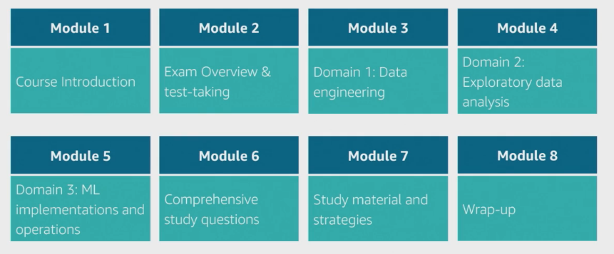
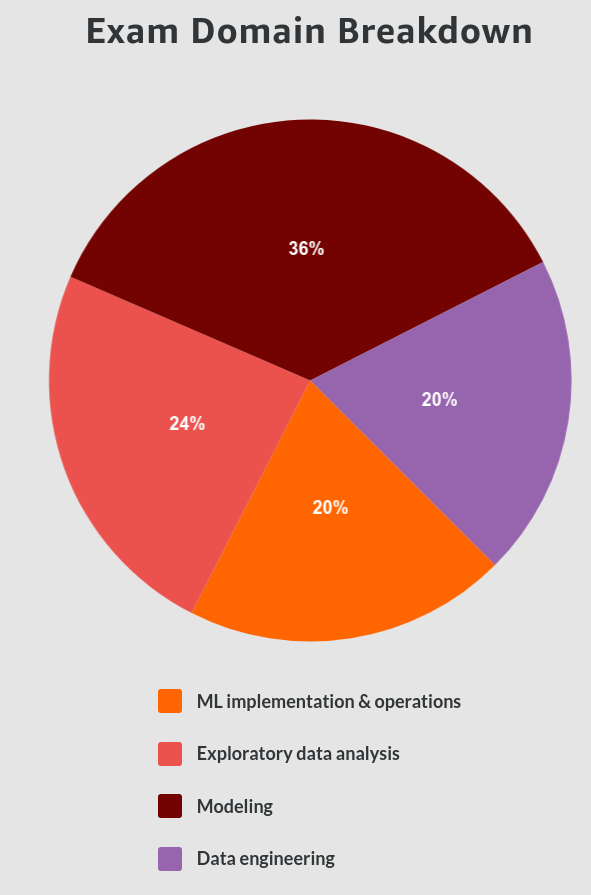

# Exam Readiness: AWS Certified Machine Learning - Specialty

https://www.aws.training/Details/eLearning?id=42183

This course doesn't teach Machine Learning but instead the topics covered on the AWS Specialty so that at the end of the course you can:
* Identify your strengths and weaknesses in the exam domains
* Describe the technical topics and concepts that make up each exam domain
* Summarize the logistics and mechanisms of the exam and its questions
* Use effective test-taking study strategies

# Exam Overview and Test-Taking Strategies

You are given 170 minutes to complete the exam. It consists of around 65 questions. This gives around 2:30 per question.

There are two types of questions on the exam:

* Multiple choice: Has one correct response and three incorrect responses (distractors).

* Multiple response: Has two or more correct responses out of five or more options. These types of questions will explicitly tell you to "(Select TWO)" or "(Select THREE)."

**EXAMPLE**

A data scientist is working on optimizing a model during the training process by varying multiple parameters. The data scientist observes that, during multiple runs with identical parameters, the loss function converges to different, yet stable, values. 

What should the data scientist do to improve the training process?

A. Increase the learning rate. Keep the batch size the same. [REALISTIC DISTRACTOR]

B. Reduce the batch size. Decrease the learning rate. [CORRECT] 

C. Keep the batch size the same. Decrease the learning rate. [REALISTIC DISTRACTOR]

D. Do not change the learning rate. Increase the batch size. [REALISTIC DISTRACTOR]

> Incorrect answers are plausible
Incorrect answers (or distractors) are designed to be plausible options.

> Qualifiers and key phrases are often part of questions
Look for qualifiers that can help you eliminate answer options. Look for key phrases that may imply AWS services or features.

EXAMPLE 1: Qualifiers

A company is interested in building a fraud detection model. Currently, the data scientist does not have a sufficient amount of information due to the low number of fraud cases.

Which method is MOST likely to generate the GREATEST number of valid fraud cases?

---

EXAMPLE 2: Key phrases

A company is setting up a system to manage all of the datasets it stores in Amazon S3. The company would like to automate running transformation jobs on the data and…
 

Which solution will allow the company to achieve its goals with minimal management?