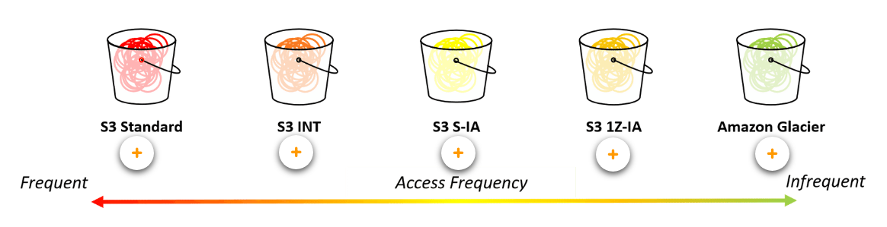
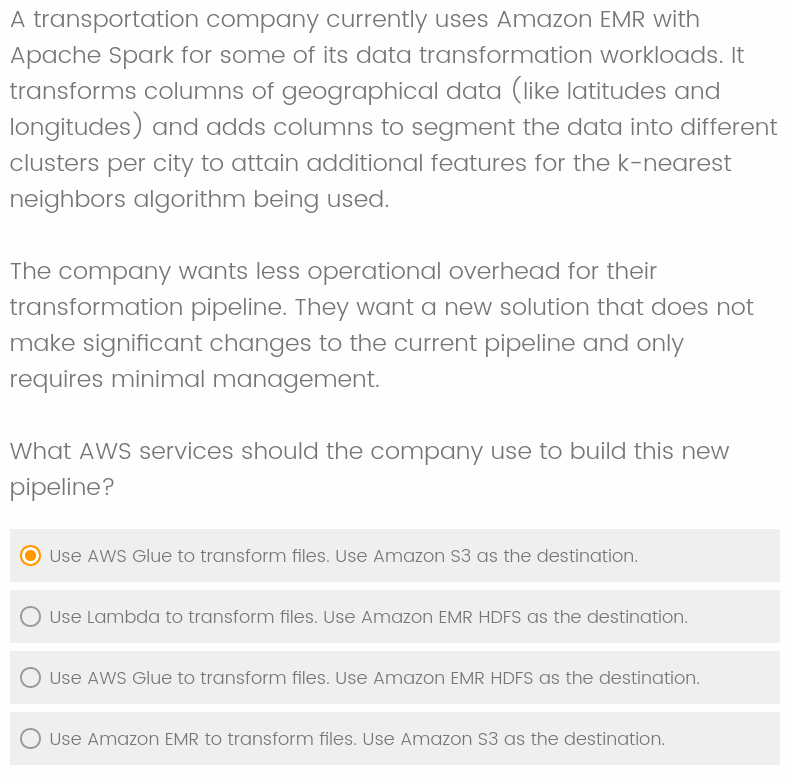

# Domain 1: Data Engineering

## Domain 1.1: Create data repositories for machine learning

...storing all of this data is challenging
You need a way to store your data in a centralized repository

Data lake as a key solution to this challenge
With a data lake, you can store structured and unstructured data

AWS Lake Formation and Amazon S3
AWS Lake Formation is your data lake solution, and Amazon S3 is the preferred storage option for data science processing on AWS

INT - Changing Access Patterns
IA - Infrequent Access
1Z-IA - Re-creatable, less accessed data
Glacier - Archive

* 
* **Amazon FSx for Lustre** -  When your training data is already in Amazon S3 and you plan to run training jobs several times using different algorithms and parameters, consider using Amazon FSx for Lustre, a file system service. FSx for Lustre speeds up your training jobs by serving your Amazon S3 data to Amazon SageMaker at high speeds. The first time you run a training job, FSx for Lustre automatically copies data from Amazon S3 and makes it available to Amazon SageMaker. You can use the same Amazon FSx file system for subsequent iterations of training jobs, preventing repeated downloads of common Amazon S3 objects.
* **Amazon S3 with Amazon EFS** - Alternatively, if your training data is already in Amazon Elastic File System (Amazon EFS), we recommend using that as your training data source. Amazon EFS has the benefit of directly launching your training jobs from the service without the need for data movement, resulting in faster training start times. This is often the case in environments where data scientists have home directories in Amazon EFS and are quickly iterating on their models by bringing in new data, sharing data with colleagues, and experimenting with including different fields or labels in their dataset. For example, a data scientist can use a Jupyter notebook to do initial cleansing on a training set, launch a training job from Amazon SageMaker, then use their notebook to drop a column and re-launch the training job, comparing the resulting models to see which works better

> This EFS looks like an auto-managed S3 where the infrequent files are stored in cheaper solutions given an automatic rule.
> In otherhand this FSx solution looks suitable for massive data since it implements its own filesystem to avoid network bottlenecks and limits transmissions between nodes.

> But checking the image and speed comparison it doesn't look like its really worthy the bother most of the times.

Study Topics on this Subdomain:
* [ ] AWS Lake Formation
* [ ] Amazon S3 (as storage for a data lake)
* [ ] Amazon FSx for Lustre
* [ ] Amazon EFS
* [ ] Amazon EBS volumes
* [ ] Amazon S3 lifecycle configuration
* [ ] Amazon S3 data storage options

## Domain 1.2: Identify and implement a data ingestion solution

Batch and stream processing are two kinds of data ingestion
Several services can help with batch processing into the AWS Cloud (as Glue, AWS DMS, AWS Step Functions).
Stream processing is well suited for real-time applications and the AWS solution for that is Kinesis. 

* Kinesis Producer Library provides the generating application code conenction to the kinesis queue and the Kinesis Counsumer Library generate application code to consume from this queue.
* Kinesis Data Firehose ingest data in real time and can compress and generate incremental views. It also allows you to execute AWS Lambda before delivering to S3
* Amazon Kinesis Data Analytics provides the easiest way to process and transform the data that is streaming through Kinesis Data Streams or Kinesis Data Firehose using SQL. This lets you gain actionable insights in near-real time from the incremental stream before storing it in Amazon S3.

Study Topics on this Subdomain:
* [ ] Amazon Kinesis Data Streams
* [ ] Amazon Kinesis Data Firehose
* [ ] Amazon Kinesis Data Analytics
* [ ] Amazon Kinesis Video Streams
* [ ] AWS Glue
* [ ] Apache Kafka

## Domain 1.3: Identify and implement a data transformation solution

Raw ingested data is not ML ready
The raw data ingested into a service like Amazon S3 is usually not ML ready as is. The data needs to be transformed and cleaned, which includes deduplication, incomplete data management, and attribute standardization. Data transformation can also involve changing the data structures, if necessary, usually into an OLAP model to facilitate easy querying of data. 

Transforming your data for ML
Data transformation is often necessary to deal with huge amounts of data. Distributed computation frameworks like MapReduce and Apache Spark provide a protocol of data processing and node task distribution and management. They also use algorithms to split datasets into subsets and distribute them across nodes in a compute cluster.

Using Apache Spark on Amazon EMR provides a managed framework
Using Apache Spark on Amazon EMR provides a managed framework that can process massive quantities of data. Amazon EMR supports many instance types that have proportionally high CPU with increased network performance, which is well suited for HPC (high-performance computing) applications.

A key step in data transformation for ML is partitioning your dataset
The choice of ETL processing tool is also largely dictated by the type of data you have. For example, tabular data processing with Athena lets you manipulate your data files in Amazon S3 using SQL. If your datasets or computations are not optimally compatible with SQL, you can use AWS Glue to seamlessly run Spark jobs (Scala and Python support) on data stored in your Amazon S3 buckets.

You can store a single source of data in Amazon S3 and perform ad hoc analysis
By not moving the data around and connecting to it using different services, customers avoid building redundant copies of the same data.

Study Topics on this Subdomain:
* [ ] Apache Spark on Amazon EMR
* [ ] Apache Spark and Amazon SageMaker
* [ ] AWS Glue

## Walk-through of sample questions

**Q1**
A data engineer needs to create a cost-effective data pipeline solution that ingests unstructured data from various sources and stores it for downstream analytics applications and ML. The solution should include a data store where the processed data is highly available for at least one year, so that data analysts and data scientists can run analytics and ML workloads on the most recent data. For compliance reasons, the solution should include both processed and raw data. The raw data does not need to be accessed regularly, but when needed, should be accessible within 24 hours.

What solution should the data engineer deploy?
The solution doesn't use EFS because it's **cost-effective**. For the same reason it doesn't store all the data on standard S3.

**Q2**
An ad-tech company has hired a data engineer to create and maintain a machine learning pipeline for its clickstream data. The data will be gathered from various sources, including on premises, and will need to be streamed to the company’s Amazon EMR instances for further processing.

What service or combination of services can the company use to meet these requirements?
As the data will be **streamed** the best solutions are the Kinesis solutions. As the data will be later processed the Firehose solution is not required.

https://amazonmr.au1.qualtrics.com/jfe/form/SV_dg3duwjYBh3zZnn

