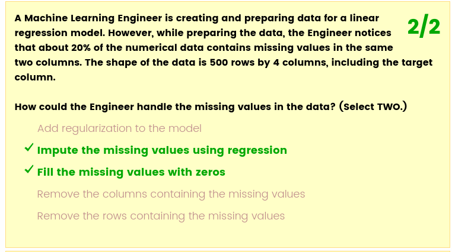
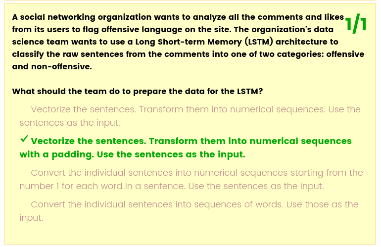
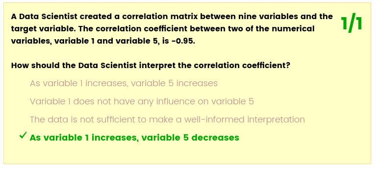

# Domain 2: Exploratory Data Analysis

## Domain 2.1: Sanitize and prepare data for modeling

You probably have data that is missing, noisy, biased, and/or imbalanced. As a result, you have to sanitize and clean your data so it’s more understandable and conducive to effectively training your ML model. 

Use descriptive statistics to better understand your data

The first thing you should do, before cleaning the data, is to use descriptive statistics to better understand your data.

* Overall statistics - Number of rows, number of columns. Having too many features might lead to a poor performance model
* Multivariate statistics - Obtain correlations and relations between features
* Attribute statistics - Shape of attributes as mean, std, percentiles, variance, minimum and maximum values

1) Identifying correlations is important, because they can impact model performance
2) Scatter plots visualize relationships between numerical variables
3) Correlation matrices help you quantify the linear relationships among variables

**Sanitize your data**
1) Standardize language and grammar
2) Make sure the data is on the same scale
3) Make sure a column doesn’t include multiple features
4) You might also need to clean your data based on any outliers that may exist 
5) Missing data also needs to be handled at this stage
   1) Remove the columns or rows that include the missing data
   2) Fill the missing value with the column mean, a zero, or another numerical value using imputation

Topics related to this subdomain:
* [ ] Dataset generation
  * [ ] Amazon SageMaker Ground Truth
  * [ ] Amazon Mechanical Turk 
  * [ ] Amazon Kinesis Data Analytics
  * [ ] Amazon Kinesis Video Streams
* [ ] Data augmentation
* [ ] Descriptive statistics
* [ ] Informative statistics
* [ ] Handling missing values and outliers

## Domain 2.2: Perform feature engineering

Feature engineering gives your model stronger prediction power.
You may need to perform feature engineering because of the dimensionality of your dataset—particularly if there are too many features for your model to handle. 
To reduce the number of features, you need to deploy dimensionality reduction techniques like principal component analysis (PCA).

For numerical features, you can do what is referred to as transformation.
One of the examples below is of a multinominal or polynomial transformation, where you take the square and cube of the original feature and use all three columns as separate attributes while training your model. The other is an example of multiplication as a means of transformation.

You may need to perform feature engineering because of the format of your data
You will often handle categorical data that needs to be converted into numerical data before it can be read by your ML algorithm. Your approach will differ depending on whether your data is ordinal (the categories are ordered) or nominal (categories are not ordered).

Common techniques for scaling
So how do we do it, exactly? How can we align different features into the same scale?

* Mean/variance standardization
* MinMax scaling
* Maxabs scaling
* Robust scaling
* Normalizer

Topics related to this subdomain

* [ ] Scaling
* [ ] Normalizing
* [ ] Dimensionality reduction
* [ ] Date formatting
* [ ] One-hot encoding

## Domain 2.3: Analyze and visualize data for ML
Visualization helps you better understand your features and their relationships
Visualization techniques include visualizing averages and summary statistics using line charts, histograms, and an ever-expanding catalog of custom visualizations. This subdomain focuses on assessing your understanding of these and other techniques, and tests your ability to analyze the visualized data to make informed decisions from it.

Visualizations help give you a better idea of what’s inside a particular feature and help you answer questions like these:
* What’s the range of the data?
* What’s the peak of the data?
* Are there any outliers?
* Are there any interesting patterns in the data? 
Data visualization will also help you determine whether you need to clean and preprocess your data before model training.

Common visualization techniques include scatter plots and histograms

Topics related to this subdomain

* [ ] Scatter plots
* [ ] Box plots
* [ ] Histograms
* [ ] Scatter matrix
* [ ] Correlation matrix
* [ ] Heatmaps
* [ ] Confusion matrix

## Samle Questions

**Q1**
A team of data scientists in a company focusing on security and smart home devices created an ML model that can classify guest types at a front door using a video doorbell. The team is getting an accuracy of 96.23% on the validation dataset.

However, when the team tested this model in production, images were classified with a much lower accuracy. That was due to weather: The changing seasons had an impact on the quality of production images.

What can the team do to improve their model?
Use data agumentation. Normalize might seem reasonable but the problem isn't on the trained model and in a non-generalized deployed model instead.

**Q2**
A team of data scientists in a financial company wants to predict the risk for their incoming customer loan applications. The team has decided to do this by applying the XGBoost algorithm, which will predict the probability that a customer will default on a loan. In order to create this solution, the team wants to first merge the customer application data with demographic and location data before feeding it into the model.

However, the dimension of this data is really large, and the team wants to keep only those features that are the most relevant to the prediction.

What techniques can the team use to reach the goal? (Select TWO.) PCA and t-SNE. Although t-SNE doesn't help at all it was conseidered a good technique.

https://amazonmr.au1.qualtrics.com/jfe/form/SV_d9W72HMVJckXsUJ

The LSTM can have larger batch with sentences with same lenght.
I just don't understand why the first one fill with zeroes and not with some other statistical value (mean) or drop.