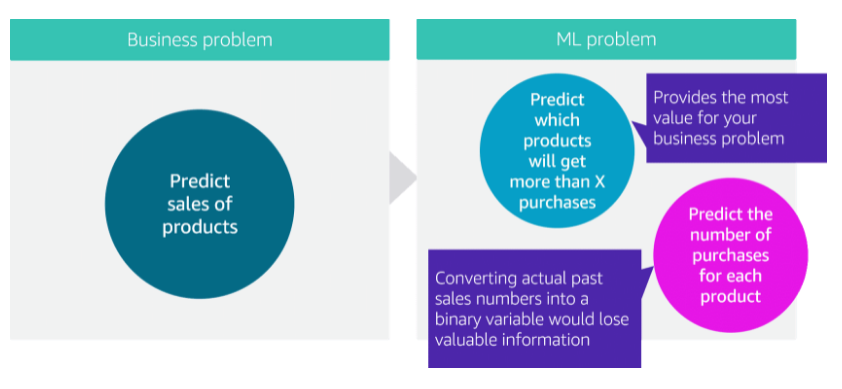

# Domain 3: Modeling

This domain consists of five subdomains:

* Framing business problems as ML problems
* Selecting the appropriate model(s) for a given ML problem
* Training ML models
* Performing hyperparameter optimization
* Evaluating ML models

## Domain 3.1: Frame business problems as ML problems

Before framing your business problem, first consider whether ML is an appropriate solution to your problem
ML is about identifying hidden patterns in data. It has the potential to leverage large amounts of data to train an ML model on that data’s patterns and structures to then make predictions. And the power of ML is that your model, in theory, gets progressively better at making these predictions as it’s trained. you have tons of data that need to be analyzed for patterns that can be used to make predictions. This is a perfect use case for ML. 

Now, think of a business case that is not appropriate for ML
ML is not appropriate when you can determine a target value by using simple rules or computations that can be programmed without needing any data-driven learning. Alternatively, you should use machine learning when:

* You cannot code the rules. Many human tasks (such as recognizing whether an email is spam or not spam) cannot be adequately solved using a simple (deterministic), rule-based solution. Many factors could influence the answer. When rules depend on too many factors and many of these rules overlap or need to be tuned very finely, it soon becomes difficult for a human to accurately code the rules. You can use ML to effectively solve this problem.
* You cannot scale. You might be able to manually recognize a few hundred emails and decide whether they are spam or not. However, this task becomes tedious for millions of emails. ML solutions are effective at handling large-scale problems

Different types of ML algorithms have their own particular use cases

Within supervised learning, you have different types of problems. These can be broadly categorized into two categories: classification and regression. 

Topics related to this subdomain

* [ ] Supervised learning
* [ ] Regression and classification
* [ ] Unsupervised learning
* [ ] Clustering
* [ ] Anomaly detection
* [ ] Deep learning
* [ ] Perceptron
* [ ] Components of an artificial neuron

## Domain 3.2: Select the appropriate model(s) for an ML problem

**classification problems**. Amazon SageMaker provides a few built-in algorithms that work for these situations: Linear Learner, XGBoost, and K-Nearest Neighbors. XGBoost, for instance, is an open-source implementation of the gradient-boosted trees algorithm. Gradient boosting is a supervised learning algorithm that attempts to accurately predict a target variable by combining an ensemble of estimates from a set of simpler, weaker models.
**regression probelms**.you could choose Linear Learner and XGBoost. The difference is that you set the hyperparameters to direct these algorithms to produce quantitative results. 

Algorithms for natural language processing (NLP)

Amazon SageMaker built-in algorithms for NLP:

* BlazingText (optimized Word2vec)+ text classification
* Sequence2sequence input=sequence of tokens; output= another sequence of tokens
* Object2Vec generalizes the well-known Word2Vec embedding technique for words that are optimized in the Amazon SageMaker BlazingText algorithm

Algorithms for CV:

* Image classification 
* Object detection
* Semantic segmentation

Other options for training algorithms:
* Use Apache Spark with Amazon SageMaker
* Submit custom code to train a model with a deep learning framework like TensorFlow or Apache MXNet
* Use your own custom algorithm and put the code together as a Docker image
* Subscribe to an algorithm from AWS Marketplace

Topics related to this subdomain:

* [ ] Linear learner
* [ ] XGBoost
* [ ] K-means
* [ ] Decision trees
* [ ] Random forest
* [ ] Image classification
* [ ] Object detection
* [ ] Semantic segmentation