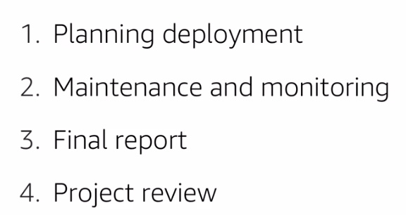
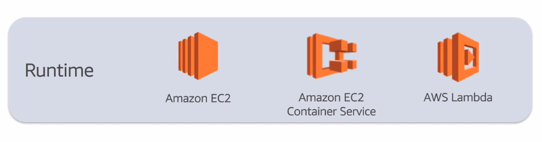
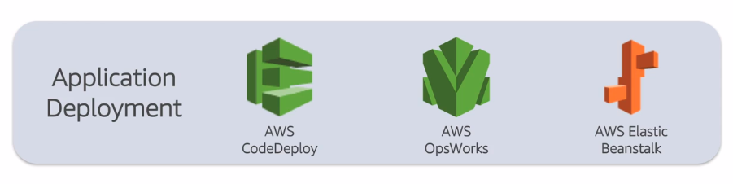

# Introduction to CRISP-DM on AWS
Quite old (1996)

Deployment is a whole thing by itself dealt with MLOps

# Phase 1 : Business Understanding

* Identify areas where business need to improve
* Convert that into a problem that can be solved or question that need to be answered
* Formulating a well thought question that is both specific and measurable it of uttermos importance
* List required resources for project
* Analyze risks
* Plan contigencies
* Compare costs and benefits
* Convert question to a ML objective
* Define the criteria to evaluate the model
* Create a project plan that specifies steps

# Phase 2: Data Understanding
* Do I selecte all the data? Codify it in any way?
* Consider other data sources / merged data
* Is the data structured or unstructured?
* Describe metadata proprieties of data
* Veryfing attributes
* Identify missing data

Key AWS Services:
* Glue (Data Catalog, Edit Transforms and Schedule Runs)
* Athena (SQL, Serverless)
* QuickSight (BI Service)

# Phase 3 & 4: Data Preparation Tasks & Modeling

Constraints:
* Total size
* Included and excluded columns

Preparing Data:
* Cleaning
  * Drop rows
  * Default value
  * Calculate the missing values (mean, regression, etc)
  * Clean outliers
* Transforming:
  * Derive additional attributes from original data
  * Normalizations
  * Attribute transformation
* Merging
* Formatting:
  * rearrange
  * shuffle
  * remove constraints of modeling tool (e.g. Unicode chars)

Key AWS Services:
* Apache Spark on Amazon EMR:
  * Prebuilt MLlib Dataframe-based API
  * IPython, Zeppelin notebooks
  * Scala, Python, R, Java, SQL
  * Leverage Spot instances for task nodes
* EC2
  * Deep Learning AMI
  * Preinstalled GPU CUDE
  * Preinstalled DL frameworks (TensorFlow, Keras, Caffe2, Torch, Theano, MXNet, etc)
  * Anaconda, numpy, scikit

# Phase 5: Evaluation
Depends on:
* Accuracy
* Model generalization
* Business Success criteria

Review the project:
* Assess the steps taken in each phase
* Perform quality assurance checks

# Phase 6: Deployment

* EC2 Container Service (ECS) + EC2 helps runs dockerized applications
* Lambda can also run ECS images, is serverless and much cheaper but has memory and time constraints that might be a problem
  

* AWS CodeDeploy + AWS OpsWork looks like Terraform
* Elastic Beanstalk 

* CloudFormation has JSON application format

* Could easily be controlled with any git (github/gitlab) solution

* CloudWatch logs are available but depends on a structured logging proccess

# Certificate
https://www.aws.training/Transcript/CompletionCertificateHtml?transcriptid=w67HxrZroUC-zeYB5raLzA2

# Final Comments
The course is really simple and can be done in a sit. It doesn't require any priori knowledge since it cover the topics in an introductory manner.