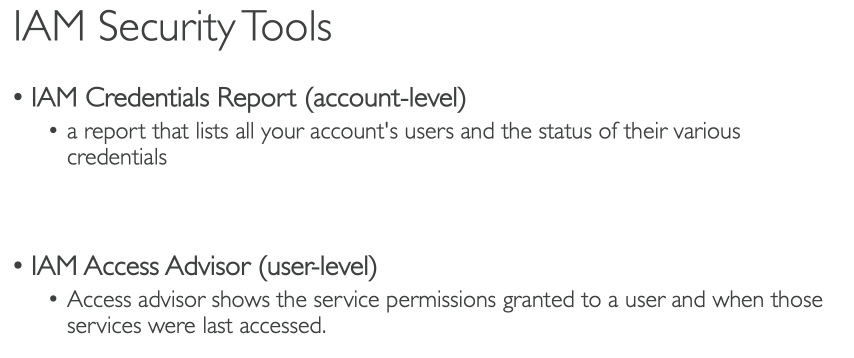
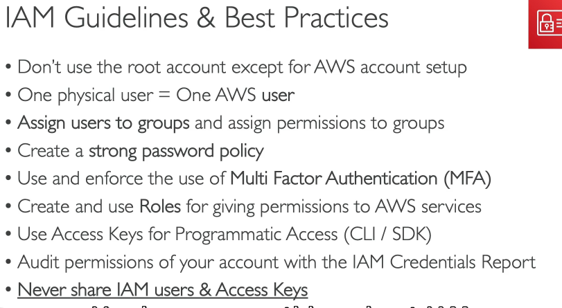

# IAM and CLI

When the AWS account is created a root user is created. It's good practice never use this account again as it has too many privileges. The good practice is to create an Admin account and then create user accounts to every person accessing the services. Another good practice is to conceed only the necessary access to the user.

Accesses can be conceeded directly to the user or trough Groups. A user can be part of several groups or none.
Services can have privileges through Roles. Roles are JSON defined rules specific for services to obtain privileges on other AWS services.

There are two Security Tools available on the IAM scope:

1) IAM Credentials Report (account-leve)
   1) a report that lists all your accounts and the status of their various credentials. Is usually blocked to the admin and only available for the root user but can be unlocked to the admin through the root account
2) IAM Access Advisor (user-level)
   1) Access advisor shows the service permissions granted to a user and when those services were last accessed. This helps to point ut which services are conceeded and not being used to creating more restricted groups and rules.

