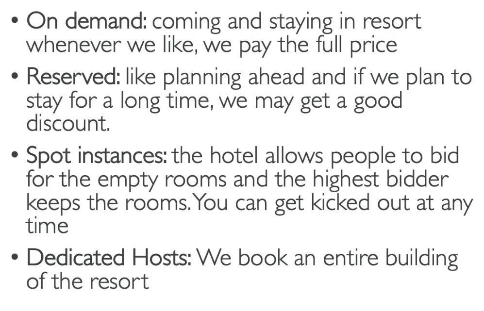
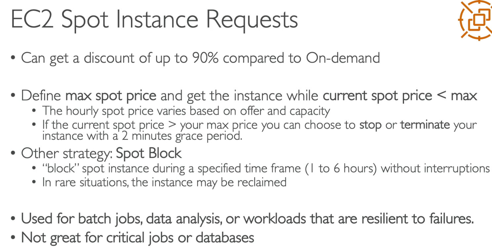
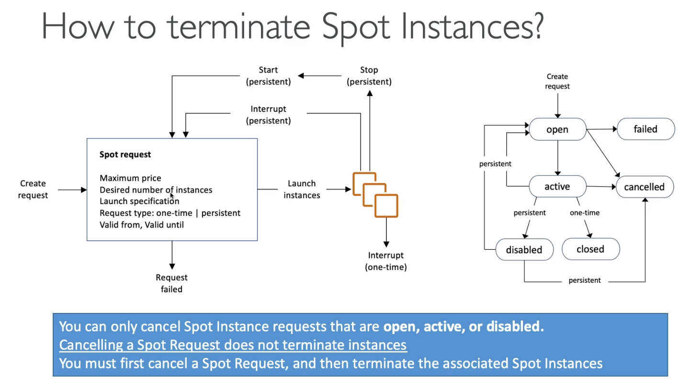
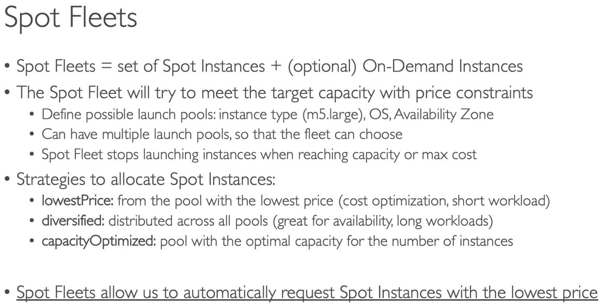
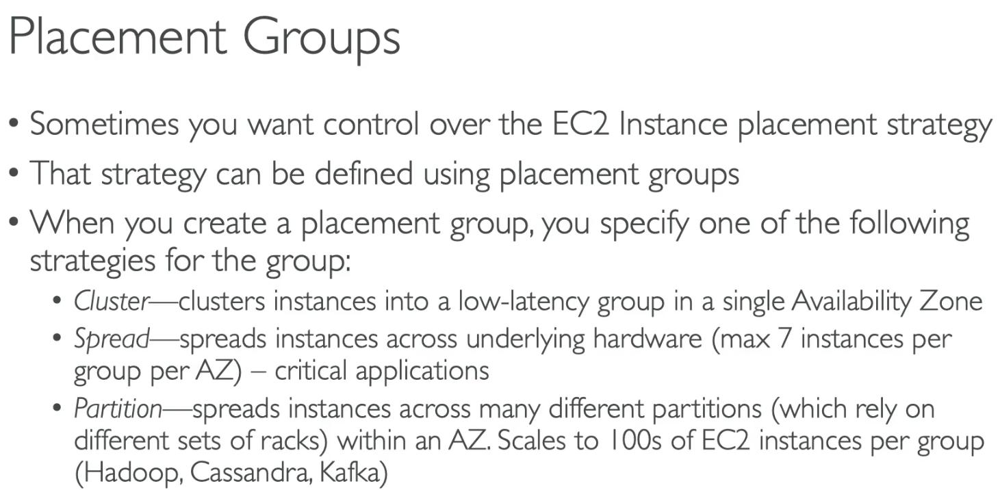
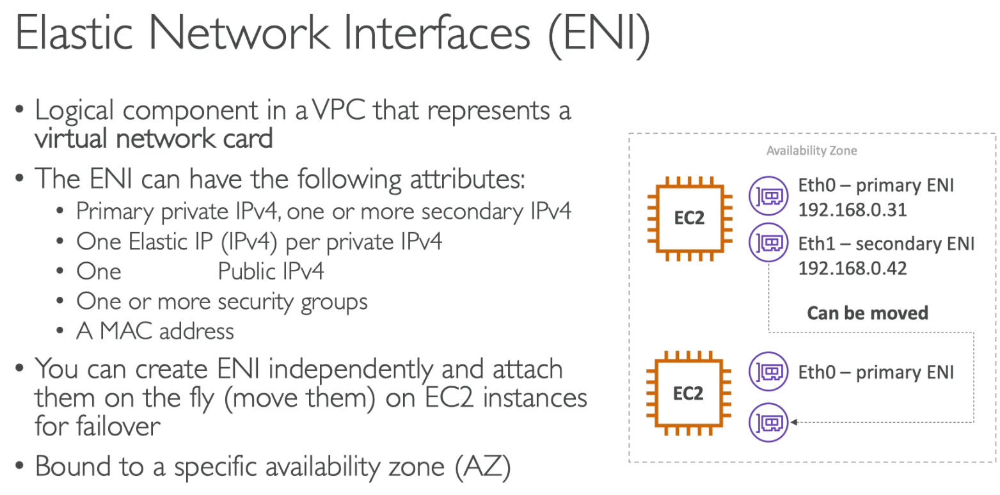
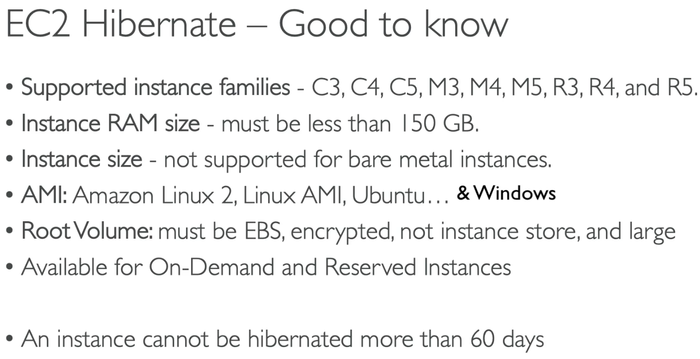
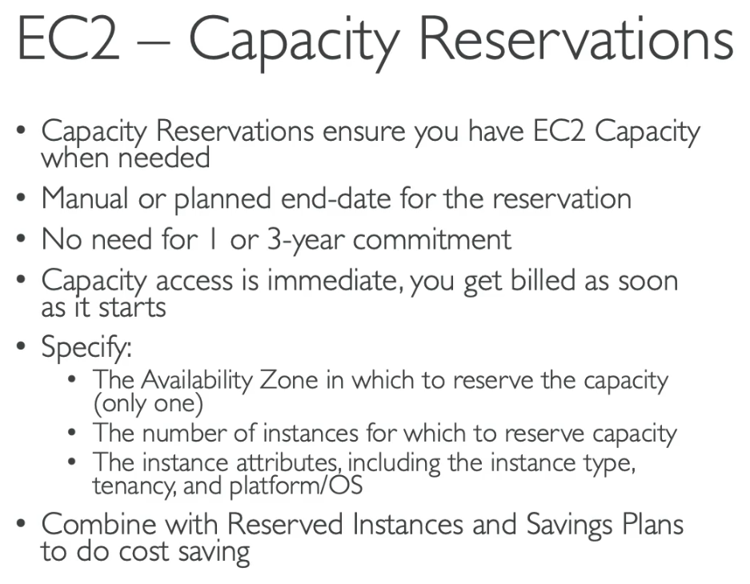

# EC2

* Instance types: can control your available RAM, vCPU (cores available for parallel programming), bandwith and cost
* Security Groups are inbound and outbound rules that controls who can see who from where
* Among the classic ports we have 80 for HTTP, 443 for HTTPS, 22 for FTP, 2222 for SFTP
* We can directly connect to an EC2 instance using SSH (if it is available on the respective security group)
* The connection needs a PEM certificate file on the connection
* The EC2 can also be accessed through Instance Connect on browser
* As an EC2 is an AWS instance we can control access directly to the instance through the IAM Roles
* **Instance Launch Types**:
    * On-Demand Instances: 
      * short workload, 
      * predictable pricing, 
      * pay what you use
    * Reserved: 
      * MINIMUM 1 year OR 3 years
      * long workload, 
      * Convertible Reserved Instances: long workloads with flexible instances
      * Scheduled Reserved Instances: example - every Thursday between 3 and 6pm
    * Spot Instances:
      * Short Workloads
      * Cheap
      * Can lose instances (less reliable)
      * Works on betting prices to obtain instances
    * Dedicated Hosts:
      * Book and entire physical server
      * Control instance placement
    * Dedicated Instances:
      * Instances running on hardware that's dedicated to you
      * May share hardware with other instances in same account
      * No control over instance placement
      * Per instance pricing

## 46 - Spot Instances

## 47 - Placement Groups

## 49 - Elastic Network Interface

## 50 - EC2 Hibernate

## 54 - Capacity Reservations

