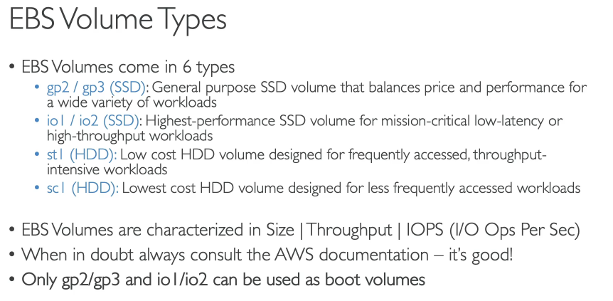
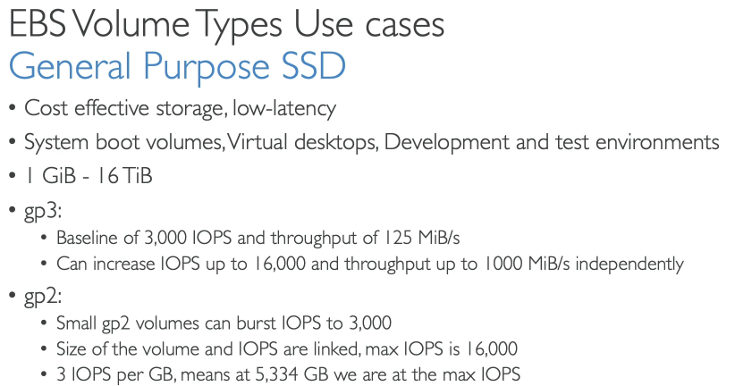
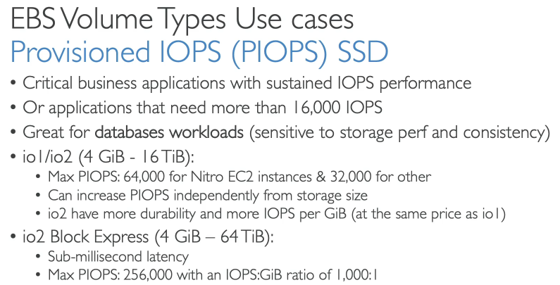
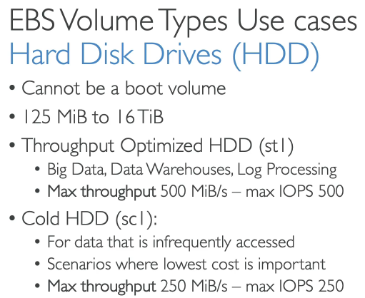
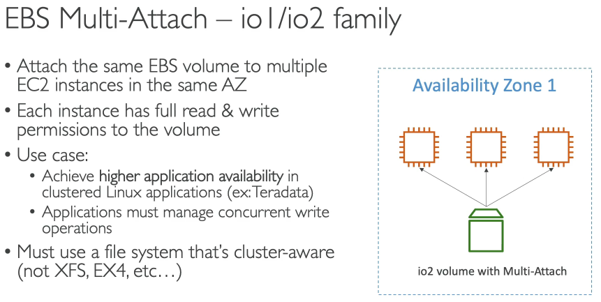
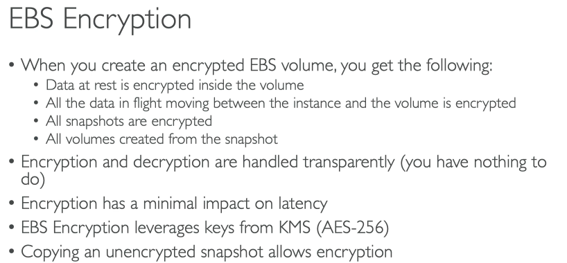
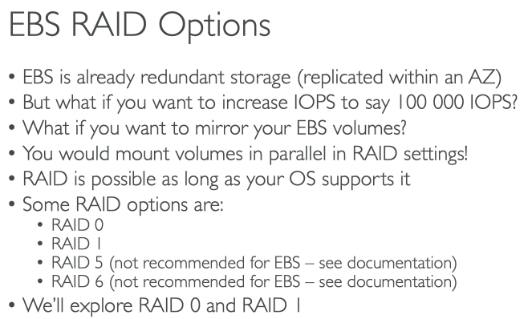
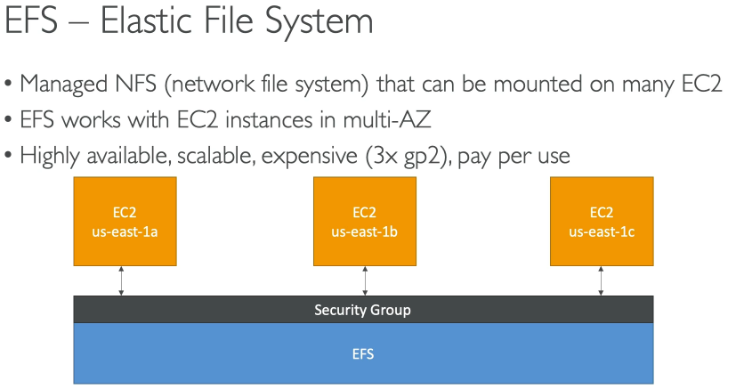

# EBS

* Bound to one AZ
* "network USB stick"
* Can only be mounted to one instance at time but one instance can have multiple EBSs connected
* Allows to persist data
* Has provisioned capacity (size in GBs and IOPS)
* Delete on termination is default for root partition
* To transport the EBS to another AZ or encrypt it it's necesary to Snapshot it fist and then copy it
* You can Snapshot without detaching from the volme but it's not recommended
* AMI = Amazon Machine Image. Is the image used fo the EC2 instance to boot. Build your own AMI helps applications to boot faster as the warm up is quicker
* You can use **EC2 Instance Store** as a high-performance alternative. It's ephemeral so it's only good for cache

## 62 - EBS Volume Types

gp2 GB and IOPS are linked together up to the given limit

## 66 - EFS Elastic File System

only compatilbe with Linux
it's really high performance and scale the system automatically moving files less frequently accessed to a cheaper (colder) access part automatically.

EFS-IA (Infrequent Access)