Vertical Scalability = t2.micro -> t2.large
Horizontal Scalability = 1 instance -> 10 instances
High Availability = Horizontal Scalability + System Running in at least 2 data centers (the objective is to survive a data center loss)
# ELB - Elastic Load Balancer

A Load balancer is an interface of EC2 instances which serve traffic seamlessly to the instances. An ELB:

* Expose a single point of access (DNS) of your application
* Do regular health checks
* Separate public and private IPs

3 kinds of load balancers:

1) Classic Load Balancer (v1 - old generation) - 2009:
   * HTTP, HTTPS, TCP
2) Application Load Balancer (v2 - new generation) - 2016:
   * HTTP, HTTPS, WebSocket
3) Network Load Balancer (v3 - ner generation) - 2017:
   * TCP, TLS (secure TCP), & UDP

A classic setup is expose the load balancer to the world trhough the Security Group but only allow the instances to receive traffic from the Load Balancer, so no instance is directly exposed.

## 75 - Application Load Balancer (ALB) v2

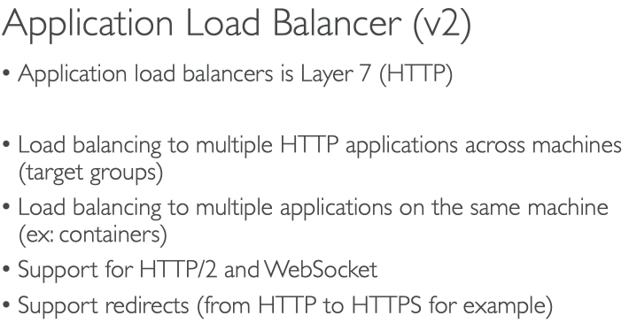

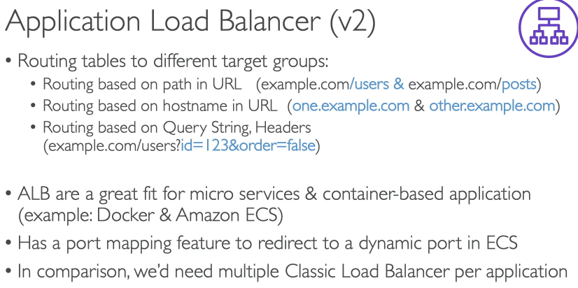

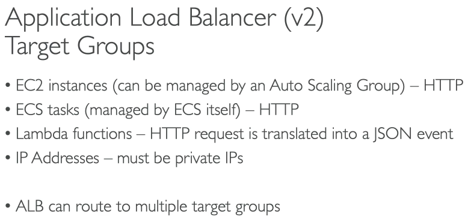

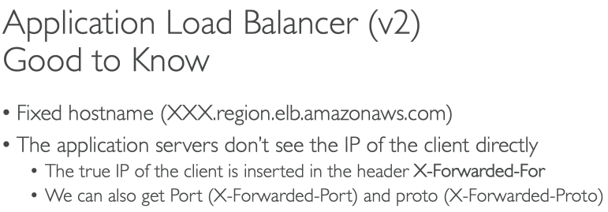

## 77 - Network Load Balancer (NLB)

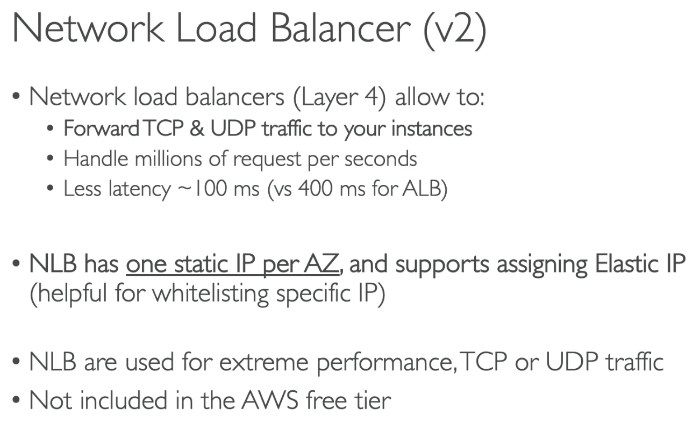

## 79 - Load Balancer Stickiness

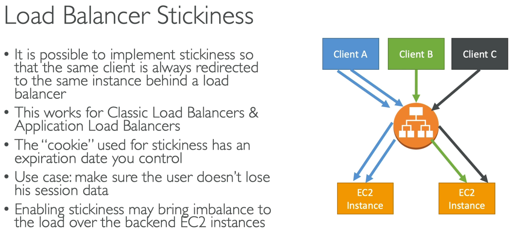

## 80 - Cross Zone

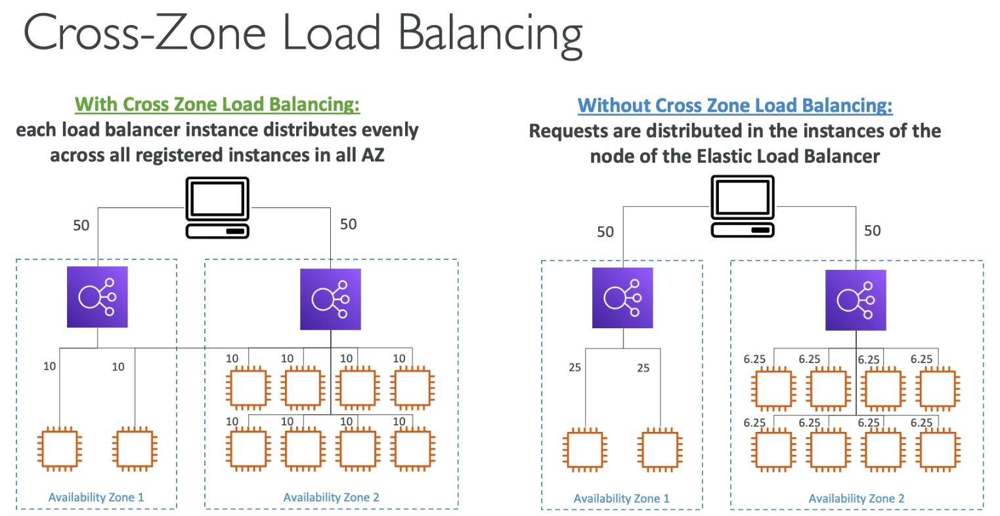

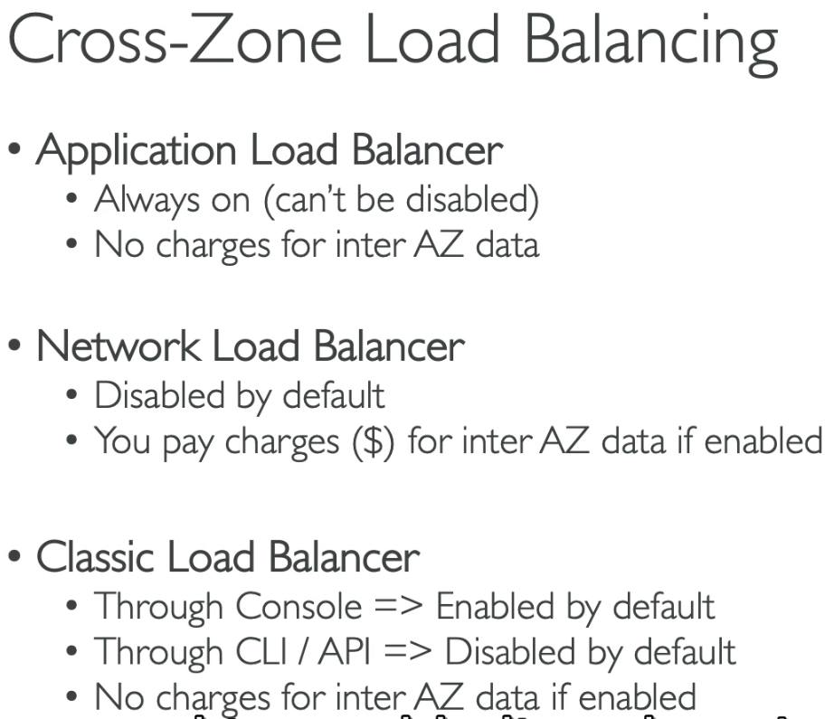

## 82- Connection Draining

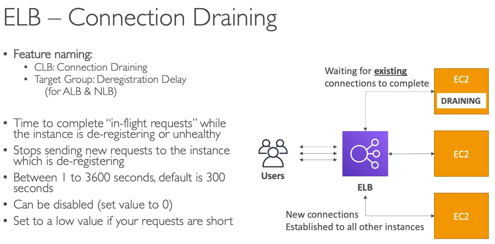

## 83 - Auto Scaling Group (ASG)

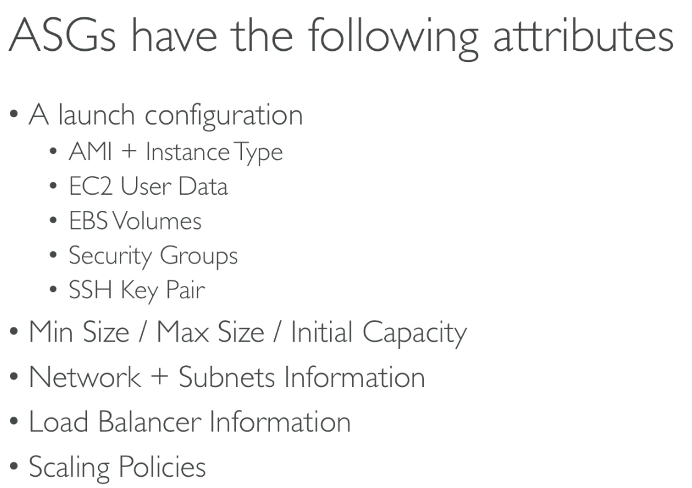
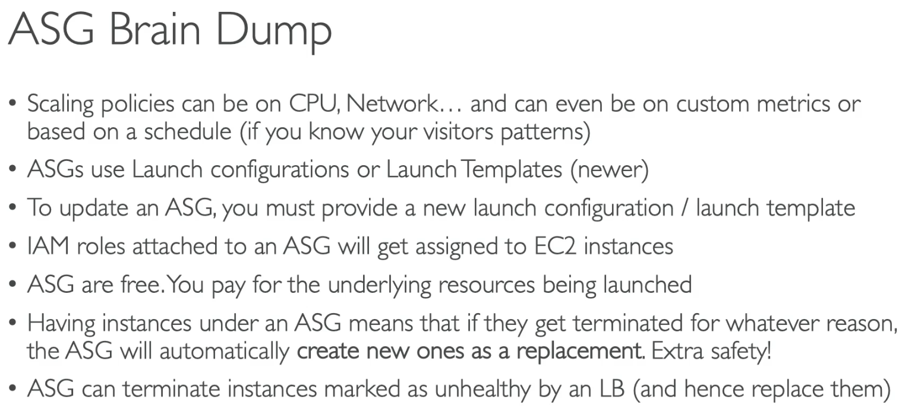
Scale out = increase instances
Scale in = reduce instances

## 85 - Auto Scaling Groups

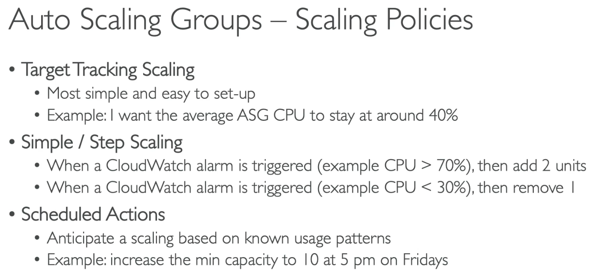
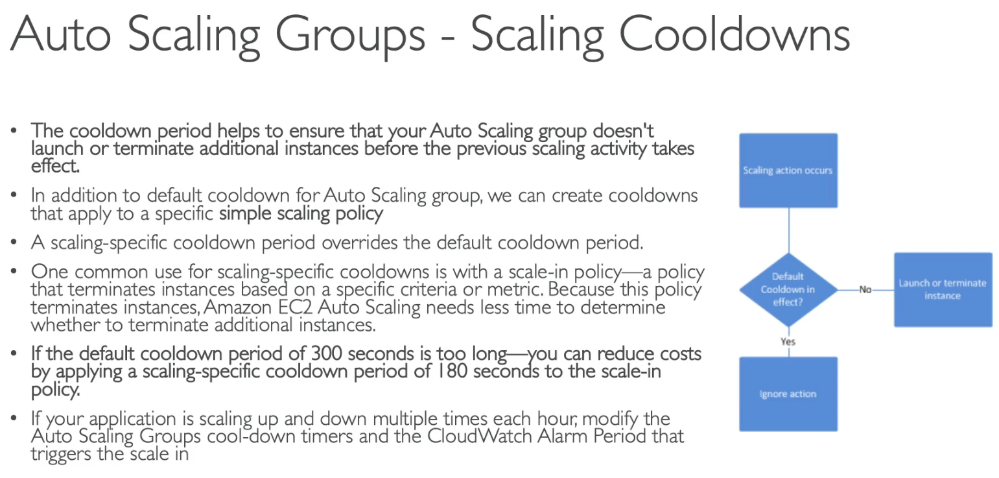

## 86 - ASG for Solutions Architects

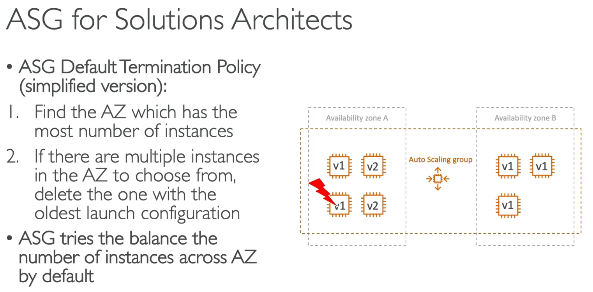
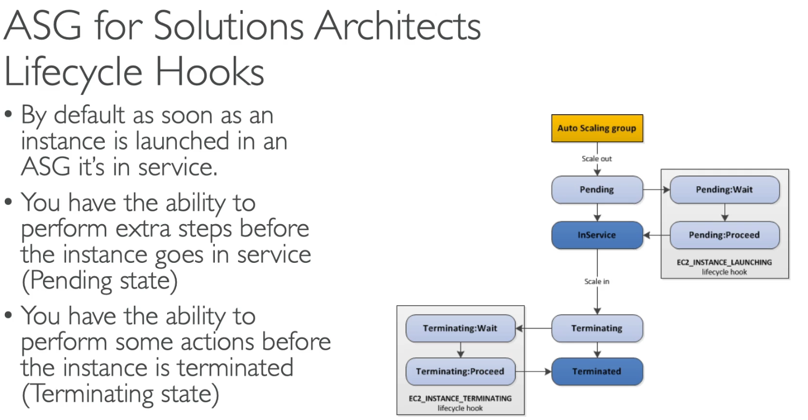
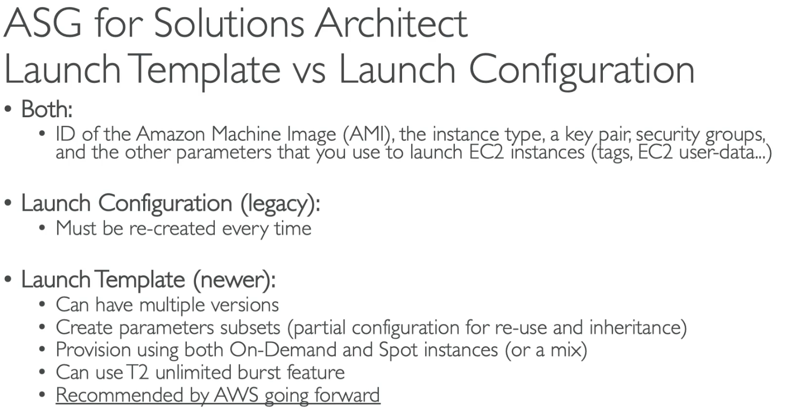

