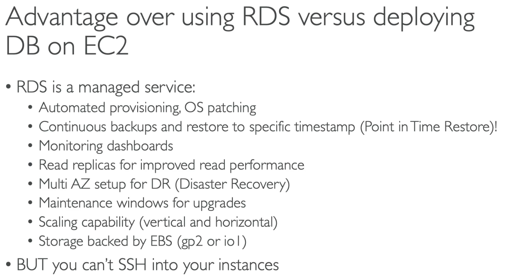
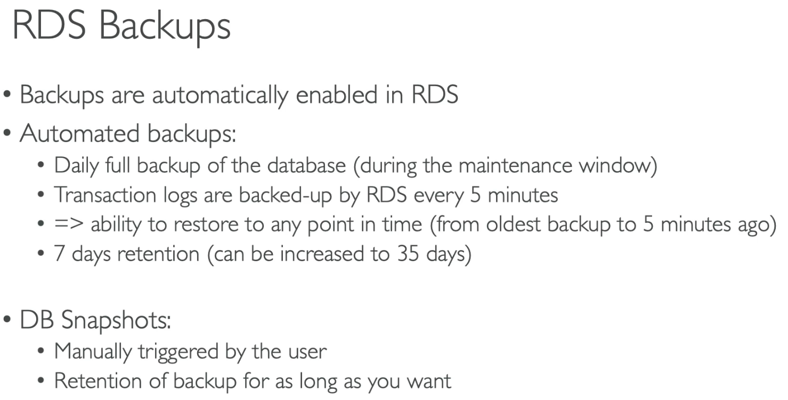
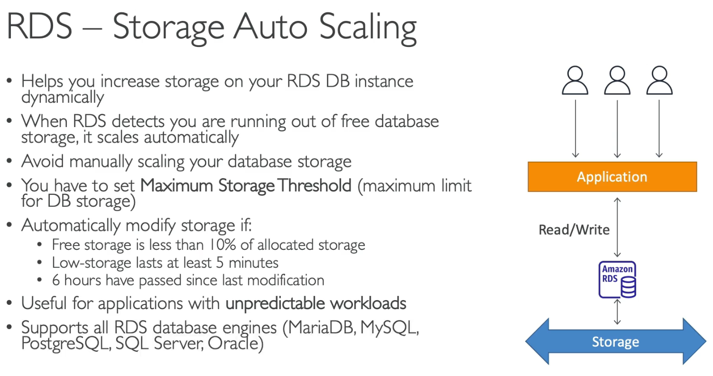
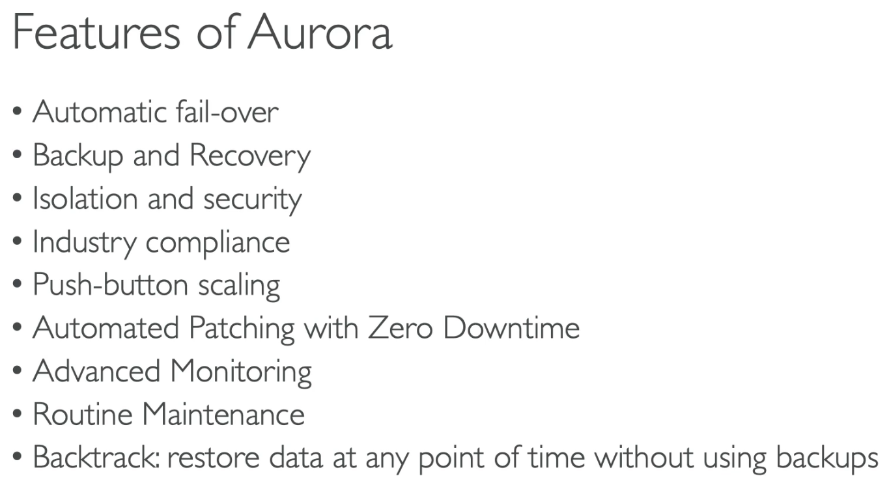
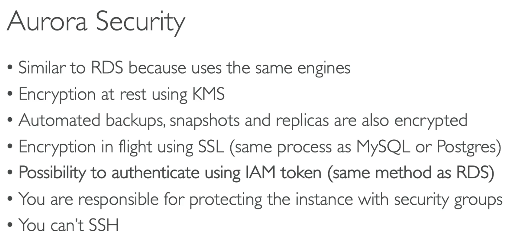
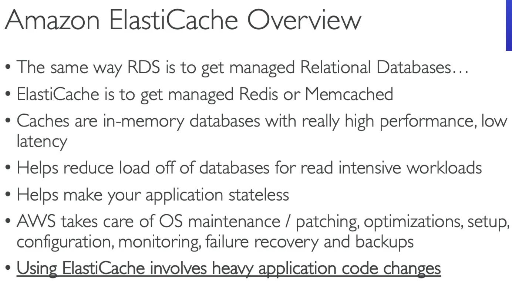
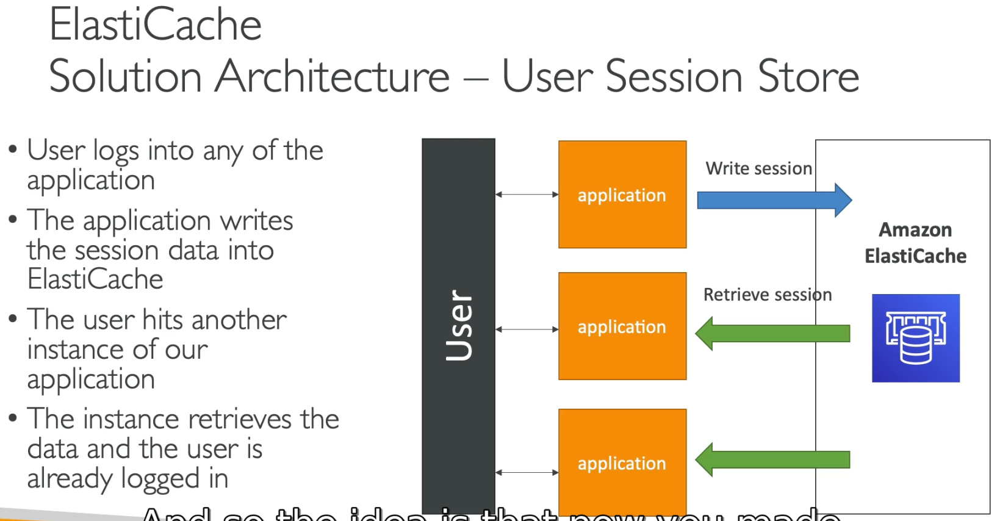
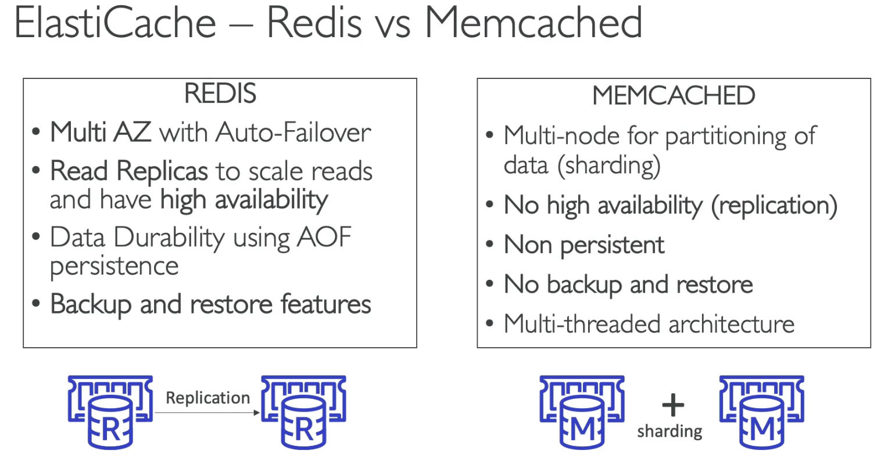
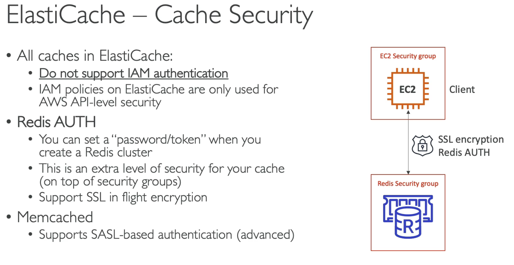
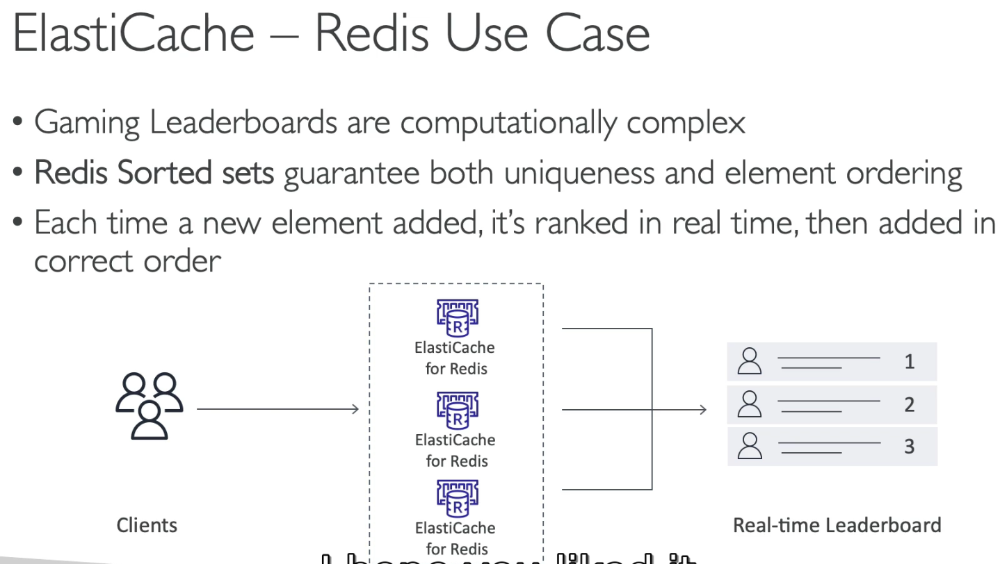

# RDS

## 95 - ElastiCache

## 97 - ElastiCache Security 

Most of this chapter is simple. The RDS is a leverage service offered by amazon to quickly solve several problems of managing a Database. Many common systems are available as Oracle, MySQL, Postgres but Amazon also offers an optimized version called Aurora. Aurora has connections using Postgres and MySQL and ih highly optimized.

Most of the RDS services have in the default configuration a single writer and several reader instances. The reading instances can be increased or decreased through an ELB + ASG configuration. It's possible to write a custom endpoint to select only few reading instances that have better compatibility with the disered task. 

Caches available are Redis and ElastiCache. Redis is an in-memory database for caching purposes. ElastiCache has sharded cache. A common patter is to use ElastiCache as cache for user info when not using stickiness on EC2 instances.