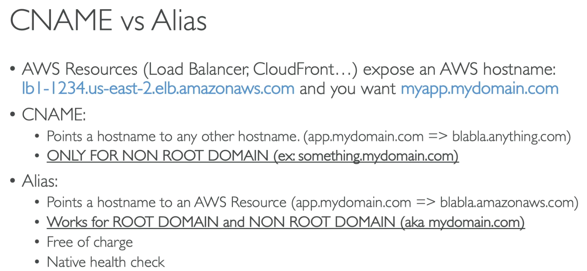
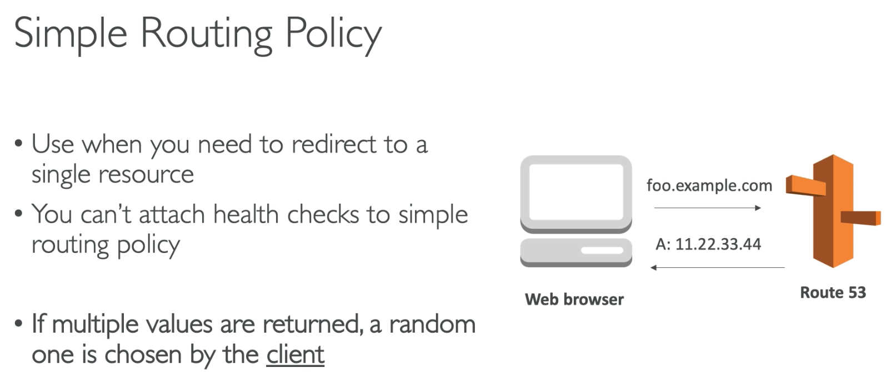
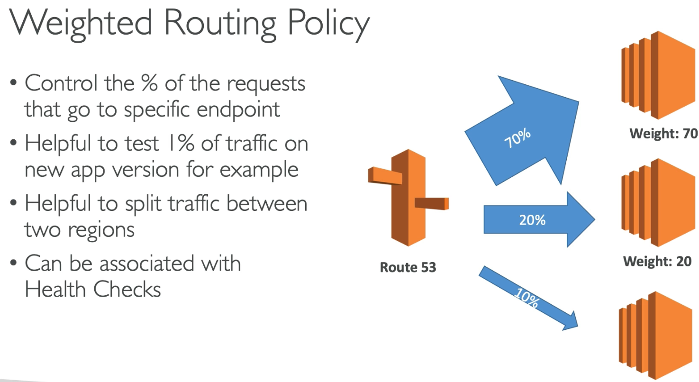
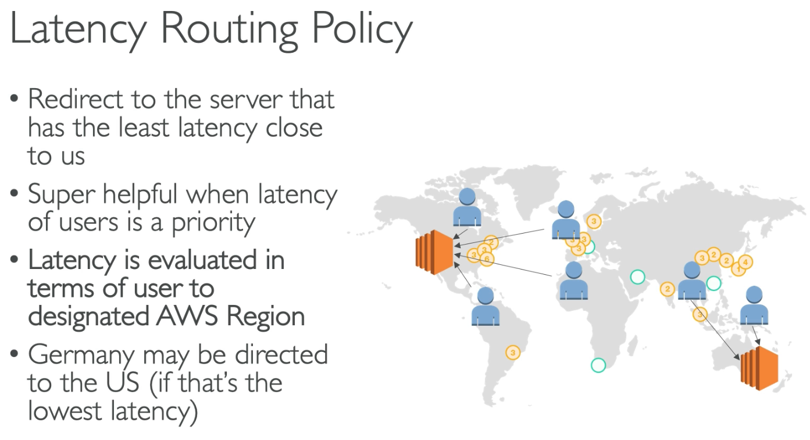
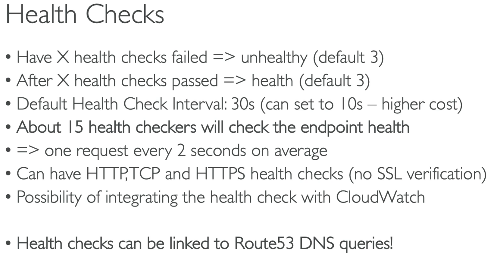
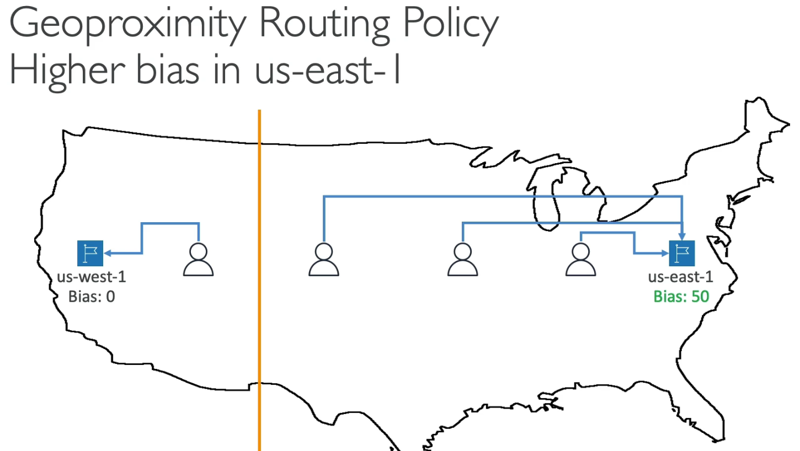
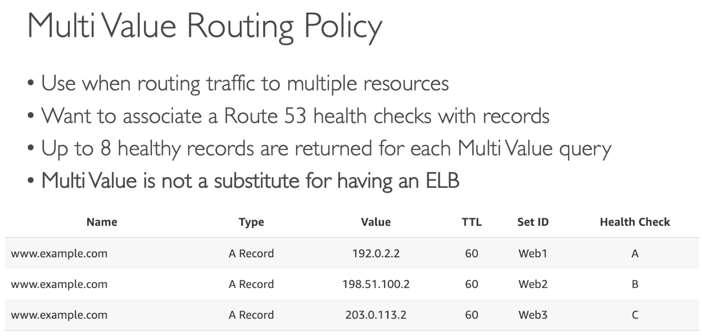

# Route 53

## 103 - Route 53 CNAME vs Alias

## 104 - Routing Policy - Simple

## 105 - Routing Policy - Weighted

From a client side perspective, we're not aware that there are multiple IPs

## 106 - Routing Policy - Latency

## 106 -Health Check
If a health check fails, Route 53 will not send traffic to that route

## 108 - Routing Policy - Failover
Works by pointing the Route 53 to two instances, primary and secondary. The primary need to have a health check enabled and, in caso it goes unhealthy the traffic is redirected to the secondary.

## 109 - Routing Policy - Geolocation
Works creating rules based on geographic rules (country, continent, etc). Needs to have a Default case.

## 110 - Routing Policy - Geographic Bias

Works by defining smallest latency of users x resources given a bias parameter.

## 111 - Routing Policy - Multi Value

Give some fault tolerance on the client side since even if a resource goes down there are others to ask from.

## 112 - 3rd party domains
You can buy 3rd party domains and point out the name servers to the service in the Route 53 service to configure its DNS.