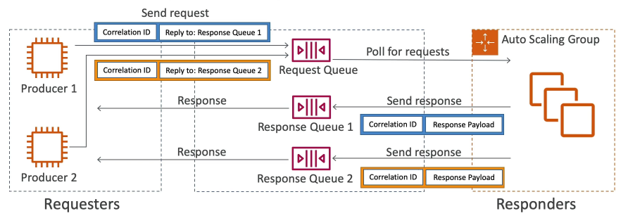
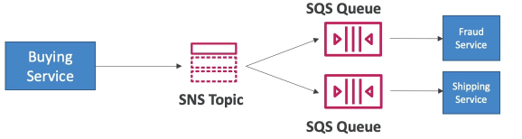

## 17 - SQS

## 175 - Messaging

Section Introduction

* Synchronous between applications can be problematic if there are sudden spikes of traffic
* What if you need to suddenly encode 1000 videos but usually it’s 10?

* In that case, It’s better to decouple your applications, 
  * using SQS: queue model 
  * using SNS: pub/sub model 
  * using Kinesis: real-time streaming model

* These services can scale independently from our application!

## 176 - SQS

Amazon SQS — Standard Queue

* Oldest offering (over 10 years o ld) 
* Fully managed service, used to decouple applications
* Attributes: 
  * Unlimited throughput, unlimited number of messages in queue 
  * Default retention of messages: 4 days, maximum of 14 days 
  * Low latency (<10 ms on publish and receive) 
  * Limitation of 256KB per message sent
* Can have duplicate messages (at least once delivery, occasionally)
* Can have out of order messages (best effort ordering)

SQS — Producing Messages

* Produced to SQS using the SDK (SendMessage API) 
* The message is persisted in SQS until a consumer deletes it 
* Message retention: default 4 days, up to 14 days
* Example: send an order to be processed
  * Order id 
  * Customer id 
  * Any attributes you want it
* SQS standard: unlimited throughput

SQS — Consuming Messages

* Consumers (running on EC2 instances, servers, or AWS Lambda)... 
* Poll SQS for messages (receive up to |0 messages at a time) 
* Process the messages (example: insert the message into an RDS database)
* Delete the messages using the DeleteMessage API

Amazon SQS - Security

* Encryption: 
  * In-flight encryption using HTTPS API 
  * At-rest encryption using KMS keys 
  * Client-side encryption if the client wants to perform encryption/decryption itself
* Access Controls: [IAM policies to regulate access to the SQS API
* SQS Access Policies (similar to $3 bucket policies) 
  * Useful for cross-account access to SQS queues 
  * Useful for allowing other services (SNS, S3...) to write to an SQS queue

## 179 - SQS — Message Visibility Timeout

* After a message is polled by a consumer, it becomes invisible to other consumers 
* By default, the ‘message visibility timeout’ is 30 seconds 
* That means the message has 30 seconds to be processed
* If a message is not processed within the visibility timeout, it will be processed twice
* A consumer could call the ChangeMessageVisibility API to get more time
* If visibility timeout is high (hours), and consumer crashes, re-processing will take time
* If visibility timeout is too low (seconds), we may get duplicates

## 180 - Amazon SOS — Dead Letter Queue

* If a consumer fails to process a message within the iL ite ee SQS Queue Visibility Timeout... the message goes back to the queue!
* We can set a threshold of how many times a message can go back to the queue
* After the MaximumReceives threshold is exceeded, the message goes into a dead letter queue (DLQ)
* Useful for debugging!
* Make sure to process the messages in the DLQ before they expire: 
  * Good to set a retention of 14 days in the DLQ

## 181 - SQS Request-Response
In this pattern the producer send the reply queue in the sending message so the responder use this information to send the message to the correct queue. This pattern uses the SQS Temporary Queue Client so the Queues are virtual and only kept for the application time.

* To implement this pattern: use the SOS Temporary Queue Client

## 182 - Amazon SQS — Delay Queue

* Delay a message (consumers don't see it immediately) up to 15 minutes 
* Default is O seconds (message is available right away)
* Can set a default at queue level
* Can override the default on send using the DelaySeconds parameter

## 183 - Amazon SOS — FIFO Queue

* FIFO = First In First Out (ordering of messages in the queue)
* Limited throughput: 300 msg/s without batching, 3000 msg/s with
* Exactly-once send capability (by removing duplicates)
* Messages are processed in order by the consumer
* The queue name has to end with .fifo

## 184 - SOS with Auto Scaling Group (ASG)

* Scale the amout of instances based on some queue metric
* The queue metric is a CloudWatch Custom Metric as Queue Lenght ou Number os Instances which triggers a CloudWatch Alarm and scale the ASG accordingly

## 185 - Amazon SNS

* The “event producer” only sends message to one SNS topic
* As many “event receivers’ (subscriptions) as we want to listen to the SNS topic notifications
* Each subscriber to the topic will get all the messages (note: new feature to filter messages)
* Up to 10,000,000 subscriptions per topic
* 100,000 topics limit
* Subscribers can be:
  * SQS
  * HTTP/ HTTPS (with delivery retries — how many times)
  * Lambda
  * Emails
  * SMS messages
  * Mobile Notifications

SNS integrates with a lot of AWS services

* Many AWS services can send data directly to SNS for notifications 
* CloudWatch (for alarms)
* Auto Scaling Groups notifications
* Amazon $3 (on bucket events)
* CloudFormation (upon state changes => failed to build, etc)

AWS SNS — How to publish

* Topic Publish (using the SDK) 
  * Create a topic 
  * Create a subscription (or many) 
  * Publish to the topic

* Direct Publish (for mobile apps SDK) 
  * Create a platform application 
  * Create a platform endpoint 
  * Publish to the platform endpoint 
  * Works with Google GCM, Apple APNS, Amazon ADM...

Amazon SNS — Security

* Encryption: 
  * In-flight encryption using HTTPS API 
  * At-rest encryption using KMS keys 
  * Client-side encryption if the client wants to perform encryption/decryption itself

* Access Controls: [AM policies to regulate access to the SNS API

* SNS Access Policies (similar to S3 bucket policies) 
  * Useful for cross-account access to SNS topics 
  * Useful for allowing other services ( $3...) to write to an SNS topic

## 186 - SNS and SQS - Fan Out

* Push once in SNS, receive in all SQS queues that are subscribers
* Fully decoupled, no data loss
* SQS allows for: data persistence, delayed processing and retries of work
* Ability to add more SQS subscribers over time
* Make sure your SQS queue access policy allows for SNS to write