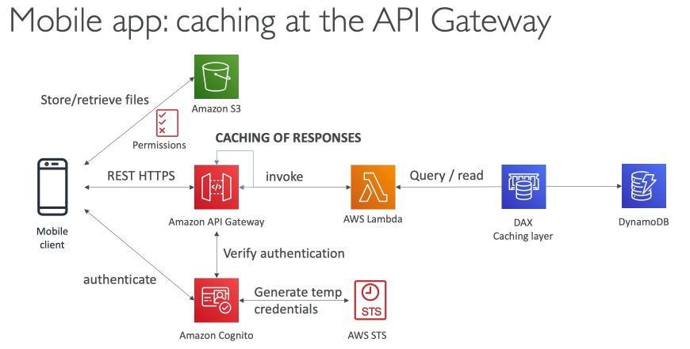
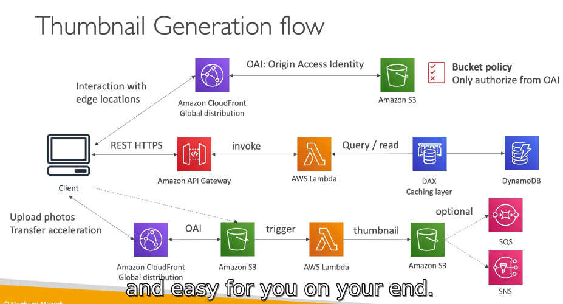
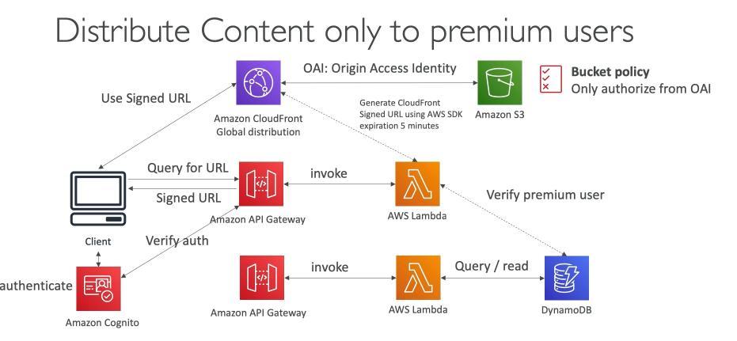
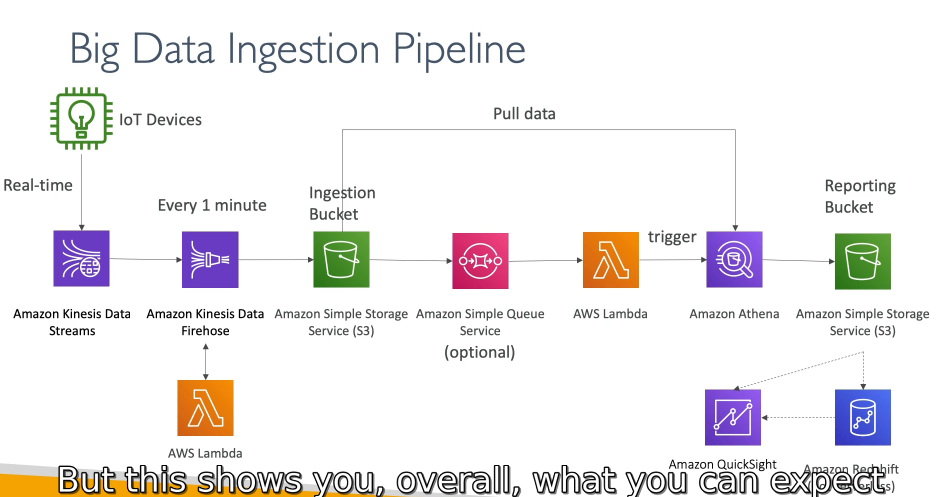

# 20 - Serverless Discussion

## 215 - Mobile application: My lodoList

* We want to create a mobile application with the following requirements
* Expose as REST API with HTTPS
* Serverless architecture
* Users should be able to directly interact with their own folder in $3 * Users should authenticate through a managed serverless service
* The users can write and read to-dos, but they mostly read them
* The database should scale, and have some high read throughput

* Serverless REST API: HTTPS, AP] Gateway, Lambda, DynamoDB
* Using Cognito to generate temporary credentials with STS to access S3 bucket with restricted policy.
* App users can directly access AWS resources this way. 
* Pattern can be applied to DynamoDB, Lambda...
* Caching the reads on DynamoDB using DAX 
* Caching the REST requests at the AP! Gateway level 
* Security for authentication and authorization with Cognito, STS

## 216 - Serverless hosted website: MyBlog.com

* This website should scale globally
* Blogs are rarely written, but often read
* Some of the website is purely static files, the rest is a dynamic REST API 
* Caching must be implement where possible
* Any new users that subscribes should receive a welcome email
* Any photo uploaded to the blog should have a thumbnail generated

* We've seen static content being distributed using CloudFront with $3
* The REST API was serverless, didn't need Cognito because public
* We leveraged a Global DynamoDB table to serve the data globally
* (we could have used Aurora Global Tables)
* We enabled DynamoDB streams to trigger a Lambda function
* The lambda function had an IAM role which could use SES
* SES (Simple Email Service) was used to send emails in a serverless way 
* S3 can trigger SQS / SNS / Lambda to notify of events

## 217 - Discussions on Micro Services

* You are free to design each micro-service the way you want 
* Synchronous patterns: API Gateway, Load Balancers 
* Asynchronous patterns: SQS, Kinesis, SNS, Lambda triggers (S3)

* Challenges with micro-services: 
  * repeated overhead for creating each new microservice, 
  * issues with optimizing server density/utilization 
  * complexity of running multiple versions of multiple microservices simultaneously 
  * proliferation of client-side code requirements to integrate with many separate services.

* Some of the challenges are solved by Serverless patterns: 
  * API Gateway, Lambda scale automatically and you pay per usage 
  * You can easily clone API, reproduce environments 
  * Generated client SDK through Swagger integration for the API Gateway

## 218 - Distributing paid content

* We sell videos online and users have to paid to buy videos
* Each videos can be bought by many different customers
* We only want to distribute videos to users who are premium users * We have a database of premium users
* Links we send to premium users should be short lived

* We have implemented a fully serverless solution:
* Cognito for authentication
* DynamoDB for storing users that are premium
* 2 serverless applications
  * Premium User registration
  * CloudFront Signed URL generator
* Content is stored in S3 (serverless and scalable)
* Integrated with CloudFront with OAI for security (users can't bypass)
* CloudFront can only be used using Signed URLs to prevent unauthorized users
* What about S3 Signed URL? They're not efficient for global access

## 220 - Big Data Ingestion Pipeline

* We want the ingestion pipeline to be fully serverless
* We want to collect data in real time
* We want to transform the data
* We want to query the transformed data using SQL
* The reports created using the queries should be in $3
* We want to load that data into a warehouse and create dashboards

Big Data Ingestion Pipeline discussion

* IoT Core allows you to harvest data from loT devices
* Kinesis is great for real-time data collection
* Firehose helps with data delivery to S3 in near real-time (| minute)
* Lambda can help Firehose with data transformations
* Amazon $3 can trigger notifications to SQS
* Lambda can subscribe to SQS (we could have connecter S3 to Lambda) e Athena is a serverless SOL service and results are stored in $3
* The reporting bucket contains analyzed data and can be used by reporting tool such as AWS QuickSight, Redshift, etc...