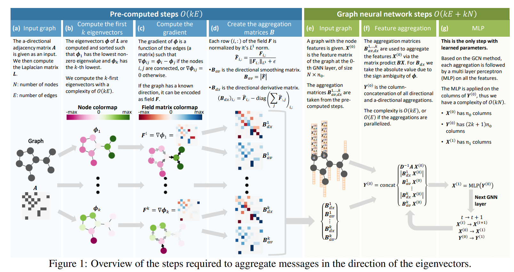
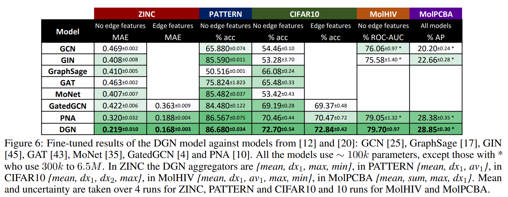

# Directional Graph Networks

https://arxiv.org/pdf/2010.02863.pdf

This paper points out some strategies to improve GNNs adding a laplacian preprocessor on the graph with directional structure to improve gnn performance. I don't quite understand what is a Laplacian Eigenvector but it generates reasonable good features to be used by the GNNs.

As stated in Figure 1 it's a pre-computed step with complexity related only to the edges dimension times the first k Eigenvector.

In Figure 6 it's possible to observe some results with much higher performance in some tasks as ZINC and Pattern

According to the results most of the results expected are from inputs that benefits from the directional proprieties as cited below:

> **Broader Impact**. This work will extend the usability of graph networks to all problems with engineering and physically
defined directions, thus making GNN a new laboratory for signal processing, physics, material science and molecular
and cell biology. In fact, the anisotropy present in a wide variety of systems could be expressed as vector fields
(spinor, tensor) compatible with the DGN framework, without the need of eigenvectors. One example is magnetic
anisotropicity in metals, alloys and organic molecules that is dependant on the relative orientation to the magnetic field.
Other examples are the response of materials to high electromagnetic fields; all kind of field propagation in crystals
lattices (vibrations, heat, shear and frictional force, young modulus, light refraction, birefringence); multi-body or liquid
motion; magnons and solitons in different media, fracture propagation, traffic modelling; developmental biology and
embryology, and design of novel materials and constrained structures. Finally applications based on neural operators
for ODE/PDE may benefit as wel