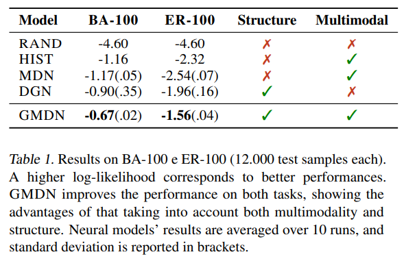

# Graph Mixture Density Networks

https://arxiv.org/pdf/2012.03085.pdf

Once again in a very short span of time Mixture of Experts is cited in a paper I've picked.

> The problem of training a network to output a conditional
multimodal distribution, i.e., a distribution with one or more
modes, has been studied for 30 years. The Mixture of
Experts (MoE) model (Jacobs et al., 1991; Jordan & Jacobs, 1994) is one of the first proposals that can achieve the goal,
even though it was originally meant for a different purpose.
The MoE consists of a multitude of neural networks, also
called local experts, each being expected to solve a specific
sub-task. In addition, an MoE uses a gating network to
weigh the local experts’ contributions for each input. This
way, the model selects the experts that are most likely to
make the correct prediction. The overall MoE output is then
the weighted combination of the local experts’ outputs;

MDNs look like simpler MoE, simply sharing an encoding steps across experts

>The Mixture Density Network (MDN) of Bishop (1994),
instead, reduces the computational burden of training an
MoE while allowing the different experts, now called subnetworks, to cooperate. An MDN is similar to an MoE
model, but it has subtle differences. First, the input is transformed into a hidden representation that is shared between
simpler sub-networks, thus increasing the overall efficiency.
Secondly, this representation is used to produce the gating
weights as well as the parameters of the different output
distributions. Hence, the initial transformation should encode all the information needed to solve the task into said
representation. As the computational costs of processing the
input grow, so does an MDN’s efficiency compared to an
MoE. This is even more critical when the input is structured,
such as a sequence or a graph, as it requires more resources
to be processed

There's citation that might be useful for reference in my thesis work by the end of related work.
> There is an increasingly
growing literature on the topic which is not covered in this
work, so we refer the reader to recent introductory texts
and surveys (Bronstein et al., 2017; Battaglia et al., 2018;
Bacciu et al., 2020b; Wu et al., 2020).

The evaluation step is well detailed. The particular approaches can be highlited below:

* train/dev/test 80/10/10
* holdout strategy
* specification of metric of interest
* avoiding (un)lucky random initializations average over ten runs

> Evaluation Setup. We assess the performance of different models using a holdout strategy for all datasets
(80%/10%/10% split). Given the size of the datasets, we
believe that a simple holdout is sufficient to assess the performances of the different models considered. To make
the evaluation even more robust for the epidemic datasets,
different simulations about the same graph cannot appear
in both training and test splits. The metric of interest is the
log-likelihood of the data (log L), which captures how well
we can fit the target distribution and the model’s uncertainty
with respect to a particular output value. We also report the
Mean Average Error (MAE) on the real-world benchmarks
for completeness. However, the MAE does not reflect the
model’s uncertainty about the output, as we will show.
We perform model selection via grid search for all the models presented. For each of them, we select the best configuration on the validation set using early stopping with patience
(Prechelt, 1998). Then, to avoid an unlucky random initialization of the chosen configuration, we average the model’s
performance on the unseen test set over ten final training
runs. Similarly to the model selection phase, in these final training runs we use early stopping on a validation set
extracted from the training set (10% of the training data).

Another cool thing to point out is that they used grid search to find out the best parameters and they are all present in a neat format as can be seen below:

> * MDN: C ∈ {2,3,5}, hidden units per convolution ∈
{64}, neighborhood aggregation ∈ {sum}, graph readout ∈ {sum, mean}, α ∈ {1
C , 1.05C }, epochs ∈
{2500}, Φi ∈ {Linear model}, Adam Optimizer with
learning rate ∈ {0.0001}, full batch, patience ∈ {30}.
> * GMDN: C ∈ {3,5}, graph convolutional layers ∈
{2,5,7}, hidden units per convolution ∈ {64}, neighborhood aggregation ∈ {sum}, graph readout ∈ {sum,
mean}, α ∈ {1
C , 1.05C }, epochs ∈ {2500}, Φi ∈
{Linear model}, Adam Optimizer with learning rate ∈
{0.0001}, full batch, patience ∈ {30}.
> * DGN: same as GMDN but C ∈ {1} (that is, it outputs
a unimodal distribution).

They also point out that even that the number of epochs is high an early stopping strategy is applied as regularization technique.

> Note that we kept the maximum number of epochs intentionally high as we use early stopping to halt training.

In Table 1 the results are presented neatly with average and standard deviation.

