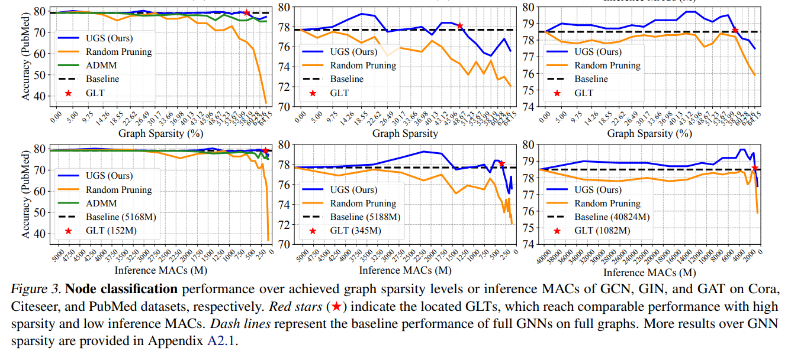

# A Unified Lottery Ticket Hypothesis for Graph Neural Networks

https://arxiv.org/pdf/2102.06790.pdf

They start the paper with an interesting abstract proposing prunning of adjacency matrix to improve performance on node classification and link prediction tasks on large graphs.

> Existing network weight pruning algorithms cannot address the main space and
computational bottleneck in GNNs, caused by
the size and connectivity of the graph. To this
end, this paper first presents a unified GNN sparsification (UGS) framework that simultaneously
prunes the graph adjacency matrix and the model
weights, for effectively accelerating GNN inference on large-scale graphs. (...)  Specifically, for node classification,
our found GLTs achieve the same accuracies with
20% ∼ 98% MACs saving on small graphs and
25% ∼ 85% MACs saving on large ones. For link
prediction, GLTs lead to 48% ∼ 97% and 70%
MACs saving on small and large graph datasets,
respectively, without compromising predictive
performance. 

The Intro is well cited of interesting papers that might be useful for my thesis

> Graph Neural Networks (GNNs) (Zhou et al., 2018; Kipf
& Welling, 2016; Chen et al., 2019; Velickovi ˇ c et al. ´ , 2017)
have established state-of-the-art results on various graphbased learning tasks, such as node or link classification (Kipf
& Welling, 2016; Velickovi ˇ c et al. ´ , 2017; Qu et al., 2019;
Verma et al., 2019; Karimi et al., 2019; You et al., 2020d;c),
link prediction (Zhang & Chen, 2018), and graph classification (Ying et al., 2018; Xu et al., 2018; You et al., 2020b).
GNNs’ superior performance results from the structureaware exploitation of graphs. To update the feature of
each node, GNNs first aggregate features from neighbor
connected nodes, and then transform the aggregated embeddings via (hierarchical) feed-forward propagation.

> Graph Neural Networks. There are mainly three categories of GNNs (Dwivedi et al., 2020): i) extending original
convolutional neural networks to the graph regime (Scarselli
et al., 2008; Bruna et al., 2013; Kipf & Welling, 2016; Hamilton et al., 2017); ii) introducing anisotropic operations on
graphs such as gating and attention (Battaglia et al., 2016;
Monti et al., 2017; Velickovi ˇ c et al. ´ , 2018), and iii) improving upon limitations of existing models (Xu et al., 2019;
Morris et al., 2019; Chen et al., 2019; Murphy et al., 2019).
Among this huge family, Graph Convolutional Networks
(GCNs) are widely adopted, which can be categorized as
spectral domain based methods (Defferrard et al., 2016;
Kipf & Welling, 2016) and spatial domain bases methods
(Simonovsky & Komodakis, 2017; Hamilton et al., 2017).

The results don't increse the model performance greatly, but since the graphs are prunned the model training is accelerated. Depeding on the model used the sparsity achieved can go from 5-95%