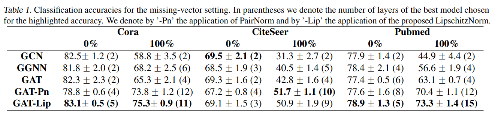
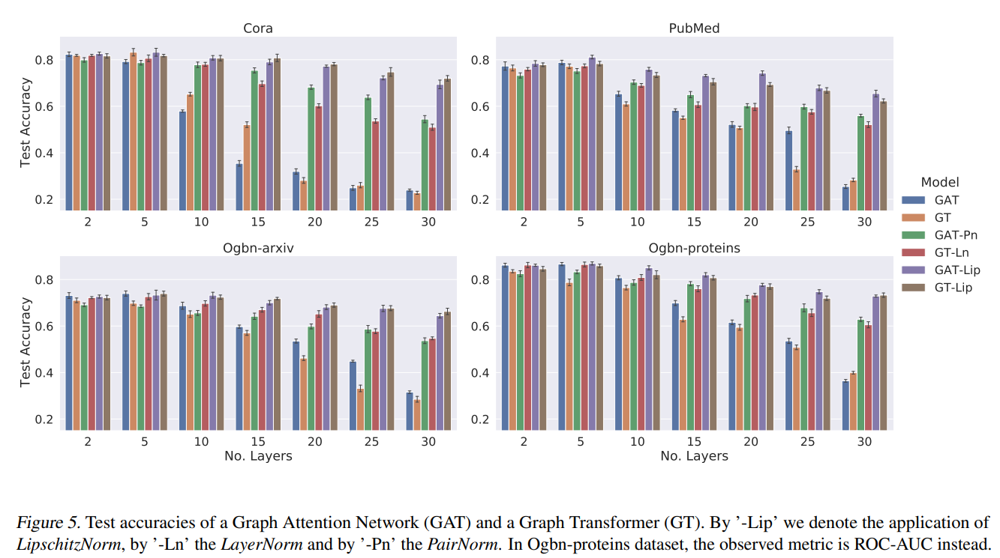

# Lipschitz Normalization for Self-Attention Layers with Application to Graph Neural Networks

https://arxiv.org/pdf/2103.04886.pdf

This paper describes the *LipschitzNorm* layer focused on normalizing exploding gradients problems on GATsof long-range dependencies. It proves that the regular GAT implementation has exploding gradients due to the lack of Lipschitz continuity, explains the theory behind it, implement a *LipischitzNorm* layer whith has no parameters and show improved results on several previous works using GATs.

The results point out an improvement in the range of 1-10% simply sy using this normalization in most of the tasks.

Althoug many of the results don't have long-term dependencies and the increasing number of layers in GATs harms the model accuracy it's clear that the *LipschitzNorm* has great benefit of being used.