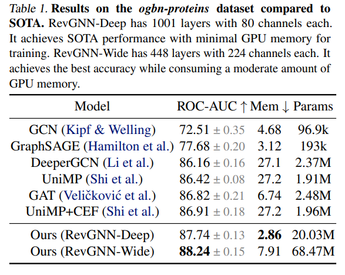

# Training Graph Neural Networks with 1000 Layers

https://arxiv.org/pdf/2106.07476.pdf

Here we have some graph databases that might be useful for comparison or citation in thesis.
> GNNs have shown a lot of promise on recent large-scale
graph datasets such as Benchmarking GNNs (Dwivedi et al.,
2020), Open Graph Benchmark (OGB) (Hu et al., 2020;2021) and Microsoft Academic Graph (MAG) (Wang et al.,2020). Recent works (Li et al., 2019; 2020; Chen et al.,2020) have successfully trained deep models with a large number of parameters and achieved state-of-the-art performance.

And here we have some normalization and regularization techniques that seems quite appropriate for modeling.
> Researchers have also studied different normalization and
regularization techniques such as DropEdge (Rong et al.,
2020), DropConnect (Hasanzadeh et al., 2020), PairNorm
(Zhao & Akoglu, 2019), weight normalization (Oono &
Suzuki, 2019), differentiable group normalization (Zhou
et al., 2020), and GraphNorm (Cai et al., 2020). Another line
of work (Wu et al., 2019; Klicpera et al., 2019; Bojchevski
et al., 2020; Liu et al., 2020; Frasca et al., 2020) proposes
an efficient propagation scheme to avoid stacking layers
by incorporating multi-hop information into a single GNN
layer via K-th power adjacency matrices or personalized
PageRank diffusion matrices.

They introduce a concept of equilibrium state which could be translated into a single layer represeting infinity layers, where its update goes forever until an equilibrium state is reached.
>Deep Equilibrium GNNs. An alternative way to train
weight-tied GNNs with O(ND) memory consumption is to
use implicit differentiation (Scarselli et al., 2008; Bai et al.,
2019), which assumes that the network can reach an equilibrium state.

They have some huge models with excelent results (given the restrictions)

As expected there's no free lunch. The ability to train huge models without large clusters comes in time costs.
>Larger and deeper models incur a cost in terms of training and inference time. RevGNN-Deep and RevGNN-Wide take 13.5 days and 17.1
days, respectively, to train for 2000 epochs on a single
NVIDIA V100. Nonetheless, it is affordable for accuracycritical applications in scientific research such as predicting
protein structures (Senior et al., 2020).