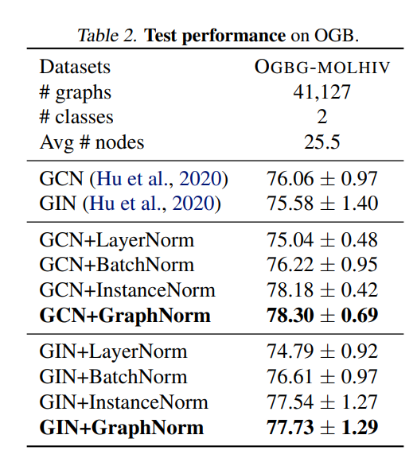

# GraphNorm: A Principled Approach to Accelerating Graph Neural Network Training

https://arxiv.org/pdf/2009.03294.pdf

Yet another normalizing approach on GNNs. It implies that normalizing data is benefitial to model generalization as other machine learning approaches. It states that the best normalization approach is domain dependant and show some results improvements on graph benchmarks with GCN and GIN

We can see improvements up to 3% but also deterioration in some normalization approaches.