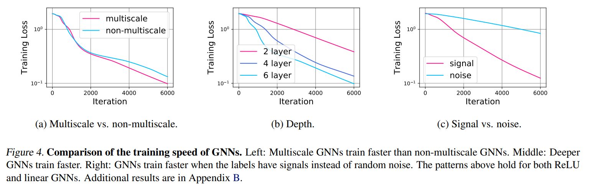

# Optimization of Graph Neural Networks: Implicit Acceleration by Skip Connections and More Depth

https://arxiv.org/pdf/2105.04550.pdf

This paper focus on theoretical analysis of GNNs. It's main observations are below (as well as in the title):

>We then study what may affect the training speed of GNNs.
First, for any fixed depth, GNNs with skip connections train
faster. Second, increasing the depth further accelerates the
training of GNNs. Third, faster training is obtained when the
labels are more correlated with the graph features, i.e., labels
contain “signal” instead of “noise”. Overall, experiments
for nonlinear GNNs agree with the prediction of our theory
for linearized GNNs

Summarizing:

1) Skip Connections are better in any given fixed depth. It allows for the network to control its smoothing as the learning proceeds.
2) Adding depth to the network yields to better results. It agrees with the 1000 layers work.
3) GNNs work better on data which its structure is relevant for the given task. So the more the structure is relevant for the task the better GNNs will perform.

It's very theoretical and strongly consistent on the mathematical proofs and empiricla results.