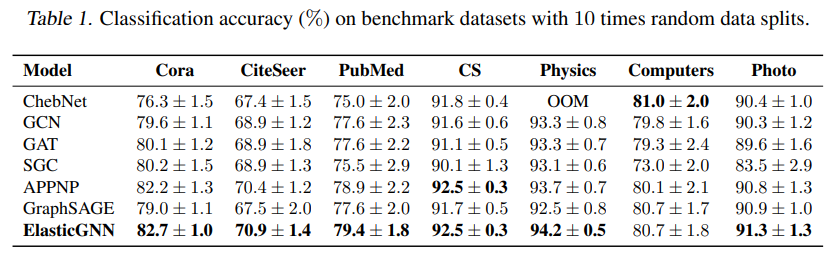

# Elastic Graph Neural Networks

http://proceedings.mlr.press/v139/liu21k/liu21k.pdf

It proposes a controllable norm between l1 and l2, like ElasticNet

Among the Datsets used they cite
> two co-purchase graphs, i.e., Amazon Computers and Amazon Photo (Shchur et al., 2018)

> Shchur, O., Mumme, M., Bojchevski, A., and Gunnemann, ¨
S. Pitfalls of graph neural network evaluation. arXiv
preprint arXiv:1811.05868, 2018.

that might be useful to my thesis.

Table 1 shows amazing results outperforming classical networks in almost all situations.