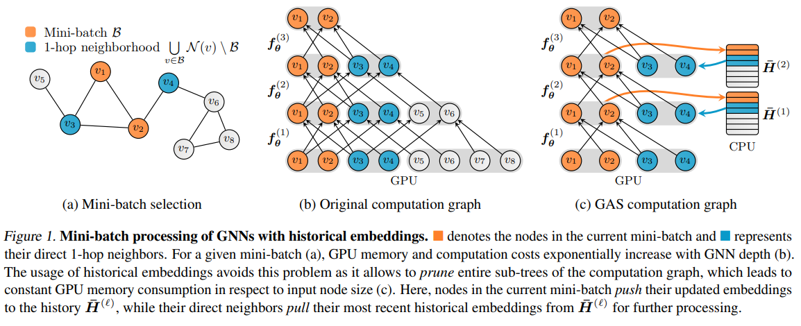
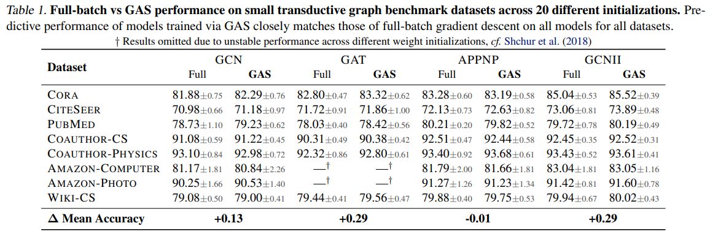
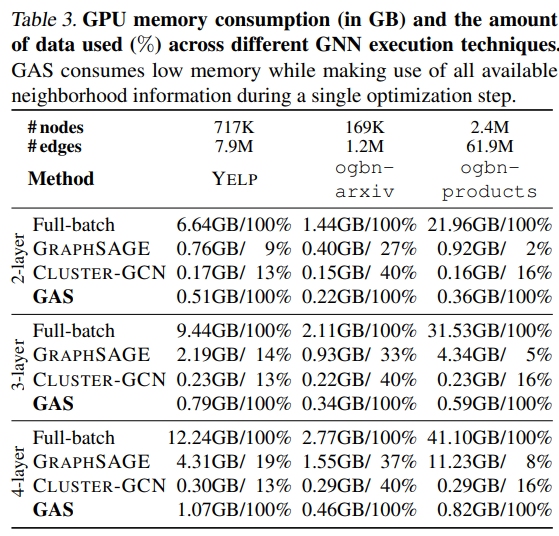

# GNNAutoScale: Scalable and Expressive Graph Neural Networks via Historical Embeddings

https://arxiv.org/pdf/2106.05609.pdf

> Here, we propose the GNNAutoScale (GAS) framework that
disentangles the scalability aspect of GNNs from their underlying message passing implementation. GAS revisits and
generalizes the idea of historical embeddings (Chen et al.,
2018b), which are defined as node embeddings acquired in
previous iterations of training, cf. Figure 1. For a given minibatch of nodes, GAS prunes the GNN computation graph so
that only nodes inside the current mini-batch and their direct
1-hop neighbors are retained, independent of GNN depth.
Historical embeddings act as an offline storage and are used
to accurately fill in the inter-dependency information of
out-of-mini-batch nodes, cf. Figure 1c. Through constant
memory consumption in respect to input node size, GAS
is able to scale the training of GNNs to large graphs, while
still accounting for all available neighborhood information

This paper introduces a framework that learns partially from historical embeddings while prunning excessive computation from neighbors. 

Their results also point that this approach is better than all implementations in the benchmarks.

It looks both promissing and scalable to be used in my thesis. There are some references to historical embeddings that I'll add to the reading list as well. Either the scalability and the historical embeddings might be arguments to answer "when should we forget about an item preference?".