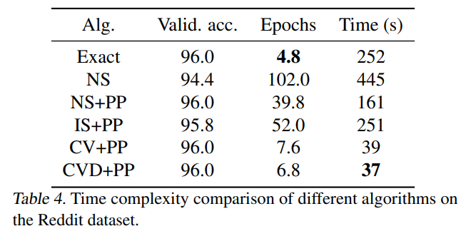

# Stochastic Training of Graph Convolutional Networks with Variance Reduction

https://arxiv.org/pdf/1710.10568.pdf

> Graph convolutional networks (GCNs) are powerful deep neural networks for graph-structured data.
However, GCN computes the representation of a
node recursively from its neighbors, making the
receptive field size grow exponentially with the
number of layers. Previous attempts on reducing
the receptive field size by subsampling neighbors
do not have a convergence guarantee, and their
receptive field size per node is still in the order
of hundreds. In this paper, we develop control
variate based algorithms which allow sampling
an arbitrarily small neighbor size. Furthermore,
we prove new theoretical guarantee for our algorithms to converge to a local optimum of GCN.
Empirical results show that our algorithms enjoy
a similar convergence with the exact algorithm
using only two neighbors per node. The runtime
of our algorithms on a large Reddit dataset is only
one seventh of previous neighbor sampling algorithms.

Given a large dataset with 2nd order neighbors that exponentially grow this technique might produce good results much quicker than other solutions.