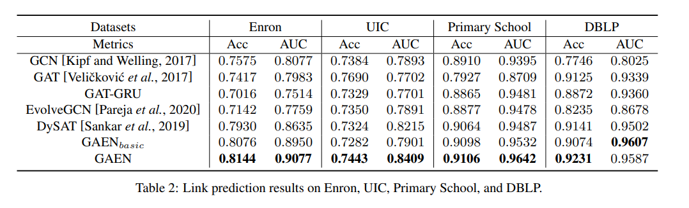

# GAEN: Graph Attention Evolving Networks

https://www.ijcai.org/proceedings/2021/0213.pdf

> In reality, most real-world networked systems are in an evolving process [Fournier-Viger et al., 2020], where network nodes and structures are continuously changing over time.

>  in addition to the structural node relationships observed from the most recent static network, the correlations between the current network with all its historical networks within a temporal sequence can be modeled to enhance the representation learning of dynamic networks.

> To capture network dynamics, existing methods typically impose some regularization/constrain on embedding learning of networks at different time steps. For example, in the literature [Seo et al., 2018; Manessi et al., 2020], Long Short-Term Memory (LSTM) networks are used to model a sequence of temporal networks, i.e., each node can utilize its past node features for enriched embedding learning, where the static network at each time step is modeled by independent Graph Convolutional Networks (GCN) [Kipf and Welling, 2017]. Similarly, dynamic attention network [Sankar et al., 2019] is also proposed to capture temporal dynamics where each node can use its historical representations, while each static network is modeled based on a respective Graph Attention Networks (GAT) [Velickovi ˇ c´ et al., 2017]. Despite both network dynamics and structures can be preserved, above methods fail to consider the following two attractive properties of dynamic
networks:
> * Similar Network Topologies: While a network Gt at time t evolves to network Gt+1 at time (t + 1), the network topologies between Gt and Gt+1 are usually similar. Instead of learning the two networks independently, weights of the learning model (e.g., GCN) for Gt can be evolved to the model for Gt+1, thereby making the training across all temporal networks more efficient.
> * Temporal Variation Patterns: While a network changes over time, nodes would demonstrate some temporal variation (e.g., change of local structures) patterns, i.e., adding or removing a link with a neighborhood, observed from a fixed number of sequential evolution steps. Such pattern information can be explicitly modeled in that nodes with similar patterns being close in the embedding space.

> The objective of this paper is to map graph Gt ∈ G to a low-dimensional embedding space Ot ∈ R |Vt|×h while taking all its historical graphs G1, G2, · · · , Gt−1 into consideration. It is worth noting that node sets of underlying graphs may be different. In this case, we are able to uniform node sets of these graphs by aligning them to the largest graph with maximum number of nodes n. Therefore, in the following we assume that adjacency matrices for graphs at different time steps have the same size n × n. In this work, we focus on evolving the graph attention networks to capture the dependency relationships across all input graphs and meanwhile explicitly preserve node variation or changing patterns derived from the temporal graph evolution sequence.

The results seem interesting but checking the github repository didn't quickly point me out their implementation which could be a problem to use it as-is. The github repo is at <https://github.com/codeshareabc/GAEN>