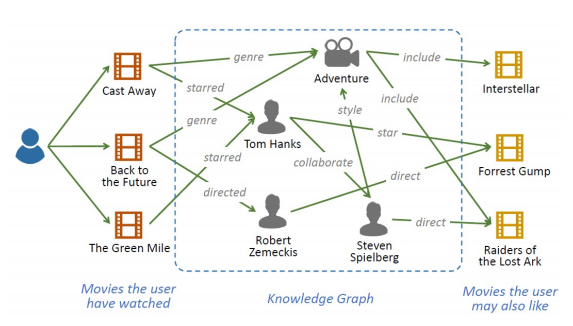
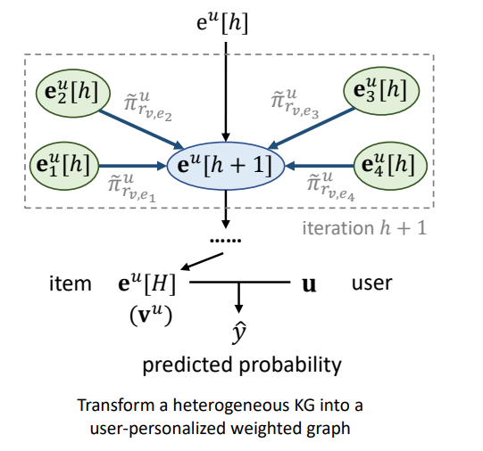
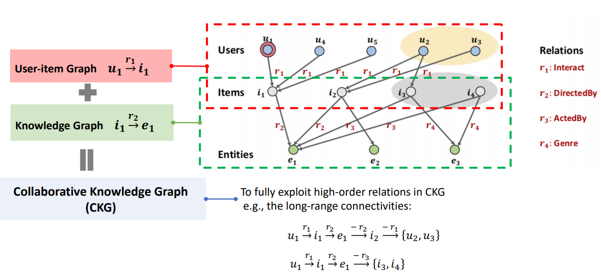

# Graph Neural Networks for Recommendations

https://advanced-recommender-systems.github.io/ijcai2021-tutorial/ijcai2021/RecSys_IJCAI_GNNs.pdf

IJCAI 2021 Presentation. Most of slides up to 51 summarizes more simpler ways to use Matrix Factorization and GCNs to build recommender systems.

There are two Knowledge Graphs implementations which are interesting to discuss:

1) Knowledge Graph Convolutional Networks for Recommender Systems with Label Smoothness Regularization (KDD’19 and WWW’19)

In this approach each user creates a user-personalized weighted graph. 

2) KGAT: Knowledge Graph Attention Network for Recommendation (KDD’19)

Uses an Collaborative Knowledge Graph to build long term relations and learn from it.