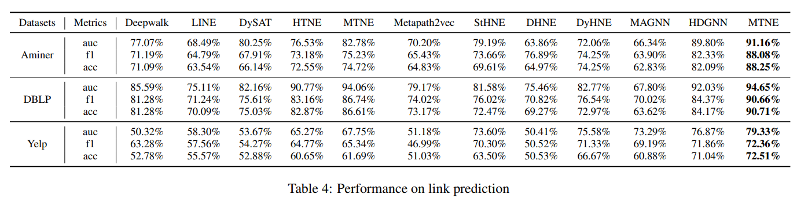
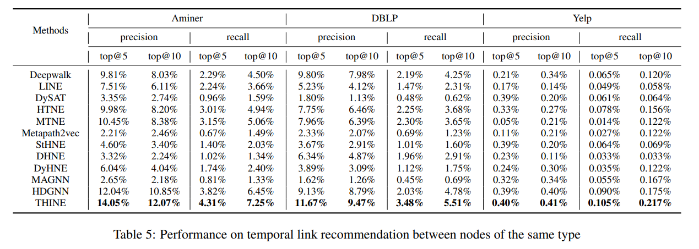

# Temporal Heterogeneous Information Network Embedding

https://www.ijcai.org/proceedings/2021/0203.pdf

> THINE not only uses attention mechanism and
meta-path to preserve structures and semantics in
HIN but also combines the Hawkes process to
simulate the evolution of the temporal network.
Our extensive evaluations with various real-world
temporal HINs demonstrate that THINE achieves
the SOTA performance in both static and dynamic
tasks, including node classification, link prediction,
and temporal link recommendation.

> how to capture the temporal influence between heterogeneous nodes?

> (Static) Link prediction. (...) We can observe that THINE outperforms all the baselines,
and most dynamic methods have a good effect on link prediction, which further indicates that temporal information helps
extract the structures and semantics of temporal HINs.

> Temporal link recommendation. We do a temporal link
recommendation experiment to test dynamic effectiveness.
Especially, we train all the methods on HINs before time
t. Then we make recommendations after time t. For each
dataset, the first 80% of the period is used for training while remaining as a test set. Using negative squared Euclidean
distance, we predict the top-5, 10 (top-2, 4) connection after
time t for test nodes. We then estimate results with precision
and recall.

> Currently, there is an increasing trend that focuses on temporal HIN embedding. Most of such works use meta-path
to capture semantics in HIN and divide time into snapshots
to obtain node embeddings, like DHNE [Yin et al., 2019],
Change2vec [Bian et al., 2019], and DyHNE [Wang et al.,
2020]. Besides, HDGAN [Li et al., 2020] takes advantage
of time-level attention mechanism to simulate network evolution. Furthermore, a few semi-supervised methods are designed for HIN, such as static method MAGNN [Fu et al.,
2020] and dynamic model HDGNN [Zhou et al., 2020], but
there is still a lack of deep methods for temporal HINs. Moreover, none of them considers the dynamics of network evolution and multi-types node embeddings simultaneously.