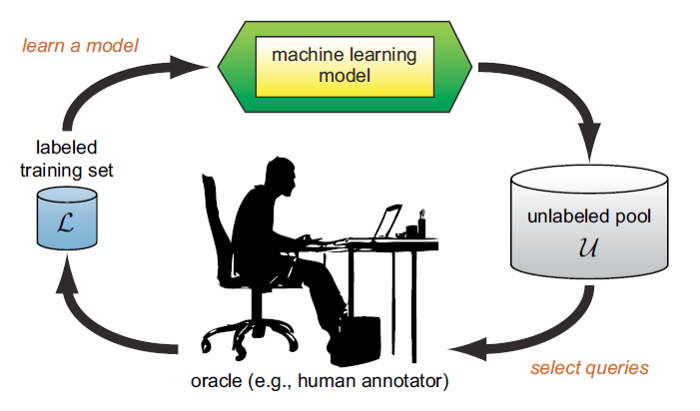

# The True Sample Complexity of Active Learning

https://www.cs.cmu.edu/~ninamf/papers/true-active-journal.pdf

This is a theoretical paper talking about limits of the Active Learning techniques. It's fairly old for the fild (~2015) but provides lots of math limits not present elsewhere.

Active Learning compass techniques that iteratively tries to selecte the most informative samples. Given the model and data restrictions there are several options available. This study brings some equations to decide weather a classifier can be e-good classifier and how many labels are needed for it.

## Active Learning Sampling Strategies

https://medium.com/@hardik.dave/active-learning-sampling-strategies-f8d8ac7037c8

These sampling strategies are categorized as shown below :
1) Committee-based Strategies - Train a comittee of models to vote
    1) **Query by Committee (QBC)**: Several models (of the same type of varying hyperparameters, or diferent strategies) trained on the same data vote on which samples they agree and which they don't. The sample that is most disagreed is sent to the oracle for further investigation. The disagreement can be the variance in regression models.
    $$x^*_{VE} = argmax - \sum{\frac{V(y_i)}{\#C}}log\frac{V(y_i)}{\#C}$$
    2) **Entropy-based Query by Bagging (EQB)**: The model is trained on a single model with k folds created with "draw with replacement" (i.e., the same sample can be drawn multiple times). For every unlabeled data sample, k labels are provided which is predictions by k different models. These predictions can be seen as probability-based output.
    3) **Adaptive Maximum Disagreement (AMD)**: The models are constructed on different subsets of features providing more divergence in the model’s discriminative ability. 
2) Large margin-based Strategies - Used with SVMS
   1) **Margin Sampling (MS)**: Obtain the data samples having distance 1 from the decision boundary. It only outputs 1 sample at a time.
   2) **Multiclass Level Uncertainty (MCLU)**: Focus on multi-class setting. Obtain samples using all the decision boundaries x all the classes.
   3) **Margin Sampling-closest Support Vectors (MS-cSV)**: 
3) Posterior probability-based Strategies

## Active Learning: Curious AI Algorithms

https://www.datacamp.com/community/tutorials/active-learning

Provides a simple example of how to implement Active Learning in Python with a human as a Oracle. The Steps consist of:
0) Gather the data
1) Label the seed dataset. This one could be a single sample or a random sample to train an initial model
2) Train the model on the labeled data. With the model trained 
3) Choose unlabeled samples from the pool given a criteria
4) Repeat steps 2 and 3 until a **Stopping Criteria** is achieved. This could be number of instances queried or performance improvement/stagnation adding samples

