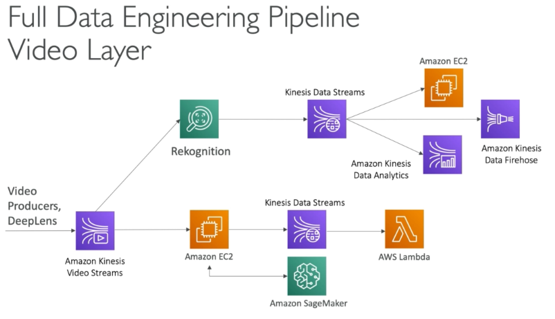

# Data Engineering

S3: Objects, Policies, and Access Control Lists
AWS Kinesis: 

## Kinesis Streams

* Producer:
  * 1MB/s or 1000 messages/s at write PER SHARD
  * “Provisioned ThroughputException”’ otherwise 
* Consumer Classic:

  * 2MB/s at read PER SHARD across all consumers
  * 5 API calls per second PER SHARD across all consumers 
* Data Retention:
  * 24 hours data retention by default 
  * Can be extended to 7 days

## Kinesis Data Firehose

* Fully Managed Service, no administration
* Near Real Time (60 seconds latency minimum for non full batches)
* Data Ingestion into Redshift / Amazon S3 / ElasticSearch / Splunk
* Automatic scaling
* Supports many data formats
* Data Conversions from CSV / JSON to Parquet / ORC (only for S3)
* Data Transformation through AWS Lambda (ex: CSV => JSON)
* Supports compression when target is Amazon S3 (GZIP ZIP and SNAPPY)

* Streams 
  * Going to write custom code (producer / consumer) 
  * Real time (\~200 ms latency for classic, ~70 ms latency for enhanced fan-out) 
  * Must manage scaling (shard splitting / merging) 
  * Data Storage for 1 to 7 days, replay capability, multi consumers
  * Used to build real time data pipelines

* Firehose 
  * Ingestion service
  * Fully managed, send to s3, Splunk, Redshift, ElasticSearch 
  * Serverless data transformations with Lambda 
  * Near real time (lowest buffer time is 1 minute) 
  * Automated Scaling 
  * No data storage

## Kinesis Data Analytics
* Use cases 
  * Streaming ETL: select columns, make simple transformations, on streaming data 
  * Continuous metric generation: live leaderboard for a mobile game 
  * Responsive analytics: look for certain criteria and build alerting (filtering)

* Features 
  * Pay only for resources consumed (but it's not cheap) 
  * Serverless; scales automatically 
  * Use IAM permissions to access streaming source and destination(s) 
  * SQL or Flink to write the computation 
  * Schema discovery 
  * Lambda can be used for pre-processing

* Machine Learning on Kinesis Data Analytics
  * RANDOM_CUT_FOREST
    * SQL function used for anomaly detection on numeric columns in a stream
    * Example: detect anomalous subway ridership during the NYC marathon
    * Uses recent history to compute model
  * HOTSPOTS
    * locate and return information about relatively dense regions in your data
    * Example: a collection of overheated servers in a data center

## Kinesis Video Stream
* Producers:
  * security camera, body-worn camera, AWS DeepLens, smartphone camere audio feeds, images, RADAR data, RTSP camera.
  * One producer per video stream 
* Video playback capability 
* Consumers 
  * build your own (MXNet, Tensorflow)
  * AWS SageMaker 
  * Amazon Rekognition Video
  * Keep data for 1 hour to 10 years

## Kinesis Summary — Machine Learning
* Kinesis Data Stream: create real-time machine learning applications 
* Kinesis Data Firehose: ingest massive data near-real time 
* Kinesis Data Analytics: real-time ETL / ML algorithms on streams
* Kinesis Video Stream: real-time video stream to create ML applications

## Glue ETL - Transformations

* Bundled Transformations: 
  * DropFields, DropNullFields — remove (null) fields 
  * Filter — specify a function to filter records 
  * Join — to enrich data 
  * Map - add fields, delete fields, perform external lookups

* Machine Learning Transformations: 
  * FindMatches ML: identify duplicate or matching records in your dataset, even when the records do not have a common unique identifier and no fields match exactly.

## AWS Data Stores for Machine Learning
* Redshift:
  * Data Warehousing, SQL analytics (OLAP - Online analytical processing)
  * Load data from S3 to Redshift
  * Use Redshift Spectrum to query data directly in,S3 (nq loading)
* RDS, Aurora:
  * Relational Store, SQL (OLTP - Online Transaction Processing)
  * Must provision servers in advance
* DynamoDB:
  * NoSOL data store, serverless,provision read/write capacity
  * Useful to store a machine learning model served by your application
* S3:
  * Object storage
  * Serverless, infinite storage
  * Integration with most AWS Services
* ElasticSearch:
  * Indexing of data
  * Search amongst data points
  * Clickstream Analytics
* ElastiCache: 
  * Caching mechanism
  * Not really used for Machine Learning

## AWS Data Pipeline vs Glue
* Glue: 
  * Glue ETL - Run Apache Spark code, Scala or Python based, focus on the ETL 
  * Glue ETL - Do not worry about configuring or managing the resources 
  * Data Catalog to make the data available to Athena or Redshift Spectrum
* Data Pipeline: 
  * Orchestration service 
  * More control over the environment, compute resources that run code, & code 
  * Allows access to EC2 or EMR instances (creates resources in your own account)
* Batch:
  * For any computing job regardless of the job (must provide Docker image)
  * Resources are created in your account, managed by Batch
  * For any non-ETL related work, Batch is probably better
* AWS DMS:
  * Continuous Data Replication
  * No data transformation
  * Once the data is in AWS, you can use Glue to transform it

## DMS — Database Migration Service
* Quickly and securely migrate databases to AWS, resilient, self healing
* The source database remains available during the migration
* Supports: 
  * Homogeneous migrations: ex Oracle to Oracle 
  * Heterogeneous migrations: ex Microsoft SQL Server to Aurora 
  * Continuous Data Replication using CDC
* You must create an EC2 instance to perform the replication tasks

## AWS Step Functions

* Use to design workflows 
* Easy visualizations
* Advanced Error Handling and Retry mechanism outside the code
* Audit of the history of workflows 
* Ability to ‘Wait’ for an arbitrary amount of time 
* Max execution time of a State Machine is 1 year

## Pipelines

