# The Machine Learning Project Lifecycle

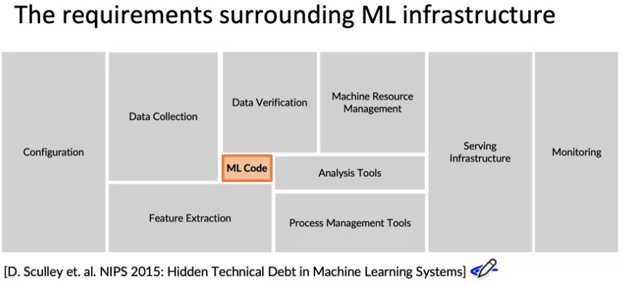

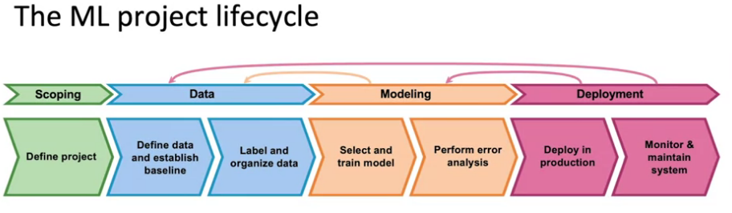

* Scoping:
  * Decide to work on speech recognition for voice search. 
  * Decide on key metrics: 
    * Accuracy, latency, throughput
  * Estimate resources and timeline
* Define data
  * ls the data labeled consistently?
  * How much silence before/after each clip?
  * How to perform volume normalization?

* Research/Academia
  * Fixed Hyperparameters and Data
  * Changes in Code (algorithm/model)
* Product Team
  * Fixed Hyperparameters and Code
  * Changes in Data
* Error Analysis can point out where to improve the data

* Deployment
* Concept or Data Drift

## Data Agumentation
* Goal:

Create realistic examples that (i) the algorithm does poorly on, but (ii) humans (or other baseline) do well on

Can adding data hurt performance?

For unstructured data problems, if: e The model is large (low bias). e The mapping x -> y is clear (e.g., given only the input x, humans can make accurate predictions).

Then, adding data rarely hurts accuracy.

In other hand adding data to structured data is usually hard and could be done creating new features that make sense to the problem, in other words, feature engineering.

## Experiment tracking

* What to track?
  * Algorithm/code versioning
  * Dataset used
  * Hyperparameters
  * Results

* Tracking tools
  * Text files (doesn't scale well)
  * Spreadsheet
  * Experiment tracking system

* Desirable features
  * Information needed to replicate results
  * Experiment results, ideally with summary metrics/analysis
  * Perhaps also: Resource monitoring, visualization, model error analysis

## Good data:

* Covers important cases (good coverage of inputs x)
* Is defined consistently (definition of labels y is unambiguous)
* Has timely feedback from production data (distribution 
* covers data drift and concept drift)
* Is sized appropriately

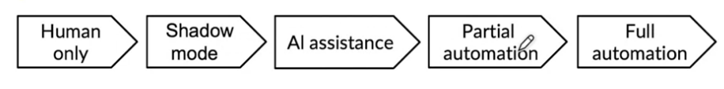

## Quiz

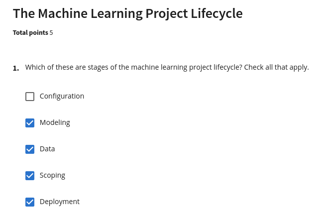
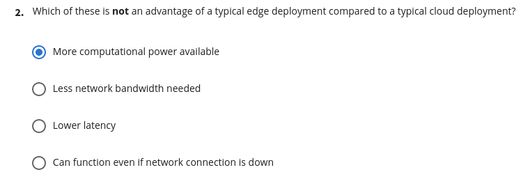
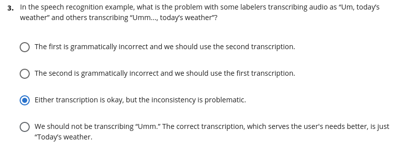
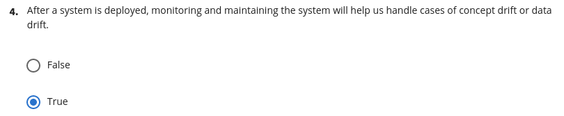
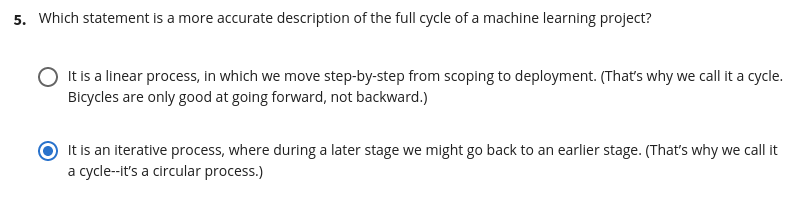

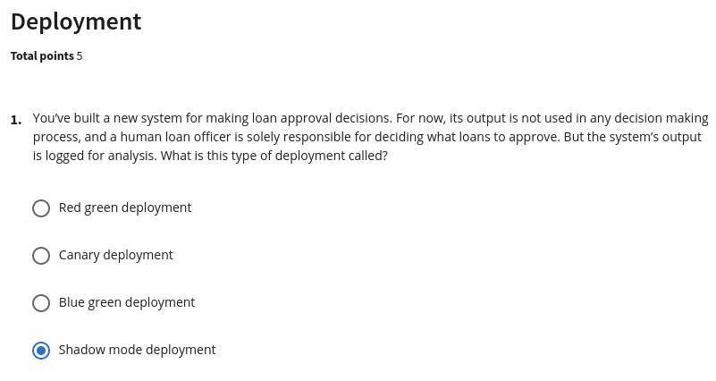
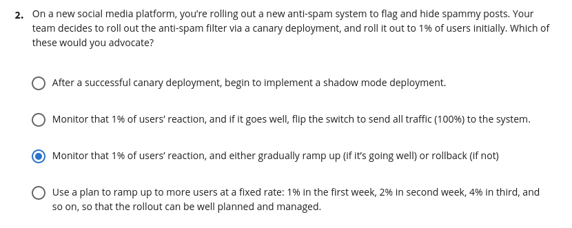
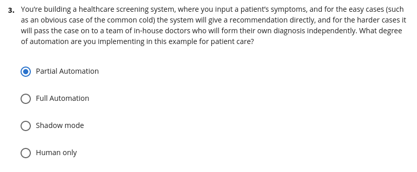
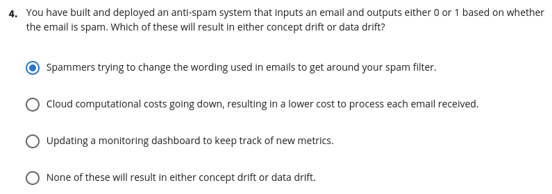
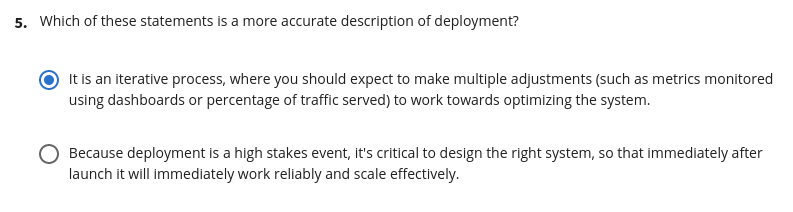