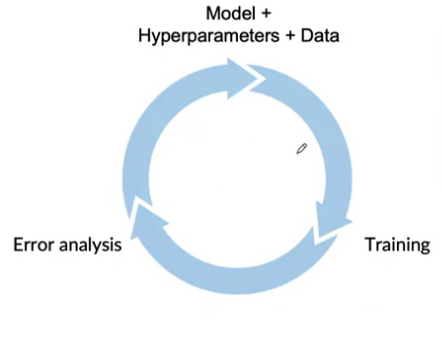
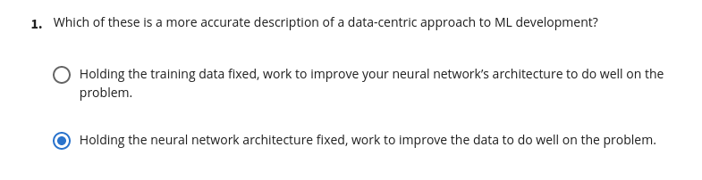
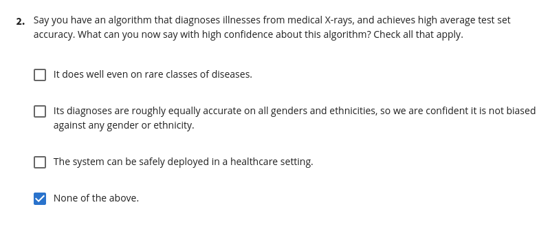
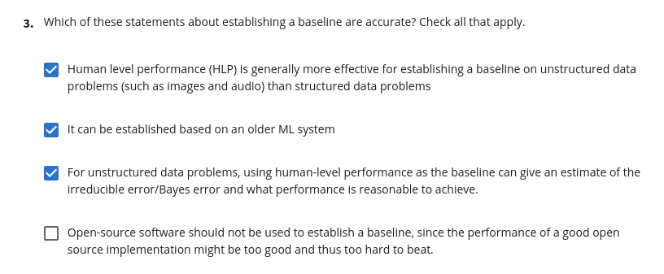
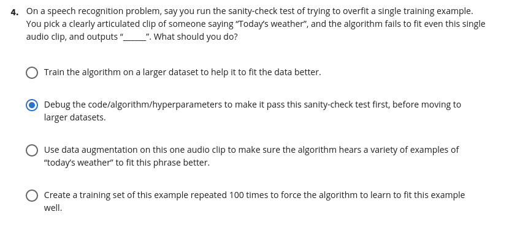
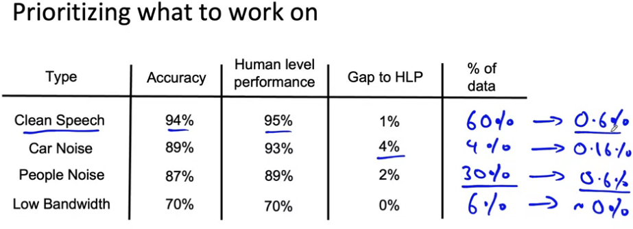

# Modeling overview

Model-centric x Data-centric approach

Make sure not to discriminate by ethnicity, gender, location, language or other protected attributes.

## Getting started on modeling

* Literature search to see what’s possible (courses, blogs, open- source projects).
* Find open-source implementations if available.
* A reasonable algorithm with good data will often outperform a great algorithm with no so good data
* Sanity-check for code and algorithm 
* Try to overfit a small training dataset before training on a large one

## Quiz

## Error Analysis and Performance Auditing

* Using spreadsheet to analyze results iteratively
* Define tags and, given a sample, determine how each tag could improve the model performance

Prioritizing what to work on

* Decide on most important categories to work on based on:
  * How much room for improvement there is. 
  * How frequently that category appears. 
  * How easy is to improve accuracy in that category.
  * How important it is to improve in that category.

Adding/improving data for specific categories:
* For categories you want to prioritize: 
  * Collect more data 
  * Use data augmentation to get more data
  * Improve label accuracy/data quality