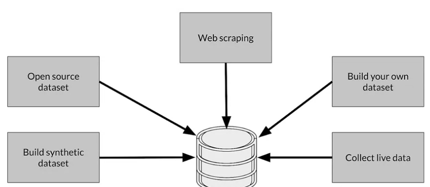
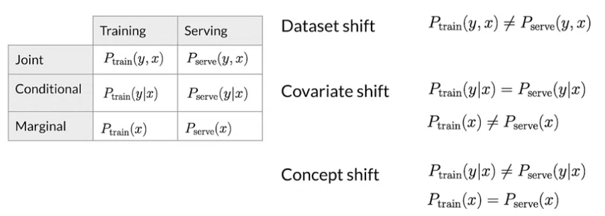
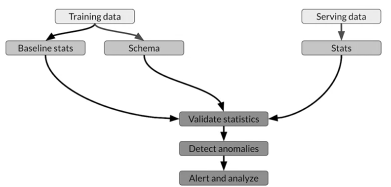
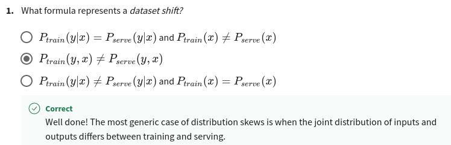
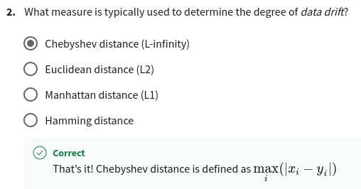
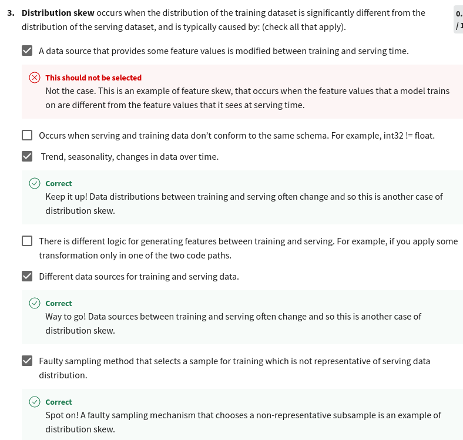
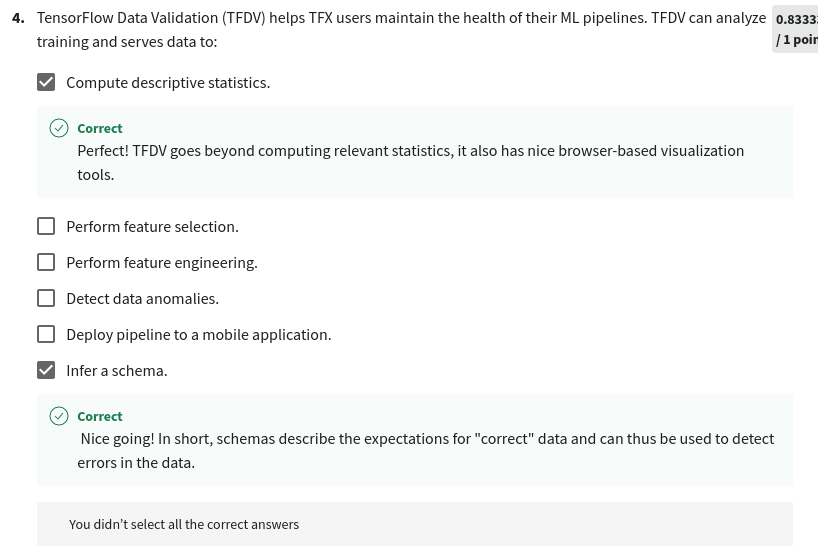

## Collecting Data

"Data is the hardest part of ML and the most important piece to get right...Broken data is the most common cause of problems in production ML systems - Scaling Machine Learning at Uber with Michelangelo - Uber"

"No other activity in the machine learning life cycle has a higher return on investment than improving the data a model has access to.” - Feast: Bridging ML Models and Data - Gojek"

Models aren't magic

Meaningful data:
* maximize predictive content 
* remove non-informative data
* feature space coverage

Key considerations:

Data availability and collection 
* What kind of/how much data is available? 
* How often does the new data come in?
* Is it annotated? If not, how hard/expensive is it to get it labeled?
* Translate user needs into data needs *
  * Data needed
  * Features needed
  * Labels needed

Get to know your data:
* Identify data sources
* Check if they are refreshed
* Consistency for values, units, & data types
* Monitor outliers and errors

Dataset issues

* Inconsistent formatting - Is zero “0”, “0.0”, or an indicator of a missing measurement
* Compounding errors from other ML Models
* Monitor data sources for system issues and outages

Measure data effectiveness
* Intuition about data value can be misleading
* Which features have predictive value and which ones do not?
* Feature engineering helps to maximize the predictive signals
* Feature selection helps to measure the predictive signals

Key points

* Understand your user, translate their needs into data problems
* What kind of/how much data is available 
* What are the details and issues of your data 
* What are your predictive features 
* What are the labels you are tracking
* What are your metrics

### Responsible Data: Security, Privacy & Fairness

* Data collection and management isn't just about your model
  * Give user control of what data can be collected
  * Is there a risk of inadvertently revealing user data?

* Protect personally identifiable information:
  * Aggregation - replace unique values with summary value
  * Redaction - remove some data to create less complete picture

* How ML systems can fail users:
  * Representational harm - amplify or reflect a negative stereotype about particular groups
  * Opportunity denial - makes predictions that have negative real life consequences that could result in lasting impacts
  * Disproportionate product failure - effectiveness of your model is really skewed so that the outputs happen more frequently for particular groups of users
  * Harm by disadvantage - infer disadvantageous associations between different demographic characteristics and the user behaviors around that

* Key points:
  * Ensure rater pool diversity
  * Investigate rater context and incentives Evaluate rater tools
  * Manage cost
  * Determine freshness requirements

## Labeling Data

### Degradated Model Performance

* Slow - example: drift
* Fast - example: bad sensor, bad software update

Gradual problems
* Data changes:
  * Trend and seasonality
  * Distribution of features changes 
  * Relative importance of features
* World changes
  * Styles change
  * Scope and processes change
  * Competitors change
  * Business expands to other geos

Sudden Problems:
* Data collection problem
  * Bad sensor/camera
  * Bad log data
  * Moved or disabled sensors/cameras
* Systems problem:
  * Bad software update
  * Loss of network connectivity
  * System down
  * Bad credentials

* Mispredictions do not have uniform cost to your business
* The data you have is rarely the data you wish you had
* Model objective is nearly always a proxy for your business objectives

### Data and Concept Change
* Easy problems
  * **Ground truth changes slowly (months, years)**
  * Model retraining driven by: 
    * Model improvements, better data 
    * Changes in software and/or systems
  * Labeling
    * Curated datasets
    * Crowd-based

* Harder problems
  * **Ground truth changes faster (weeks)**
  * Model retraining driven by:
    * Declining model performance
    * Model improvements, better data 
    * Changes in software and/or systems
  * Labeling
    * Direct feedback
    * Crowd-based
    * 
* Harder problems
  * **Ground truth changes very fast (days, hours, min)**
  * Model retraining driven by:
    * Declining model performance
    * Model improvements, better data 
    * Changes in software and/or systems
  * Labeling
    * Direct feedback
    * Weak supervision

### Data labeling

Variety of Methods:

* Process Feedback (Direct Labeling) - Actual vs Predicted CTR
  - \+ Training dataset continuous creation
  - \+ Labels evolve quickly
  - \+ Captures strong label signals
  - \- Hindered by inherent nature of the problem
  - \- Failure to capture ground truth
  - \- Largely bespoke design (might not be possible to reuse)
  - LogAnalysis tools as LogStash, Fluentd or Cloud Log Analytics (Google Cloud Logging, AWS Elastic Search, Azure Monitor)
* Human Labeling - Cardiologist labeling MRI images
  * People (“raters”) to examine data and assign labels manually
  * Methodology:
    * Unlabeled data is collected
    * Human “raters” are recruited
    * Instructions to guide raters are created
    * Data is divided and assigned to raters
    * Labels are collected and conflicts resolved
  * \+ More labels
  * \+ Pure supervised learning
  * \- Quality consistency: Many datasets difficult for human labeling
  * \- Slow
  * \- Expensive
  * \- Small dataset curation
  * MRI: high cost for specialist labeling
  * Single rater: limited number of examples per day
  * Recruitment is slow and expensive
* Semi-Supervised Labeling
* Active Learning
* Weak Supervision

## Validating Data

### Drift and skew

* Drift - Changes in data over time, such as data collected once a day
* Skew - Difference between two static versions, or different sources, such as training set and serving set

### Detecting data issues

* Detecting schema skew - Training and serving data do not conform to the same schema
* Detecting distribution skew - Dataset shift -> covariate or concept shift
* Requires continuous evaluation

### Skew Detection Workflow

### TFDV

* Skew:
  * Supported for categorical features
  * Expressed in terms of L-infinity distance (Chebyshev Distance)
  * Set a threshold to receive warnings
* Schema skew
  * Serving and training data don't conform to same schema:
  * For example, int != float
* Feature skew
  * Training feature values are different than the serving feature values:
    * Feature values are modified between training and serving time
    * Transformation applied only in one of the two instances
* Distribution skew
  * Distribution of serving and training dataset is significantly different:
    * Faulty sampling method during training 
    * Different data sources for training and serving data 
    * Trend, seasonality, changes in data over time

## Quiz

