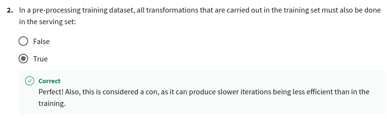

# Preprocessing

* Feature engineering can be difficult and time consuming, but also very important to success
* Squeezing the most out of data through feature engineering enables models to learn better
* Concentrating predictive information in fewer features enables more efficient use of compute resources
* Feature engineering during training must also be applied correctly during serving

## Operations

* Main preprocessing operations
  * Cleansing
  * Feature tuning
  * Representation Transformation
  * Feature Extraction / Dimensionality Reduction
  * Feature Construction
* Mapping raw data into features
* Mapping numeric values
  * Integer values to floating-point values
* Mapping categorical values
  * One Hot
* Empirical knowledge of data
  * Text - stemming, lemmatization, TF-IDF, n-grams, embedding lookup
  * Images - clipping, resizing, cropping, blur, Canny filters, Sobel filters, photometric distortions

## Techniques
* Feature Scaling
* Numerical Range:
  * Scaling - Converts values from their natural range into a prescribed range
  * Normalization - Converts values from their natural range into a range of 0 to 1
  * Standardization - Z-score relates the number of standard deviations away from the mean. Centered around the mean of the data
  * Bucketizing / Binning
  * Dimensionality Reduction:
    * PCA
    * t-SNE
    * UMAP
    * Feature Crossing
* Grouping:
  * Bucketizing
  * Bag of Words

## Feature Crosses
It combine multiple features together into a new feature. It encodes non-linearity in the feature space, or encodes the same information and fewer features

* Feature crossing: synthetic feature encoding nonlinearity in feature space.
* Feature coding: transforming categorical to a continuous variable.

## Quiz

## Preprocessing at Scale

Inconsistencies in feature engineering:
* Training & serving code paths are different
* Diverse deployments scenarios
* Risks of introducing training-serving skews
* Skews will lower the performance of your serving model

## Preprocessing granularity
* Instance-level:
  * Clipping
  * Multiplying
  * Expanding Features
* Full-Pass
  * Min-Max
  * Standardization
  * Bucketizing

## When do you transform?
Pre-process:
* Pros:
  * Run-once
  * Compute on entire dataset
* Cons:
  * Transformations reproduced at serving
  * Slower iterations

Within the model:
* Pros:
  * Faster iterations
  * Transformations reproduced at training
* Cons:
  * Expensive transforms
  * Long model latency
  * Transformations per batch: skew

Why transform per batch?

* For example, normalizing features by their average
* Access to a single batch of data, not the full dataset
* Ways to normalize per batch:
  * Normalize by average within a batch
  * Precompute average and reuse it during normalization

## Quiz

## Feature Selection

* Identify features that best represent the relationship
* Remove features that don't influence the outcome
* Reduce the size of the feature space
* Reduce storage and I/O requirements
* Minimize training and inference costs

Types:
* Unsupervised - Correlation analysis (among features and among feature and output)
* Supervised:
  * Filter Methods:
    * Pearson (Linear Regression)
    * Kendall Tau (Monotonic and Small sample)
    * Spearmens Rank Correlation (Monotonic)
    * Mutual Information
    * F-Test
    * Chi-Squared test
  * Wrapper Methods
    * Recursive Feature Elimination (RFE)
    * Forward Selection (Starts with 1 feature and adds until performance stops increasing)
    * Bacwards Selection (Starts with all features and removes until performance stops increasing)
  * Embedded Methods:
    * L1 Regularization (Ridge/SVM)
    * Feature Importance (Trees)

## Quiz

