# Data Journey
* Accounting for data and model evolution
* Intro to ML metadata
* Using ML metadata to track changes

The data journey:
1) Raw features and labels
2) Input-output map
3) ML model to learn mapping

Data transforms as it flows through the process. Interpreting model results requires understanding data transformation

Artifacts are created as the components of the ML pipeline execute
Artifacts include all of the data and objects which are produced by the pipeline components
This includes the data, in different stages of transformation, the schema, the model itself, metrics, etc.

## Data provenance: Why it matters
Helps with debugging and understanding the ML pipeline:
* Inspect artifacts at each point in the training process
* Trace back through a training run
* Compare training runs

## Data versioning

* Data pipeline management is a major challenge
* Machine learning requires reproducibility
* Code versioning: GitHub and similar code repositories e Environment versioning: Docker, Terraform, and similar
* Data versioning:
* Version control of datasets
  * Examples: DVC, Git-LFS

## Metadata

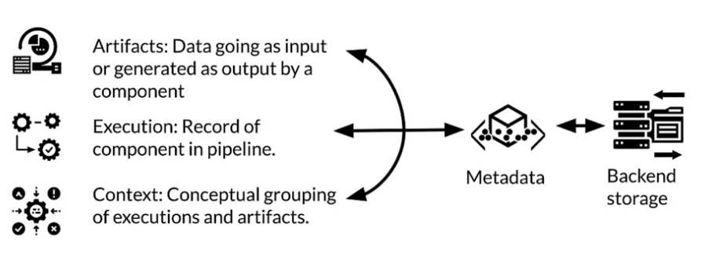
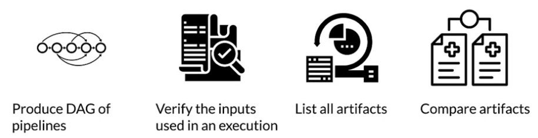

## Quiz

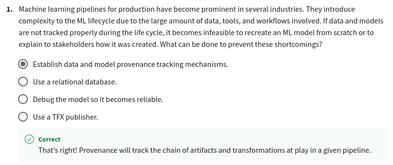
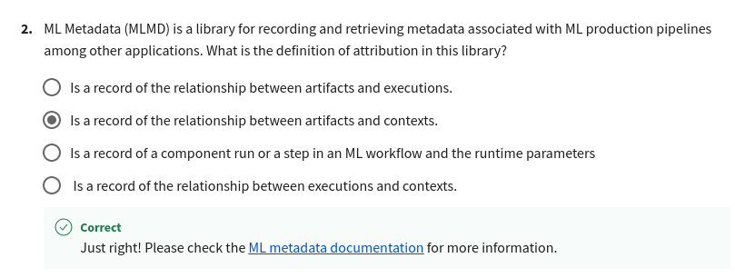
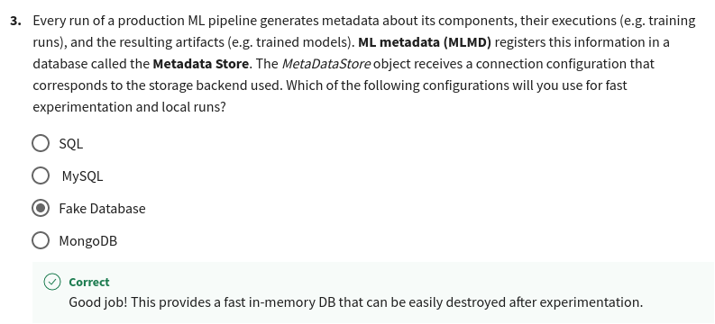

# Schema

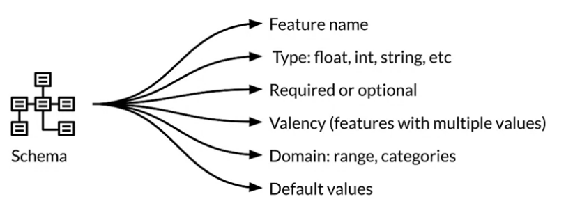
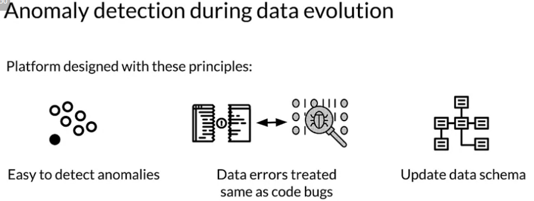

## Quiz

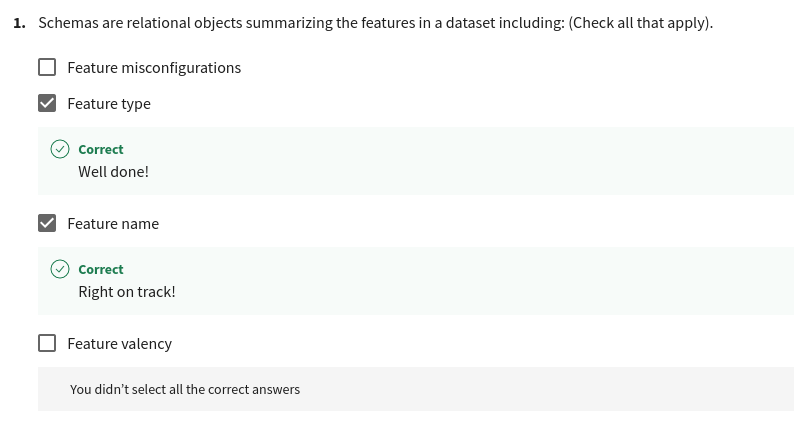
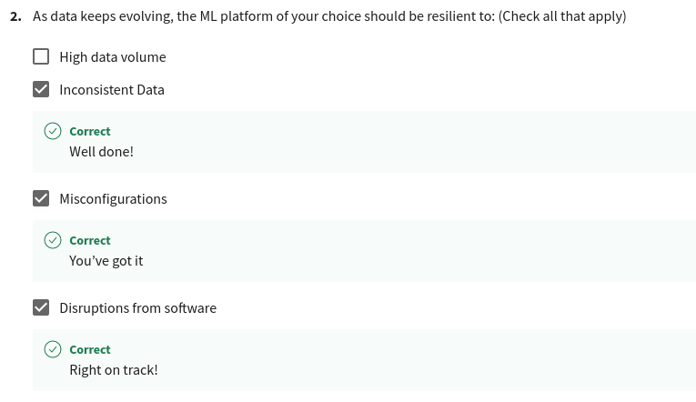
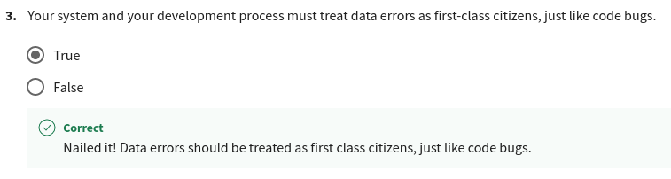

# Feature Stores

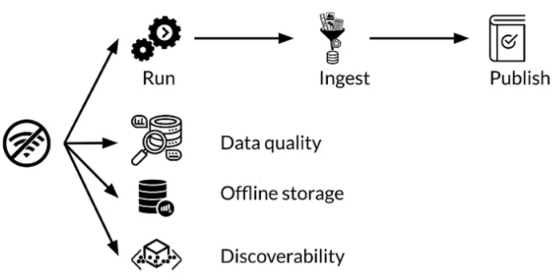
* Feature store: central repository for storing documented, curated, and access-controlled features, specifically for ML.
* Data warehouse: subject-oriented repository of structured data optimized for fast read
* Data lakes: repository of data stored in its natural and raw format.

## Quiz
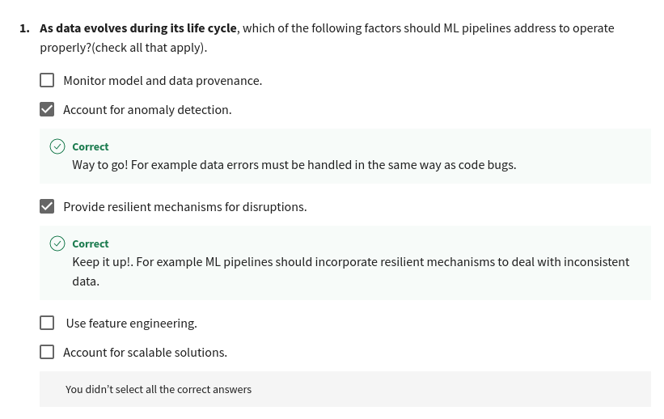
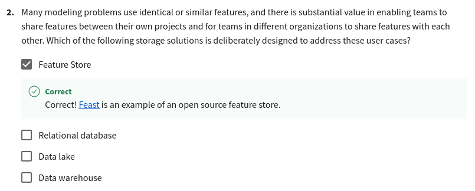
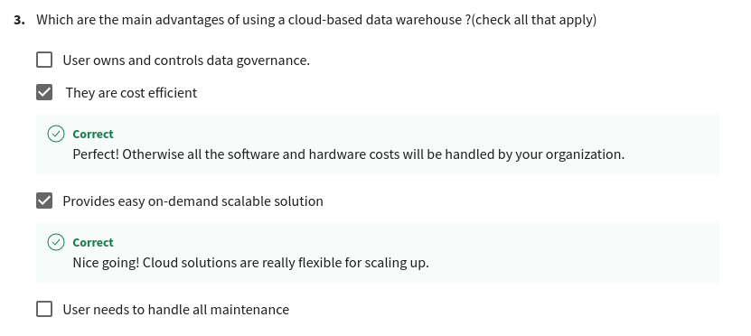
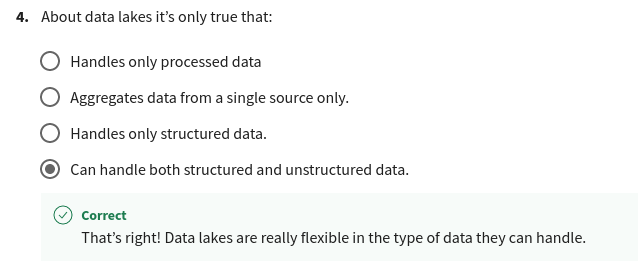
