# Advanced Labeling

Label propagation

* Semi-supervised ML algorithm
* A subset of the examples have labels
* Labels are propagated to the unlabeled points:
  * Based on similarity or “community structure”
* Graph-based - Transductive Learning

## Active Learning

* A family of algorithms for intelligently sampling data
* Select the points to be labeled that would be most informative for model training
* Very helpful in the following situations:
  * Constrained data budgets: you can only afford labeling a few points
  * Imbalanced dataset: helps selecting rare classes for training
  * Target metrics: when baseline sampling strategy does not improve selected metrics

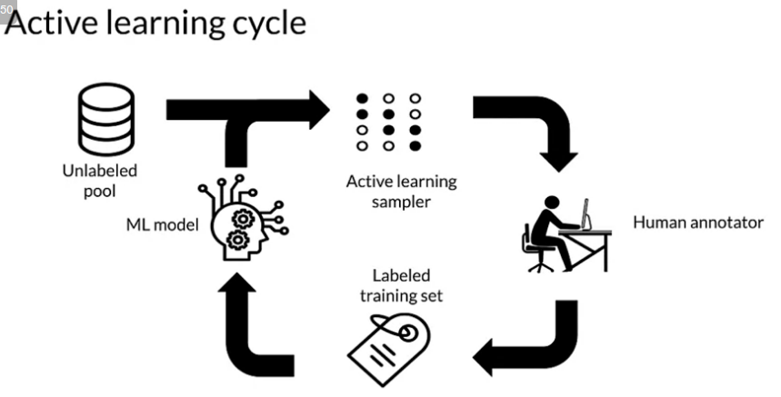

* Margin Sampling - Label points the current model is least confident in.
* Cluster-based sampling: sample from well-formed clusters to "cover" the entire space.
* Query-by-committee: train an ensemble of models and sample points that generate disagreement.
* Region-based sampling: Runs several active learning algorithms in
different partitions of the space.

## Weak Supervision

* Unlabeled data, without ground-truth labels
* One or more weak supervision sources 
* A list of heuristics that can automate labeling
* Typically provided by subject matter experts
* Noisy labels have a certain probability of being correct, not 100%
* Objective: learn a generative model to determine weights for weak supervision sources
* Used with generative models

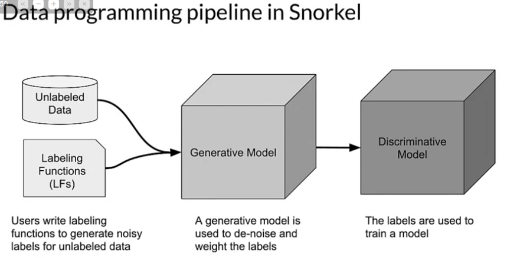

* https://www.snorkel.org/use-cases/

## Quiz

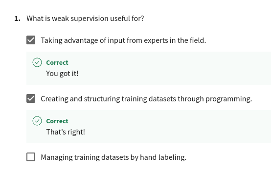
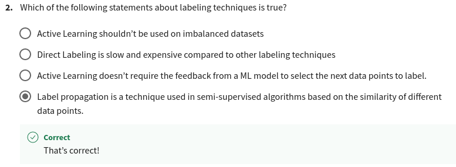
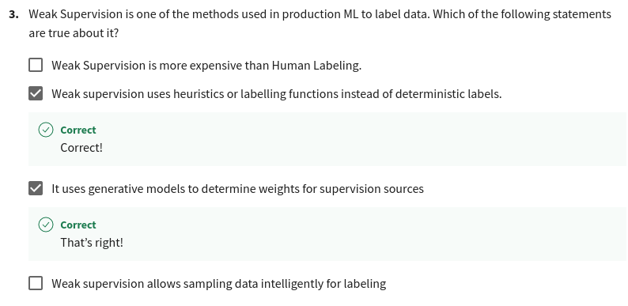

# Data Augmentation

introducing minor alterations. For images: flips, rotations, etc.
Adds examples that are similar to real examples. Improves coverage of feature space. Beware of invalid augmentations!

It generates artificial data by creating new examples which are variants of the original data. It increases the diversity and number of examples in the training data. Provides means to improves accuracy, generalization, and avoiding overfitting

## Quiz

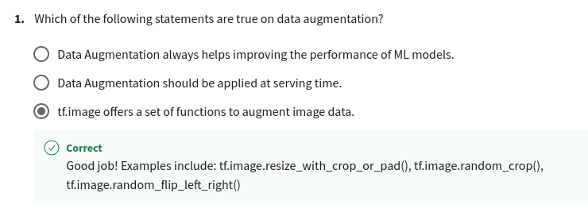
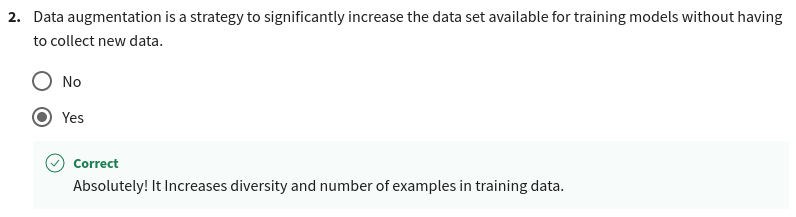
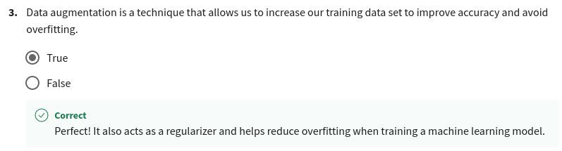

## Time Series

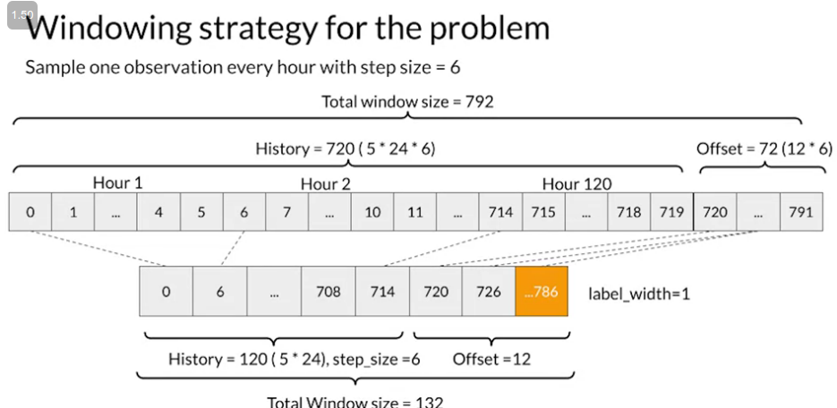

Human activity recognition (HAR). HAR tasks require segmentation operations as Segmented data should be transformed for modeling

Different methods of transformation:
* Spectrograms (commonly used)
* Normalization and encoding 
* Multichannel
* Fourier transform

## Quiz

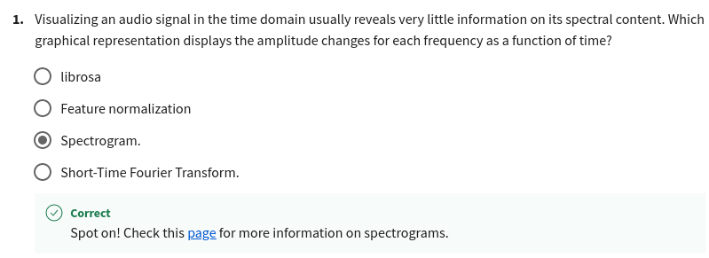
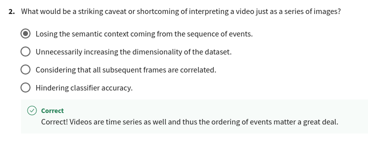
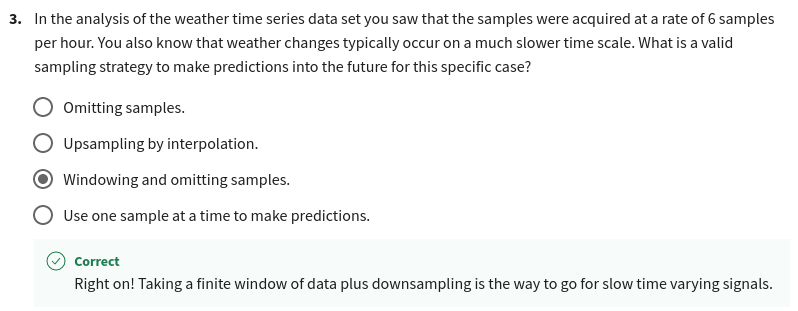