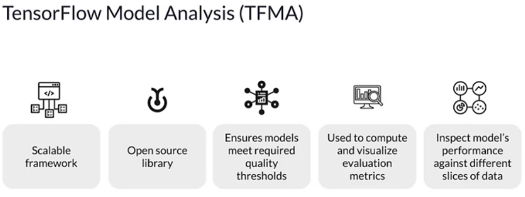

# Hyperparameter Tuning

https://keras.io/guides/keras_tuner/getting_started/#the-search-space-may-contain-conditional-hyperparameters

Basically AutoML is some witchcraft that can do the manual labor automagically. Is not rocket science and is mostly sold as final product in cloud platforms that have their own solutions.