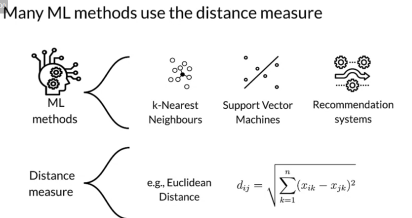
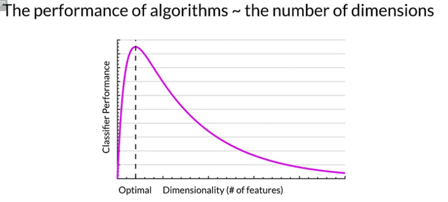
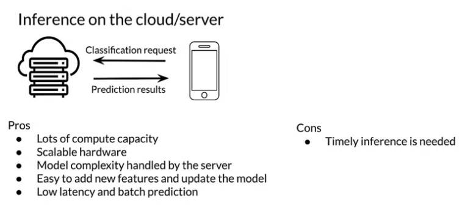
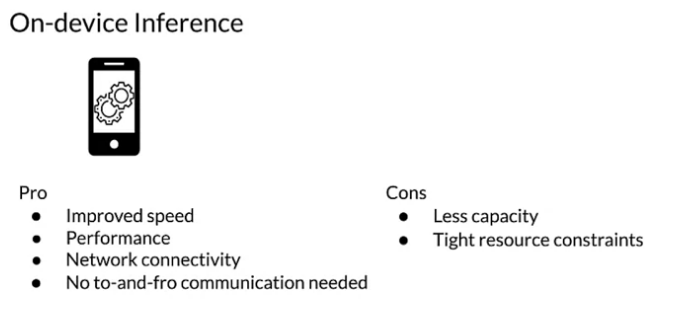

# Dimensionality Reduction




# Quantization and Pruning

* Demands move ML capability from cloud to on-device
* Cost-effectiveness
* Compliance with privacy regulations
* To generate real-time predictions you can: 
  * Host the model ona server
  * Embed the model in the device
  * Is it faster on a server, or on-device?
* Mobile processing limitations?




Quantization - The number of samples taken on each input.

Why quantize neural networks?

* Neural networks have many parameters and take up space
* Shrinking model file size
* Reduce computational resources -> Faster, lighter deployments, low power
* Make models run faster and use less power with low-precision

## Post Training Quantization
Post-training quantization is a conversion technique that can reduce model size while also improving CPU and hardware accelerator latency with little degradation in model accuracy.

```python
import tensorflow as tf converter = tf.lite.TFLiteConverter.from_saved_model(saved_model_ dir)

converter.optimizations = [tf.lite.Optimize.OPTIMIZE_FOR_SIZE]

tflite_quant_model = converter.convert()
```

## Quantization Aware Training

* Inserts fake quantization (FQ) nodes in the forward pass
* Rewrites the graph to emulate quantized inference
* Reduces the loss of accuracy due to quantization
* Resulting model contains all data to be quantized according to spec

## Pruning

```python
import tensorflow_model optimization as tfmot

model = build _your_model()

pruning schedule = tfmot.sparsity.keras.PolynomialDecay( initial sparsity=0.50, final_sparsity=0.80, begin_step=2000, end_step=4000)

model _for_pruning = tfmot.sparsity.keras.prune_low_magnitude( model,

pruning schedule=pruning schedule)

model for_pruning.fit(...)
```