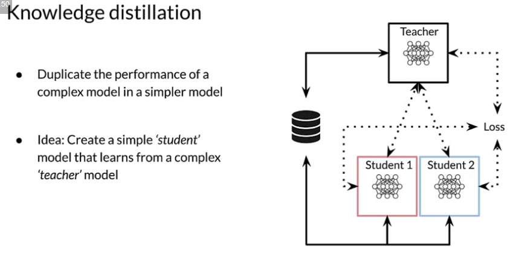
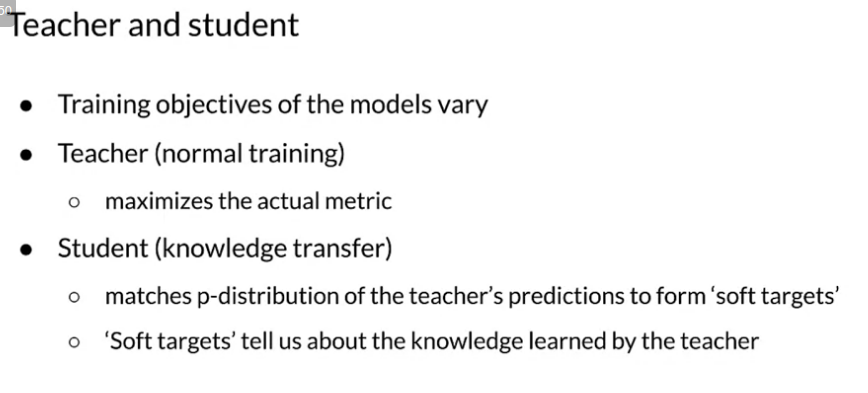
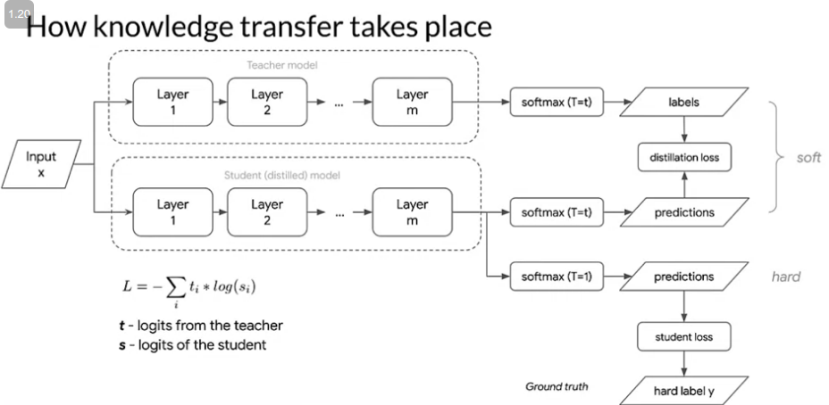

# High-Performance Modeling

* Data parallelism: In data parallelism, models are replicated onto different accelerators (GPU/TPU) and data is split between them

* Model parallelism: When models are too large to fit on a single device then they can be divided into partitions, assigning different partitions to different accelerators

How to optimize pipeline performance?
* Prefetching - overlap the work of a producer with a work of a consumer, while the model is executing step as, the input pipeline is reading the data for step S+1
* Parallelize data extraction and transformation
* Caching - tf.data.Dataset.cache()
* Reduce memory

There are two important things to notice:

The last layer does not have an softmax activation because the raw logits are needed for the knowledge distillation.
Regularization via dropout layers will be applied to the teacher but NOT to the student. This is because the student should be able to learn this regularization through the distillation process.
Remember that the student model can be thought of as a simplified (or compressed) version of the teacher model.