# Explainable AI

## Model Interpretation Methods

What is interpretability?

> “(Models) are interpretable if their operations can be understood by a human, either through introspection or through a produced explanation.” 
> “Explanation and justification in machine learning: A survey” O. Biran, C. Cotton

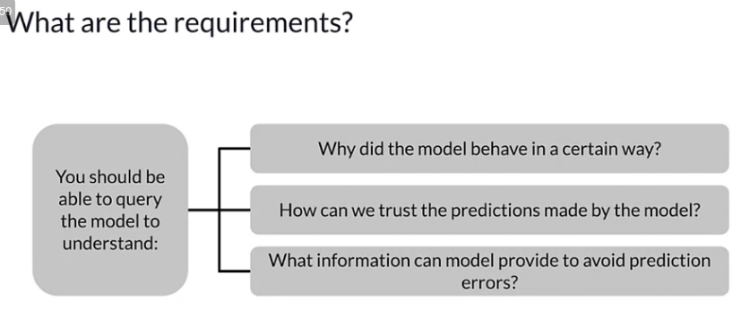
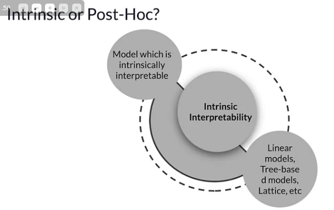
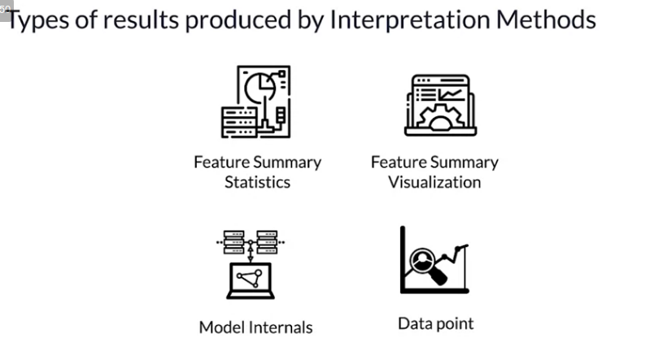
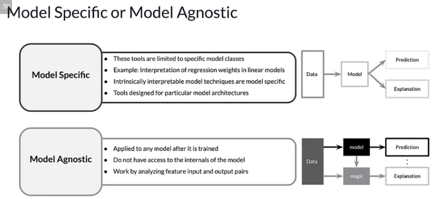
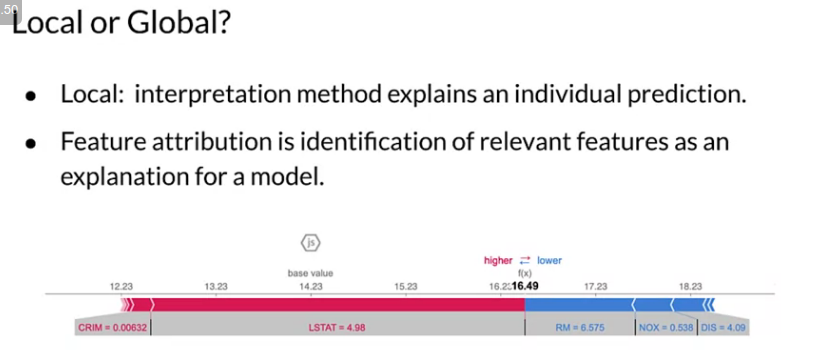
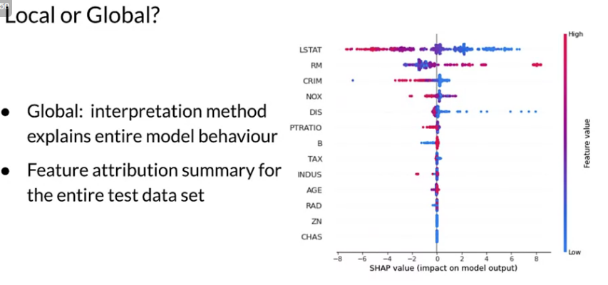

-------

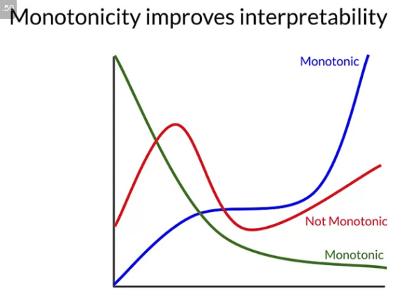
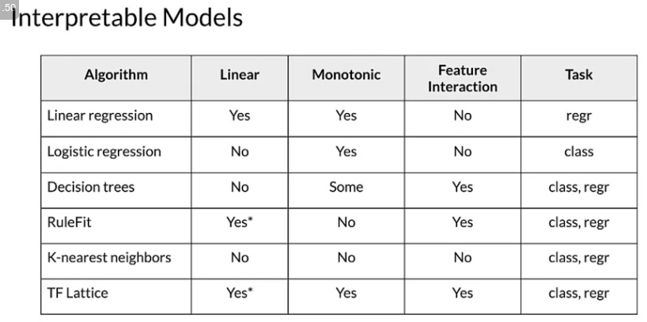
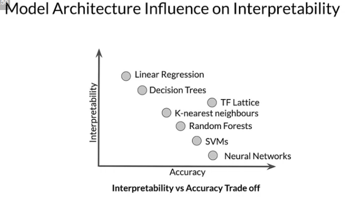

[Lattice](https://www.tensorflow.org/lattice)

## Model Agnostic Methods

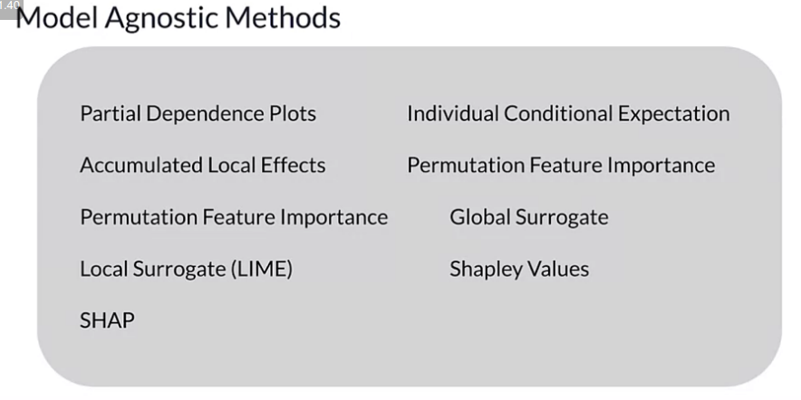

### Partial Dependence Plots
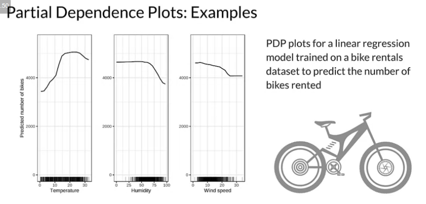

### Permutation Feature Importance
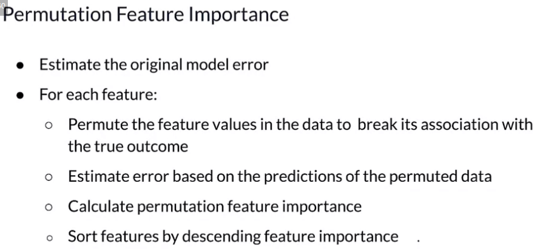

### SHapley Additive exPlanations (SHAP)
