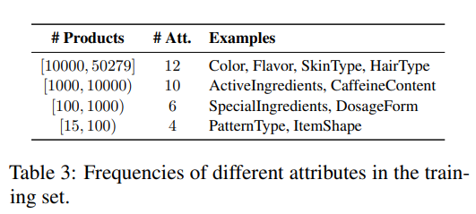

AdaTag: Multi-Attribute Value Extraction from Product Profiles with Adaptive Decoding

https://arxiv.org/abs/2106.02318

This paper discussed some strategies to extract NER from e-commerce data. The main highlights are:

* Better performance of models that share embeddings vs those who don't
* Better performance for classes with more labeled samples but not deep discussion of samples distribution per class
* > Putting together the datasets built for each individual attribute, we end up with training and development sets for 32 attributes, covering 333,857 and 40,008 products respectively. The test set has 12 attributes and covers 11,818 products.
* 
* Performances very close across different techniques as seen in the results table
* 