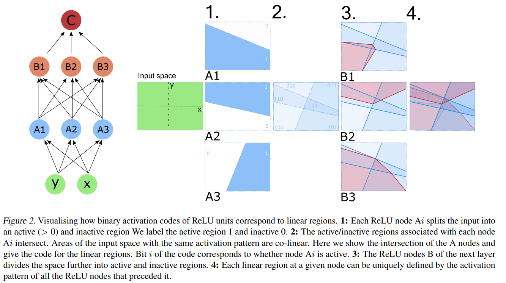
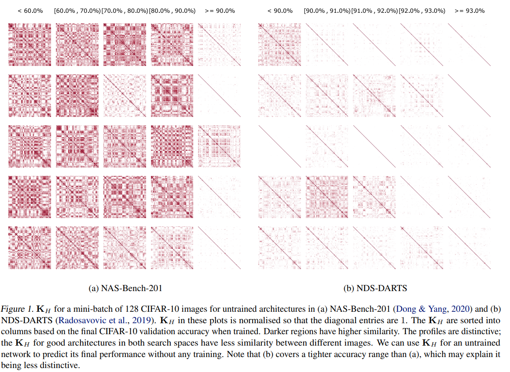

# Neural Architecture Search without Training

https://arxiv.org/pdf/2006.04647.pdf

The paper describes a escalable NAS strategy using binary enconding on the network to compare in a correlation matrix (as can be seen in figures 1 and 2 below)

It's interesting since it doesn't require training but that's it for me on this paper.