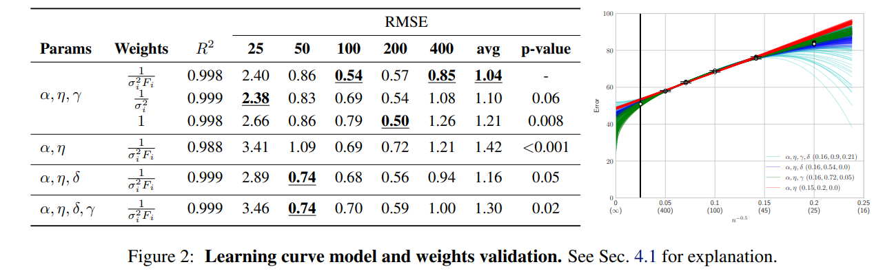
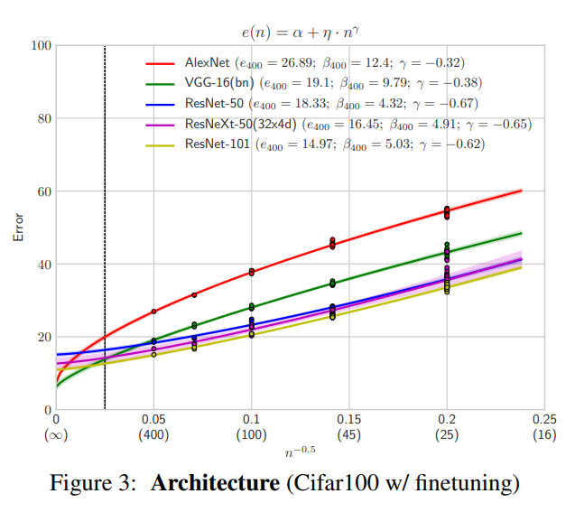

# Learning Curves for Analysis of Deep Networks

https://arxiv.org/pdf/2010.11029.pdf

This paper proposes using power law to model the test error given only the dataset size and the model performance on few trained experiments. It's nice to see a quantifiable metric to measure the error in a systematic and expected way

This given results points out good fit to the trained models.

Using this framework is also possible to compare results from different models over time. It's possible to observe that the evolving models given lower results over time of development. 

They cite the Ranger optimization algorithm as a better alternative to the Adam.

They approach other comparisons as:

* Network architecture evolution
* Optimization model
* Pre-training and Finetunning
* Pretraining on other Data Sources
* Network Depth, Width and Ensembles
* Data Agumentation

It's a very pleasant paper to read with a nice theoric overview and tons of good examples of comparisons and applications.