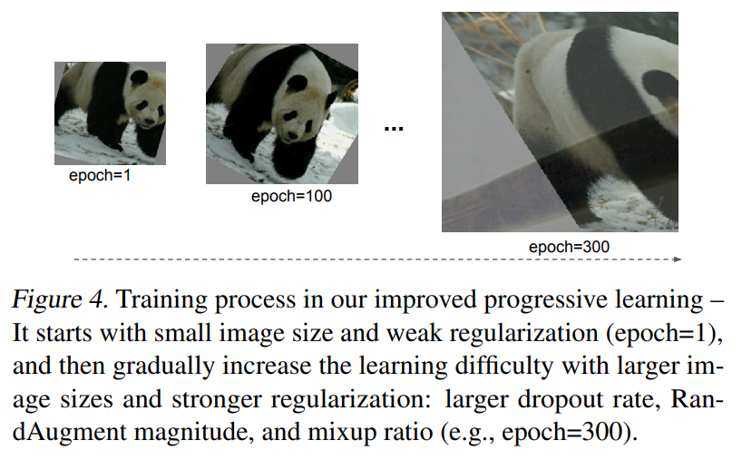

# EfficientNetV2: Smaller Models and Faster Training

https://arxiv.org/pdf/2104.00298.pdf

Google paper on Google previous model so the expectation here is tweaks to better training time, performance. They have two main contributionsare **progressive resizing** and **Neural Architecture Searching (NAS)**

> Progressive resizing (Howard, 2018) is mostly
related to our approach, which aims to improve training
speed. However, it usually comes with the cost of accuracy
drop. Another closely related work is Mix&Match (Hoffer
et al., 2019), which randomly sample different image size
for each batch. Both progressive resizing and Mix&Match
use the same regularization for all image sizes, causing a
drop in accuracy. In this paper, our main difference is to
adaptively adjust regularization as well so that we can improve both training speed and accuracy. Our approach is
also partially inspired by curriculum learning (Bengio et al.,
2009), which schedules training examples from easy to hard.
Our approach also gradually increases learning difficulty by
adding more regularization, but we don’t selectively pick
training examples.

They ponit out that :

* "Training with very large image sizes is slow" so they reduce the size of images to increase batch size. The size of the image can be increased in further iterations adding regularization.
* "Depthwise convolutions are slow in early layers but effective in later stages"so they replace depthwise 3x3 conv + 1x1 convolutions by a Fused-MBConv which has better performance on mobiles.

