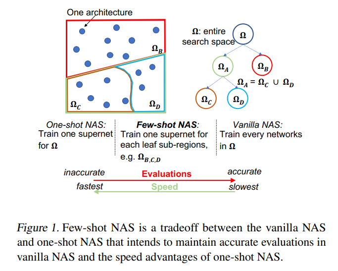

# Few-shot Neural Architecture Search

https://arxiv.org/pdf/2006.06863.pdf

A nice overview of a trade between speed and number of evaluations. One-Shot NAS usually performs poorly since it only has one model to train but it's fast. Regular NAS algorithms in other hand train all the possible networks and compare their performance, which takes a huge amount of time. This approach takes the middle approach.