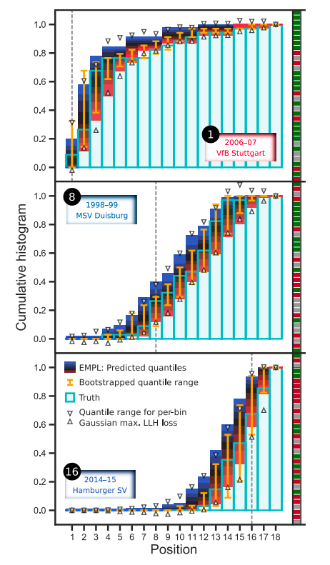

# The Earth Mover’s Pinball Loss: Quantiles for Histogram-Valued Regression

This paper is somehow unique in its presentation. It was written by a single author and the idea is that NN can benefit from learning quantiles distributions given real world data. They present a metric named Earth Mover's Pinball Loss which minimizes the histogram quantiles generations and given some mathematical background and empirical results present intresting results.

> Figure 3. Cumulative histograms depicting the distribution of the
table position after each week for three clubs (one from each test
season). The light-blue histograms represent the truth, and the colored regions show the estimated quantiles from 10 − 90% in steps
of 10% with the EMPL. The orange error bars show bootstrapping
estimates of the 10 − 90% quantile range. When simply training
a NN to estimate bin-wise means and standard deviations for the
cumulative histogram assuming a Gaussian likelihood (independently in each bin), the resulting quantile range is not confined to
[0, 1] due to the infinite support of the Gaussian distribution and
may be non-monotonic (white triangles), which are undesirable
properties. The vertical dashed lines and white numbers indicate
the position of the club at the end of the respective season (which
cannot be inferred from the histograms). The results of all the
club’s matches during the season (i.e., the input X for the MLP)
are illustrated to the right of the histograms (see main text).

Given the Bundeslinga football results in the figure we are able to observe that the model predicts a given probability distribution nicely given an error constraint.

>The EMPL
is easy to implement (see the Supplementary Material), and
we expect it to be particularly useful for tasks where the
entire distribution of possible histograms is of interest such
as rain forecasts (“what’s the probability that it rains more
than 10 mm tomorrow?”) or radiation treatment planning
(“how certain can we be that 20% of the cancerous organ
should receive a dose of 30 Gy?”). Possible extensions of
our work include multidimensional histograms, incorporating epistemic uncertainties (e.g. Gal & Ghahramani 2016),
flexible ground distances, and the application to parameterized continuous (i.e. unbinned) distributions.

As they point out the results of this work are easily interpretable, quickly achievable and largely appliable given the correct probabilistic framework.