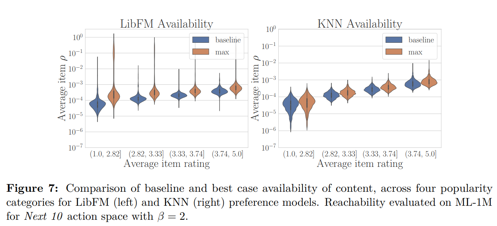

# Quantifying Availability and Discovery in Recommender Systems via Stochastic Reachability

https://arxiv.org/pdf/2107.00833.pdf

> The recommender systems literature has long proposed a variety of other metrics for evaluation,
including notions of novelty, serendipity, diversity, and coverage [Herlocker et al., 2004, Castells et al.,
2011] (...)  Empirical investigations have found evidence of popularity and demographic bias in
domains including movies, music, books, and hotels [Abdollahpouri et al., 2019, Ekstrand et al.,
2018a,b, Jannach et al., 2015]. Alternative metrics are useful both for diagnosing biases and as
objectives for post-hoc mitigating techniques such as calibration [Steck, 2018] and re-ranking [Singh
and Joachims, 2018].

> The behavior of recommendation systems over time and in closed-loop is still an open area of study.
It is difficult to definitively link observational evidence of radicalization [Ribeiro et al., 2020, Faddoul
et al., 2020] to proprietary recommendation algorithms. Empirical studies of human behavior find
mixed results on the relationship between recommendation and content diversity [Nguyen et al., 2014,
Flaxman et al., 2016]. Simulation studies [Chaney et al., 2018, Yao et al., 2021, Krauth et al., 2020]
and theoretical investigations [Dandekar et al., 2013] shed light on phenomena in simplified settings,
showing how homogenization, popularity bias, performance, and polarization depend on assumed
user behavior models. Even ensuring accuracy in sequential dynamic settings requires contending
with closed-loop behaviors.

> Recommendation algorithms must mitigate biased sampling in order to
learn underlying user preference models (...) by balancing exploitation and exploration [Kawale et al., 2015, Mary
et al., 2015]. Reinforcement Learning algorithms contend with these challenges while considering a
longer time horizon [Chen et al., 2019, Ie et al., 2019], implicitly using data to exploit user behavior.

> Our work eschews behavior models in favor of an interventional framing which considers a variety
of possible user actions. Giving users control over their recommendations has been found to have
positive effects, while reducing agency has negative effects [Harper et al., 2015, Lukoff et al., 2021].
The formal perspective we take on agency and access in recommender systems was first introduced
by Dean et al. [2020], and is closely related to a body on work on recourse in consequential decision
making [Ustun et al., 2019, Karimi et al., 2020].

> We consider systems composed of n individuals as well as a collection of m pieces of content. For
consistency with the recommender systems literature, we refer to individuals as users, pieces of
content as items, and expressed preferences as ratings. We will denote a rating by user u of item i
as rui ∈ R, where R ⊆ R denotes the space of values which ratings can take. For example, ratings
corresponding to the percentage of a video watched would have R = [0, 1] while discrete star ratings
would have R = {1, 2, 3, 4, 5}. The number of observed ratings will generally be much smaller than
the total number of possible ratings, and we denote by Ωu ⊆ {1, . . . , m} the set of items seen by
the user u. The goal of a recommendation system is to understand the preferences of users and
recommend relevant content.

> Stochastic policies have been proposed in the recommender system literature to improve diversity [Christoffel et al., 2015] or efficiently explore in a sequential setting [Kawale et al., 2015].
By balancing exploitation of items with high predicted ratings against explorations of items with
lower predictions, preferences can be estimated so that future predicted ratings are more accurate.
However, our work decidedly does not take a perspective based on accuracy. Rather than supposing
that users’ reactions are predictable, we consider a perspective centered on agency and acces

Proposition 3 brings up results that shows correlations on accuracy and reachability.

>The existence of such a construction demonstrates that there is not an unavoidable trade-off
between accuracy and reachability in recommender systems.

## Datasets

> Datasets We evaluate1 max ρ reachability in settings based on three popular recommendation
datasets: MovieLens 1M (ML-1M) [Harper and Konstan, 2015], LastFM 360K [Celma, 2010] and
MIcrosoft News Dataset (MIND) [Wu et al., 2020]. ML-1M is a dataset of 1 through 5 explicit
ratings of movies, containing over one million recorded ratings; we do not perform any additional preprocessing. LastFM is an implicit rating dataset containing the number of times a user has listened
to songs of an artist. We used the version of the LastFM dataset preprocessed by Shakespeare
et al. [2020]. For computational tractability, we select a random subset of 10% of users and 10%
artists and define ratings as rui = log(#listens(u, i) + 1) to ensure that rating matrices are well
conditioned. MIND is an implicit rating dataset containing clicks and impressions data. We use
a subset of 50K users and 40K news articles spanning 17 categories and 247 subcategories. We
transform news level click data into subcategory level aggregation and define the rating associated
with a user-subcategory pair as a function of the number of times that the user clicked on news from
that subcategory: rui = log(#clicks(u, i) + 1).

> Preference models We consider two preference models: one based on matrix factorization (MF)
as well as a neighborhood based model (KNN). We use the LibFM SGD implementation [Rendle,
2012] for the MF model and use the item-based k-nearest neighbors model implemented by Krauth
et al. [2020]. For each dataset and recommender model we perform hyper-parameter tuning using a
10%-90% test-train split. We report test performance in Table 1. See Appendix B.2 for details about
tuning. Prior to performing the audit, we retrain the recommender models with the full dataset.

> Due to the computational burden of large dense
matrices, we compute metrics for a subset of users and target items sampled uniformly at random.
For details about runtime, see Appendix B.3.

## Results
> Popularity bias In Figure 7, we plot the baseline and best case item availability (as in (3)) to
investigate popularity bias. We consider popularity defined by the average rating of an item in a
dataset. Another possible definition of popularity is rating frequency, but for this definition we
did not observe any discernable bias. For both LibFM and KNN models, the baseline availability
displays a correlation with item popularity, with Spearman’s rank-order correlations of rs = 0.87
and rs = 0.95. This suggests that as recommendations are made and consumed, more popular items
will be recommended at disproportionate rates. (...) we see a systematic bias for the KNN recommender, meaning
that regardless of user actions, the popularity bias will propagate.

> The reachability metric provides an upper bound for discovery and availability within a recommendation system. While it has the benefit of making minimal assumptions about user behavior,
the drawback is that it allows for perfectly strategic behaviors that would require users to have full
knowledge of the internal structure of the model. The results of a reachability audit may not be
reflective of probable user experience, and thus reachability acts as a necessary but not sufficient
condition. Nonetheless, reachability audit can lead to actionable insights by identifying inherent
limits in system design. They allow system designers to assess potential biases before releasing
algorithmic updates into production. Moreover, as reachability depends on the choice of action space,
such system-level insights might motivate user interface design: for example, a sidebar encouraging
users to re-rate K items from their history

> Lastly, we highlight that the reachability lens presents a contrasting view to the popular line of
work on robustness in machine learning. When human behaviors are the subject of classification
and prediction, building “robustness” into a system may be at odds with ensuring agency. Because
the goal of recommendation is personalization more than generalization, it would be appropriate to
consider robust access over robust accuracy. This calls for questioning the current normative stance
and critically examining system desiderata in light of usage context.

This paper offer a thorough discussion on the topic and many excelent references. I shall revisit this to add discussion in my thesis.