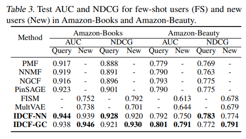

# Towards Open-World Recommendation: An Inductive Model-based Collaborative Filtering Approach

https://arxiv.org/pdf/2007.04833.pdf

> Recent works extend MF with complex architectures, like multi-layer perceptrons (Dziugaite
& Roy, 2015), recurrent units (Monti et al., 2017), autoregressive models (Zheng et al., 2016), graph neural networks
(van den Berg et al., 2017), etc., achieving state-of-the-art
results on both benchmark datasets and commercial systems
(Covington et al., 2016; Ying et al., 2018; Kang et al., 2020).

> We show that our inductive model guarantees equivalent capacity as matrix factorization and provides superior expressiveness compared to other inductive models (feature-driven,
item-based and graph-based). 

> As a general model-agnostic framework, IDCF can flexibly incorporate with various off-the-shelf MF models (e.g.
MLP-based, GNN-based, RNN-based, attention-based, etc.)
as backbones as well as combine with user profile features
for hybrid recommendation.

> We propose the InDuctive Collaborative Filtering (IDCF)
model. Our high-level methodology stems from a key observation: there exist a (or multiple) latent relational graph
among users that represents preference proximity and behavioral interactions. For instance, social networks and
following networks in social media can be seen as realizations of such relational graphs, but in most cases, the graph
structures are unobserved and implicitly affect user’s behaviors. If we can identify the graph structures, we can
leverage the idea of message passing (Scarselli et al., 2009;
Hamilton et al., 2017; Gilmer et al., 2017; Chen et al., 2020),
propagating learned embeddings from one group of users to
others, especially, in an inductive manner.

> Notice that in the above two cases, we assume no side
information, such as user profile features (ages, occupation,
etc,), social networks, item content features, etc., besides
the observed user-item rating matrix. We frame the problem
as open-world recommendation which requires the model
to deal with few-shot and zero-shot users. We present our
model framework for two settings in Fig. 2 and go into the
details in the following.

They then present a two scenario optimization:

1) Matrix Factorization Model - where the users are know and the model train the latents
2) Inductive Relation Model - where the users are not know but their embeddings is obtained through a weighted combination of the known embeddings which minimizes the know ratings of the given new user

> Hence, we parametrize C with an
attention network, reducing parameters and enabling it for
inductive learning. 

$$
c_{u^{\prime} u}=\frac{\mathbf{e}^{\top}\left[\mathbf{W}_{q} \mathbf{d}_{u^{\prime}} \oplus \mathbf{W}_{k} \mathbf{p}_{u}\right]}{\sum_{u_{0} \in \mathcal{U}_{1}} \mathbf{e}^{\top}\left[\mathbf{W}_{q} \mathbf{d}_{u^{\prime}} \oplus \mathbf{W}_{k} \mathbf{p}_{u_{0}}\right]},
$$

> The attention network captures firstorder user proximity on behavioral level and also maintains
second-order proximity that users with similar historical
ratings on items would have similar relations to other users.

> Feature-driven Recommendation. The collaborative filtering (CF) models do not assume any side information
other than the rating matrix, but they cannot be trained in
inductive ways due to the learnable user-specific embedding
pu. To address the issue, previous works leverage side information, e.g. user profile features, to achieve inductive
learning (Jain & Dhillon, 2013; Xu et al., 2013; Cheng et al.,
2016; Ying et al., 2018; Zhong et al., 2018). Define user
features (like age, occupation) as au and item features (like
movie genre, director) as bi
. The feature-driven model targets a prediction model rˆui = g(au, bi). Since the space of
au is shared among users, a model trained on one group of
users can adapt to other users without retraining. However,
feature-driven models often provide limited performance
since the shared feature space is not expressive enough compared to user-specific embedding factors (see Appendix A
for more discussions). Another issue is that high-quality
features are hard to collect in practice. A key advantage of
IDCF is the capability for inductive representation learning
without using features.

> Besides, (Zhang
& Chen, 2020) (IGMC) proposes to use local subgraphs of
user-item pairs in a bipartite graph of rating information
as input features and further adopt graph neural networks
to encode subgraph structures for rating prediction. (...) However, the expressiveness of IGMC
is limited since the local subgraph structures can be indistinguishable for users with distinct behaviors (see Appendix A
for more discussions), and the issue would become worse
for implicit feedback data. (...) Another drawback of
F-EAE and IGMC is that their models cannot output user
representations. Differently, IDCF maintains the ability to
give user-specific representations, which reflect users’ preferences and can be used for downstream tasks (like user
behavior modeling (Liu et al., 2020), user-controllable recommendation (Ma et al., 2019; Cen et al., 2020), target
advertisement and influence maximization (Khalil et al.,
2017; Manchanda et al., 2019), etc.).

>  For datasets with
implicit feedbacks, the goal is to predict whether a user
interacts with an item. The task is essentially a one-class
classification problem. Since the dataset is very sparse and
only has positive instances, we uniformly sample five items
as negative samples for each clicked item and adopt AUC
and NDCG to measure the global and personalized ranking
accuracy, respectively. AUC is short of Area Under of the
ROC Curve which measures the global consistency between
the ranking of all the predicted user-item interactions and
the ground-truth (which ranks all the 1’s before 0’).

> Table 3 shows AUC and NDCG for test interactions of fewshot users in U2 on Amazon-Books and Amazon-Beauty.
Since Amazon datasets have no user feature, the featuredriven competitors would not work. Also, IGMC would
fail to work with implicit feedbacks. We compare with
two other graph-based recommendation models, NGCF
(Wang et al., 2019) and PinSAGE (Ying et al., 2018). As
shown in Table 3, IDCF-NN and IDCF-GC significantly
outperform transductive models in implicit feedback setting with 2.3%/3.0% (resp. 1.0%/1.0%) improvement of
AUC/NDCG on Amazon-Books (resps. Amazon-Beauty).
The two Amazon datasets are both very sparse with rating
density approximately 0.001. One implication here is that
our inductive model can provide better performance than
transductive models for users with few training ratings.

>  There is an interesting phenomenon that some
of key users appear to be very ‘important’ and most query
users have high attention scores on them. It indicates that
the embeddings of these key users are informative and can
provide powerful expressiveness for query users’ preferences. In Fig. 3(d) we further plots key users’ accumulated
attention weights (sum of the attention scores over all the
query users) w.r.t. # historical ratings. We can see that key
users with more historical ratings are more likely to have
large attention weights on query users, though they are also
more likely to have low attention scores. This observation is
consistent with intuition that the users with more historical
ratings are easier for the model to identify their interests.
Also, the results gives an important hint for selecting useful
key users: informative key users are more likely to exsit
in users with more historical ratings. 

> For cold-start recommendation where test users have no
historical rating, we have no information about users if without any side information. In such case, most CF models
would fail for personalized recommendation and degrade
to a trivial one which outputs the same result (or the same
distribution) to all the users using the popularity of items.
For IDCF, the set Iu0 in Eq. (4) would be empty for users
with no historical rating, in which situation we can randomly
select a group of key users to construct Iu0 used for computing attentive scores with key users. Another method is
to directly use average embeddings of all the key users as
estimated embeddings for query users. In such case, the
model degrades to ItemPop (using the numbers of users who
rated the item for prediction).

> Another extension of IDCF is to consider transfer learning
on cross-domain recommendation tasks or when treating
recommendation for different users as different tasks like
(Lee et al., 2019). Transfer learning and meta learning have
shown power in learning generalizable models that can adapt
to new tasks. In our framework, we can also take advantage
of transfer learning (few-shot learning or zero-shot learning)
or mete-learning algorithms to train our relation learning
model hw. For example, if using model-agnostic metalearning algorithm for the second-stage optimization, we
can first compute one-step (or multi-step) gradient update
independently for each user (or a group of clustering users)
in a batch and then average them as one global update for
the model. The meta-learning can be applied over different
groups of users or cross-domain datasets.

> We compare with
Wide&Deep network (Cheng et al., 2016), GCMC (using
feature vectors) and two recently proposed methods for coldstart recommendation: graph-based model AGNN (Qian
et al., 2019) and meta-learning model MeLU (Lee et al.,
2019).

Overall the approach here is an ensemble where:

1) When known the users are simply computed using Matrix Factorization
2) When not known but with some historical data available, the user embedding is computed through an attention model
3) When not know and there's no historical data at all some combination techniques are available (mixing the most important users, averaging the users interests, randomly sampling users and computing an initial user embedding, etc)

Given these it's possible to frame all problems in the known MF/CF framework.