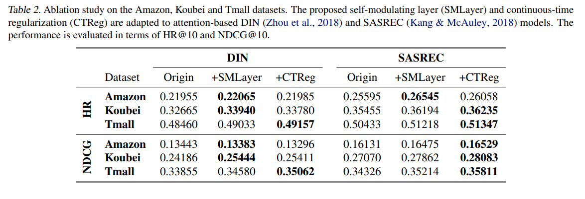
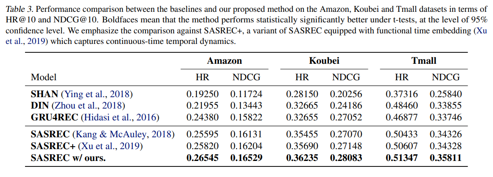

# Learning Self-Modulating Attention in Continuous Time Space with Applications to Sequential Recommendation

http://proceedings.mlr.press/v139/chen21h/chen21h.pdf

> Preference learning is of critical importance in modern machine learning applications, such as online advertising, Ecommerce and social media. Often, users’ preferences are
not static and evolve over time due to a variety of reasons. For example, a user’s interest in a particular brand might fade away due to maturity or a change in lifestyle. Nonetheless, it is difficult to model all causal aspects explicitly
(Widmer & Kubat, 1996; Koren, 2009; Wu et al., 2017).

> To model the dynamics in user preferences, many research
works (Kang & McAuley, 2018; Ying et al., 2018; Zhou
et al., 2018; Zhang et al., 2019) develop different attention
mechanisms to learn the sequential patterns of how users’
future actions are interacted with previous behaviors, and
so far have achieved state-of-the-art performance on many
benchmark datasets. The majority of these attentions (implicitly) assume that the underlying sequential patterns are
time independent(Kumar et al., 2019; Li et al., 2020; Chang
et al., 2020). This is however contradicted with the fact that
more recent behaviors will have more impact on the future
actions, or more specifically identical behavior sequences of
two users with different time intervals should have different
implications on their current and future decisions.

> To tackle the challenging problem, recent approaches generalize the notion of positional embedding to continuous time
(Xu et al., 2019; Shukla & Marlin, 2021). The idea behind
these approaches is to encode periodic patterns dependent on
the progression of time into a high-dimensional vector space
(i.e., time embedding), then by using translation-invariant
random Fourier features (Rahimi & Recht, 2007; Yu et al.,
2016) to approximately measure the temporal distance between user behaviors in the sequence.

> User modeling is of crucial importance in many online applications such as advertising, E-commerce and social media.
In general, the goal of user modeling is to learn user representations from the complex and abundant behavior data
(Adomavicius & Tuzhilin, 2005; Su & Khoshgoftaar, 2009).

> Traditional Recommendation Approaches. Traditional
approaches usually assume that user preference is static,
and collaborative filtering (CF) (Herlocker et al., 1999; Sarwar et al., 2001) is one of the most popular approaches due
to ease of implementation and quality of recommendation.
Among existing CF solutions, matrix approximation based
methods (Koren, 2008; Koren et al., 2009; Chen et al., 2015;
Li et al., 2017; 2021) have achieved state-of-the-art performance in many benchmark datasets, especial for Netflix
prize data (Bennett & Lanning, 2007). However, in practice,
user preferences often drift over time due to various reasons.

> Another emerging line focuses on modeling sequential patterns by using recurrent neural networks. For example, RRN
(Wu et al., 2017) and GRU4REC (Hidasi et al., 2016) exploit
LSTM (Hochreiter & Schmidhuber, 1997) or GRU (Chung
et al., 2014) module to capture dynamic user preferences
dependent on sequence positions. Meanwhile, SHAN (Ying
et al., 2018), RUM (Chen et al., 2018), DIN (Zhou et al.,
2018) and SASREC (Kang & McAuley, 2018) introduce
attention mechanisms to sequential recommendation problems. Compared with recurrent networks, attentions have
shorter path to access distant positions, and thereby achieve
superior performance in many cases (Vaswani et al., 2017).

In section 4.2 they generalize attention to continuous time space using survival function and conditional intensity function to model how long to keep attention over time and how if affects the current state.

Instead of predicting over all the items in the dataset the point out that spectral clustering could be used to reduce the number of target classes.

> In practice because the number of items is always
very large, Eq. (10 - 11) require considerable computational
time and memory use, not suitable for large-scale online
systems. One of the feasible solutions is to cluster the
items into groups using spectral clustering techniques (Shi
& Malik, 2000; Chen et al., 2010), and replace the item-wise
feed-forward neural networks with group-wise feed-forward
neural networks. This makes sense because the items in the
same group are densely connected to each other but sparsely
connected to the items from different groups

Here they've used Amazon Dataset as many other studies. A difference here is how they split in train/test/validation and the metrics used. Here again the normalized discounted cumulative gain (NDCG) is preset but now together with the Hit Rate (HR) which they point out has the same tendency as Precision@k and Recall@k

Tables 2 and 3 shows improvements using the proposed layers. As in other cases the metrics are only slightly better but given the hard nature of the problem is still a great advancement.

> This study evaluates the accuracy of the proposed method by
comparing it with five state-of-the-art methods summarized
previously, i.e., SHAN (Ying et al., 2018), DIN (Zhou et al.,
2018), GRU4REC (Hidasi et al., 2016), SASREC (Kang
& McAuley, 2018) and SASREC+ (Xu et al., 2019).

The proposed method adding a layer on top of the attention shows good results and has a strong teorical basis. 