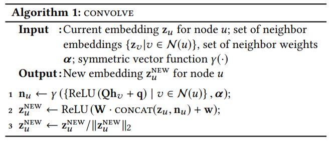
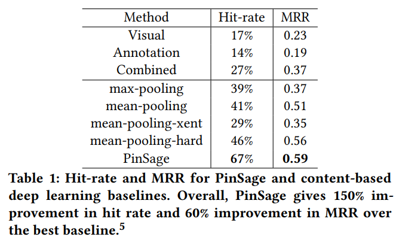

# Graph Convolutional Neural Networks for Web-Scale Recommender Systems

https://arxiv.org/pdf/1806.01973.pdf

This is the PinSage paper written by Jure Leskovec which I largely use as basis for the research on my thesis.

> Recent years have seen significant developments in this space—
especially the development of new deep learning methods that are
capable of learning on graph-structured data, which is fundamental for recommendation applications (e.g., to exploit user-to-item
interaction graphs as well as social graphs) [6, 19, 21, 24, 29, 30].

> Our task is to generate high-quality embeddings or representations of pins that can be used for recommendation (e.g., via nearestneighbor lookup for related pin recommendation, or for use in a
downstream re-ranking system). In order to learn these embeddings, we model the Pinterest environment as a bipartite graph
consisting of nodes in two disjoint sets, I (containing pins) and
C (containing boards). Note, however, that our approach is also
naturally generalizable, with I being viewed as a set of items and
C as a set of user-defined contexts or collections.

> In addition to the graph structure, we also assume that the
pins/items u ∈ I are associated with real-valued attributes, xu ∈
R
d
. In general, these attributes may specify metadata or content
information about an item, and in the case of Pinterest, we have
that pins are associated with both rich text and image features.
Our goal is to leverage both these input attributes as well as the
structure of the bipartite graph to generate high-quality embeddings.

> In addition to the graph structure, we also assume that the
pins/items u ∈ I are associated with real-valued attributes, xu ∈
R
d
. In general, these attributes may specify metadata or content
information about an item, and in the case of Pinterest, we have
that pins are associated with both rich text and image features.
Our goal is to leverage both these input attributes as well as the
structure of the bipartite graph to generate high-quality embeddings.

> Sampling negative items. (...)  To improve efficiency when training
with large batch sizes, we sample a set of 500 negative items to be
shared by all training examples in each minibatch. This drastically
saves the number of embeddings that need to be computed during
each training step, compared to running negative sampling for each
node independently. (...) the hard negative examples are more
similar to the query than random negative examples, and are thus
challenging for the model to rank, forcing the model to learn to
distinguish items at a finer granularity.

> Approximate KNN can be obtained efficiently via locality sensitive hashing (...)  Given that the PinSage
model is trained offline and all node embeddings are computed via
MapReduce and saved in a database, the efficient nearest-neighbor
lookup operation enables the system to serve recommendations in
an online fashion,

