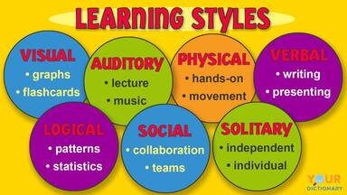
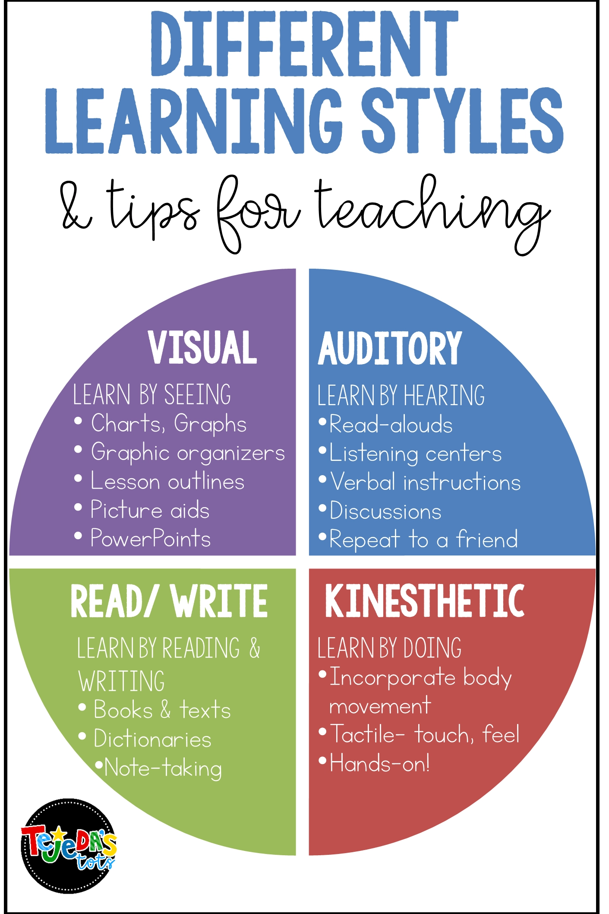

# Guidelines for Tracking

This markdown sets some guidelines for tracking activities in different branches using a system created and being improved by me. Currently the system has two main factors: main activity (or tag) and type of activity. 

## Main Activity (or tag)

This is the main thing that wishes to be tracked. Can be anything, really. Below are some ideas and things that I track myself:

* Body Measurements (weight, biceps size, chest size, BF percentage, etc)
* Thesis Activity (papers I've read, things I've written about, videos I watched, discussions I had about, etc)
* Project Tracking (blogs I've read, summary of discussions, videos with related themes, code implemented, etc)
* Music Activity (new music I've listened to, old music that is nice to listen again but rare for me to find/remeber)
* Video Activity (video I've watched and for some reason I want to highlight in my timeline)

Most of the examples above have their own set of characteristics and possibly apps to keep track of. The thing is that sometimes the tracking is too specific or not specific at all.

For Body Measurements, for example, one could simply use and Excel Spreadsheet and it works just fine. But what if you decide to tracking the pictures of evolution as well? Spreadsheets might not work so well now. And tracking editions as commits might allow for better habit tracking when one might forget to commit some measurements, for example. 

I think this metodology is particularly useful for projects that evolve over time and have many types of source information. In my thesis, for example, I read papers, have meetings with my advisor, watch online courses and videos and it's hard to track down when I did each thing or how long I've done each thing for. Particularly is also nice to have some kind of way to explicitly track comments and opinions on a material that can be tracked and shared in a single platform. That way it's possible to have an overview about a video and summarize it, the same with blogs and papers and having quick summaries of meetings with notes on what to do next.

**For each main activity it's suggested that a new branch is created**. This way it's possible to track many things in parallel as fine as it's desired.

## Type of activity
As stated above there are many types of activity that can be tracked. Using the images below as references we obtain the following list:

* Visual Static (Images and So)
* Visual Dynamic (Videos and Courses)
* Auditory (Music and Podcasts)
* Reading
* Writing
* Coding
* Kinesthesic

Thinking in my tracking logic some of those might be too specific to use lose (as Visual Static or Kinesthesic). Usually a Text Reading ow Writing might be accompanied by images as well so I will use the following guideline for the activities:

1. Always commit the material in some form (link, paste image, summary description, etc)
2. Only use Visual Static for images loose (Pinterest or images with context by itself)

The expectation is that most of the commits will be shared across *reading* and *viewing*, some will be on *writing* and *coding* and very few on *images*, *auditory* and *kinesthesic*. To track these the commit will follow the order 

> \[type of activity] commit title

for example:

> \[reading] AdaTag Paper
> 
> \[viewing] CS224W Lecture 17.3 - 18.5
>
> \[coding] implementing siamese architecture
>
> \[kinesthesic] ran 40min

## What if a given activity has two main activities?

One can commit on both braches using cherry-pick as below:

> #Branch to receive the commit: v1-release
> 
> git checkout v1-release
>
> git cherry-pick F
>
> #Branchto push the commit to: master
> 
> git push origin master v1-release
>

Source : 
* [Add Your Changes To Multiple Branches](https://docs.plone.org/about/contributing/cherrypicking.html)
* [Push a commit in two branches with Git](https://stackoverflow.com/questions/4024095/push-a-commit-in-two-branches-with-git)
